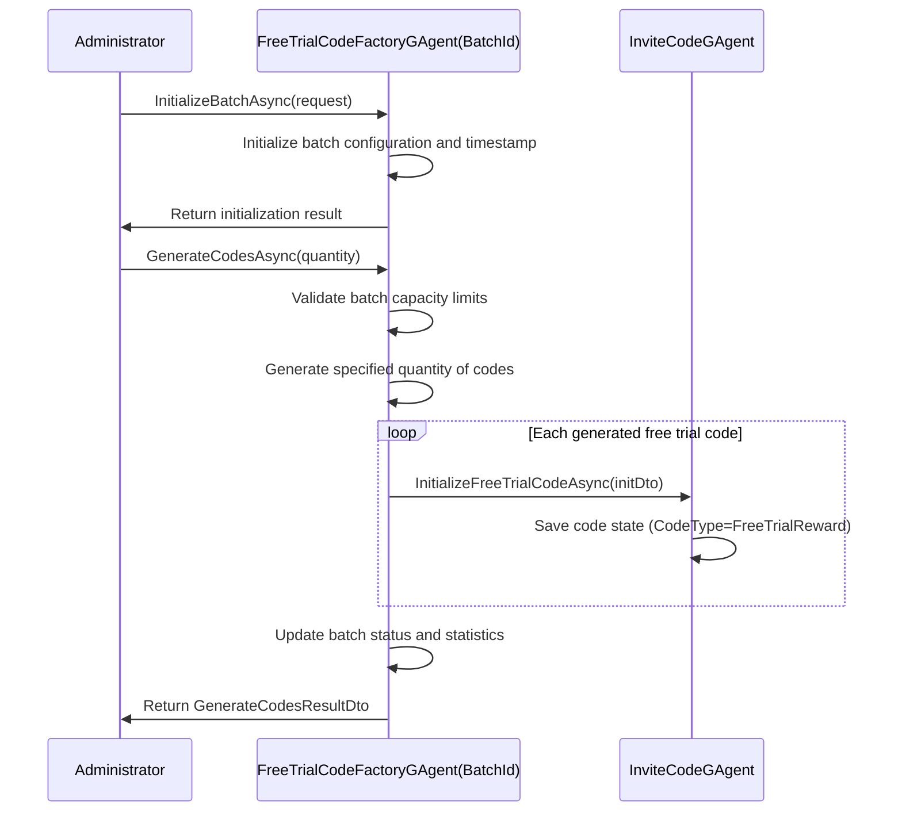
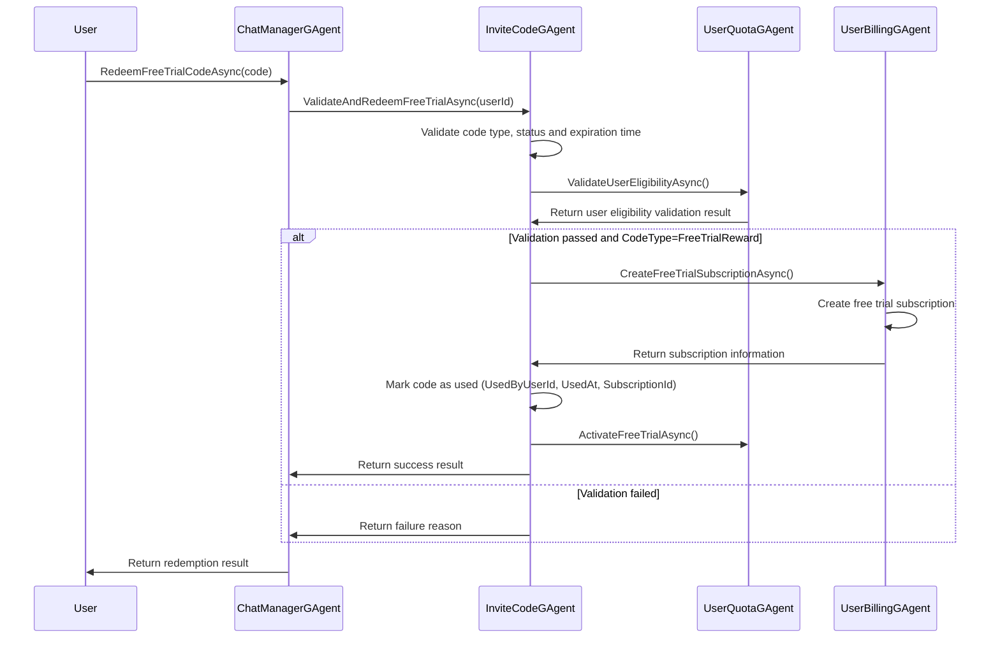

# Free Trial Reward Codes Feature Technical Design Document

## Document Basic Information

| Information Item | Content |
|----|---|
| Technical Document ID | TECH-FTC-TASK-FREE-TRIAL-CODES-001 |
| Related Requirement ID | REQ-FTC-TASK-FREE-TRIAL-CODES-001 |
| Related Task ID | TASK-FREE-TRIAL-CODES-001 |
| Related Branch | feature/free-trial-reward-codes |
| Priority | P1 |
| Status | Draft |
| Creation Date | 2025-09-12 |
| Last Update | 2025-09-12 |
| Author | HyperEcho |

## 1. System Architecture

### 1.1 Overall Architecture

The free trial reward codes system is designed based on the existing GAgent architecture, reusing core components of the invitation code system, and extending to support generation, distribution, and redemption of free trial reward codes. The system adopts Orleans Grain pattern to ensure high concurrency and distributed processing capability.

**Runtime Environment**: Embedded as DLL plugin in Aevatar-Station platform
**Communication Mechanism**: Aevatar-Station provides HTTP interfaces, this project implements core business logic
**Core Requirement**: All business logic is encapsulated within the DLL, HTTP layer only serves as pass-through calls

**Core Components:**
- `FreeTrialCodeFactoryGAgent`: Each instance manages generation of free trial reward codes for one batch
- `InviteCodeGAgent`(Extended): Reuse existing invitation code system, differentiate code types through CodeType field
- `UserBillingGAgent`: Handle creation and management of free trial subscriptions
- `UserQuotaGAgent`: Manage user free trial benefits

### 1.2 Module Division

```
Free Trial Reward Codes System
├── Batch Factory Module (FreeTrialCodeFactoryGAgent)
│   ├── Single batch initialization and configuration
│   ├── Intra-batch code generation
│   ├── Code uniqueness validation
│   ├── Batch status management
│   └── Usage statistics tracking
├── Code Management Module (InviteCodeGAgent Extended)
│   ├── Support multiple code types (FriendInvitation/FreeTrialReward)
│   ├── Code activation/validation
│   ├── Usage records
│   └── Expiration management
├── User Benefits Module (UserQuotaGAgent Extended)
│   ├── Free trial eligibility check
│   ├── Trial period management
│   └── Benefits distribution
└── Subscription Management Module (UserBillingGAgent Extended)
    ├── Free trial subscription creation
    ├── Trial expiration handling
    └── Convert to paid subscription
```

### 1.3 Compatibility with Existing Systems

- **Single Batch Instance Pattern**: Each FreeTrialCodeFactoryGAgent instance specifically manages one batch, simplifying concurrency control
- **Reuse InviteCodeGAgent**: Extend existing InviteCodeGAgent, differentiate code types through CodeType field
- **Independent Code Generation Algorithm**: Design dedicated free trial code generation algorithm, supporting batch timestamp parsing and randomness
- **Compatible with GAgent Architecture**: All new components inherit from `GAgentBase`, following existing event sourcing pattern
- **Integration with User Quota System**: Extend existing `UserQuotaGAgent` to support free trial management
- **Reuse Payment System**: Utilize existing `UserBillingGAgent` to create free trial subscriptions

## 2. Business Interface Specifications

### 2.1 GAgent Business Interfaces

**Important Note**: This project is embedded as a DLL plugin in the Aevatar-Station platform. HTTP interfaces are provided by the external platform, and this project is only responsible for implementing core business logic.

#### Core Business Interfaces

##### IFreeTrialCodeFactoryGAgent

```csharp
public interface IFreeTrialCodeFactoryGAgent : IGAgent
{
    /// <summary>
    /// Initialize batch factory (each instance corresponds to one batch)
    /// </summary>
    Task<bool> InitializeBatchAsync(InitializeBatchRequestDto request);
    
    /// <summary>
    /// Generate specified quantity of free trial reward codes
    /// </summary>
    Task<GenerateCodesResultDto> GenerateCodesAsync(int quantity);
    
    /// <summary>
    /// Get current batch information
    /// </summary>
    Task<BatchInfoDto> GetBatchInfoAsync();
    
    /// <summary>
    /// Get batch statistics
    /// </summary>
    Task<BatchStatsDto> GetBatchStatsAsync();
    
    /// <summary>
    /// Mark code as used
    /// </summary>
    Task<bool> MarkCodeAsUsedAsync(string code, string userId);
    
    /// <summary>
    /// Validate if code belongs to current batch
    /// </summary>
    Task<bool> ValidateCodeOwnershipAsync(string code);
}
```

##### IInviteCodeGAgent (Extended)

```csharp
public interface IInviteCodeGAgent : IGAgent
{
    // Existing methods...
    Task<bool> InitializeAsync(string inviterId);
    Task<(bool isValid, string inviterId)> ValidateAndGetInviterAsync();
    
    // New free trial reward code methods
    Task<bool> InitializeFreeTrialCodeAsync(FreeTrialCodeInitDto initDto);
    Task<ValidateCodeResultDto> ValidateAndRedeemFreeTrialAsync(string userId);
    Task<bool> IsExpiredAsync();
    Task<FreeTrialCodeInfoDto> GetCodeInfoAsync();
}
```

#### Business Data Transfer Objects (DTOs)

```csharp
[GenerateSerializer]
public class InitializeBatchRequestDto
{
    [Id(0)] public string BatchId { get; set; }
    [Id(1)] public int TrialDays { get; set; }
    [Id(2)] public PlanType PlanType { get; set; }
    [Id(3)] public bool IsUltimate { get; set; }
    [Id(4)] public int ExpirationDays { get; set; }
    [Id(5)] public string OperatorUserId { get; set; }
    [Id(6)] public string Description { get; set; }
    [Id(7)] public int MaxQuantity { get; set; } = 10000;
}

[GenerateSerializer]
public class GenerateCodesResultDto
{
    [Id(0)] public bool Success { get; set; }
    [Id(1)] public string Message { get; set; }
    [Id(2)] public List<string> Codes { get; set; }
    [Id(3)] public int GeneratedCount { get; set; }
    [Id(4)] public FreeTrialCodeError ErrorCode { get; set; }
}

[GenerateSerializer]
public class BatchInfoDto
{
    [Id(0)] public string BatchId { get; set; }
    [Id(1)] public int TotalGenerated { get; set; }
    [Id(2)] public int UsedCount { get; set; }
    [Id(3)] public int RemainingCount { get; set; }
    [Id(4)] public DateTime CreationTime { get; set; }
    [Id(5)] public DateTime LastGenerationTime { get; set; }
    [Id(6)] public FreeTrialCodeBatchConfig Config { get; set; }
    [Id(7)] public FreeTrialCodeFactoryStatus Status { get; set; }
}

[GenerateSerializer]
public class BatchStatsDto
{
    [Id(0)] public int TotalGenerated { get; set; }
    [Id(1)] public int UsedCount { get; set; }
    [Id(2)] public double UsageRate { get; set; }
    [Id(3)] public DateTime CreationTime { get; set; }
    [Id(4)] public DateTime? LastUsedTime { get; set; }
    [Id(5)] public bool IsExpired { get; set; }
}

[GenerateSerializer]
public class ValidateCodeResultDto
{
    [Id(0)] public bool IsValid { get; set; }
    [Id(1)] public string Message { get; set; }
    [Id(2)] public CodeType CodeType { get; set; }
    [Id(3)] public FreeTrialActivationDto ActivationInfo { get; set; }
}

[GenerateSerializer]
public class FreeTrialActivationDto
{
    [Id(0)] public int TrialDays { get; set; }
    [Id(1)] public PlanType PlanType { get; set; }
    [Id(2)] public bool IsUltimate { get; set; }
    [Id(3)] public DateTime StartDate { get; set; }
    [Id(4)] public DateTime EndDate { get; set; }
    [Id(5)] public string SubscriptionId { get; set; }
}
```

#### Business Error Types

```csharp
public enum FreeTrialCodeError
{
    None = 0,
    CodeNotFound = 4001,
    CodeAlreadyUsed = 4002,
    CodeExpired = 4003,
    UserAlreadyHasTrial = 4004,
    UserHasActiveSubscription = 4005,
    InvalidCodeType = 4006,
    InternalError = 5000
}
```

## 3. Core Implementation

### 3.1 Data Structures

#### FreeTrialCodeFactoryState

```csharp
[GenerateSerializer]
public class FreeTrialCodeFactoryState
{
    [Id(0)] public string BatchId { get; set; }
    [Id(1)] public List<string> GeneratedCodes { get; set; } = new();
    [Id(2)] public int TotalCodesGenerated { get; set; } = 0;
    [Id(3)] public DateTime CreationTime { get; set; }
    [Id(4)] public DateTime LastGenerationTime { get; set; }
    [Id(5)] public string OperatorUserId { get; set; }
    [Id(6)] public FreeTrialCodeBatchConfig BatchConfig { get; set; }
    [Id(7)] public FreeTrialCodeFactoryStatus Status { get; set; } = FreeTrialCodeFactoryStatus.Active;
    [Id(8)] public long BatchTimestamp { get; set; } // Current batch timestamp
    [Id(9)] public int UsedCount { get; set; } = 0; // Number of used codes
}

[GenerateSerializer]
public class FreeTrialCodeBatchConfig
{
    [Id(0)] public int TrialDays { get; set; }
    [Id(1)] public PlanType PlanType { get; set; }
    [Id(2)] public bool IsUltimate { get; set; }
    [Id(3)] public DateTime ExpirationDate { get; set; }
    [Id(4)] public string Description { get; set; }
    [Id(5)] public int MaxQuantity { get; set; } = 10000; // Maximum codes per batch
}

[GenerateSerializer]
public enum FreeTrialCodeFactoryStatus
{
    Active = 0,
    Expired = 1,
    Disabled = 2,
    Exhausted = 3
}
```

#### InviteCodeState (Extending Existing)

```csharp
[GenerateSerializer]
public class InviteCodeState : StateBase
{
    [Id(0)] public string InviterId { get; set; }
    [Id(1)] public DateTime CreatedAt { get; set; }
    [Id(2)] public bool IsActive { get; set; }
    [Id(3)] public int UsageCount { get; set; }
    
    // New fields to support free trial reward codes
    [Id(4)] public CodeType CodeType { get; set; } = CodeType.FriendInvitation;
    [Id(5)] public string BatchId { get; set; }
    [Id(6)] public int TrialDays { get; set; }
    [Id(7)] public PlanType PlanType { get; set; }
    [Id(8)] public bool IsUltimate { get; set; }
    [Id(9)] public DateTime? ExpirationDate { get; set; }
    [Id(10)] public string UsedByUserId { get; set; }
    [Id(11)] public DateTime? UsedAt { get; set; }
    [Id(12)] public string SubscriptionId { get; set; }
}

[GenerateSerializer]
public enum CodeType
{
    FriendInvitation = 0,
    FreeTrialReward = 1
}
```

### 3.2 Core Algorithms

#### Free Trial Reward Code Generation Algorithm

**Design Rules:**
- Code Length: 10 digits (fixed length for easy parsing)
- Character Set: Uppercase letters and numbers (A-Z, 0-9), total 36 characters
- Format: `SSSSSSSSSS` (10-digit seemingly random string)
- Batch Identifier: Use minute-level timestamp as batch ID, hidden in codes through XOR encryption
- Batch Capacity: Maximum 10,000 codes per batch
- Randomness: Use cryptographic random number generator to ensure unpredictability
- Hidden Batch Information: Mix timestamp with random numbers through XOR operation, completely random appearance

**Algorithm Implementation:**

```csharp
private async Task<List<string>> GenerateCodesAsync(int quantity)
{
    if (quantity > State.BatchConfig.MaxQuantity)
    {
        throw new ArgumentException($"Quantity cannot exceed batch max quantity: {State.BatchConfig.MaxQuantity}");
    }
    
    if (State.TotalCodesGenerated + quantity > State.BatchConfig.MaxQuantity)
    {
        throw new ArgumentException($"Would exceed batch capacity. Current: {State.TotalCodesGenerated}, Requested: {quantity}, Max: {State.BatchConfig.MaxQuantity}");
    }
    
    var codes = new List<string>();
    var usedCodes = new HashSet<string>(State.GeneratedCodes); // Use codes already generated by current instance
    
    using var rng = RandomNumberGenerator.Create();
    
    // Use current batch timestamp
    var encodedTimestamp = EncodeTimestamp(State.BatchTimestamp);
    
    for (int i = 0; i < quantity; i++)
    {
        string fullCode;
        
        do
        {
            // Generate 6-digit random value
            var randomValue = GenerateRandomValue(rng, 6);
            
            // Use XOR operation to hide timestamp in random number
            var mixedValue = MixTimestampWithRandom(encodedTimestamp, randomValue);
            
            // Convert to 10-digit string
            fullCode = EncodeToString(mixedValue);
        } 
        while (usedCodes.Contains(fullCode) || codes.Contains(fullCode));
        
        codes.Add(fullCode);
        usedCodes.Add(fullCode);
    }
    
    // Update state
    State.GeneratedCodes.AddRange(codes);
    State.TotalCodesGenerated += codes.Count;
    State.LastGenerationTime = DateTime.UtcNow;
    
    return codes;
}

/// <summary>
/// Initialize batch timestamp (called in InitializeBatchAsync)
/// Use minute-level timestamp as batch identifier
/// </summary>
private long InitializeBatchTimestamp()
{
    var now = DateTimeOffset.UtcNow;
    // Convert to minute-level timestamp
    return now.Year * 100000000L + now.Month * 1000000L + now.Day * 10000L + now.Hour * 100L + now.Minute;
}

/// <summary>
/// Encode timestamp as numeric value (for XOR mixing)
/// </summary>
private long EncodeTimestamp(long timestamp)
{
    // Compress timestamp to suitable range
    return timestamp % (36L * 36L * 36L * 36L); // Maximum value for 4-digit base-36
}

/// <summary>
/// Generate random value with specified digits
/// </summary>
private long GenerateRandomValue(RandomNumberGenerator rng, int digits)
{
    var maxValue = 1L;
    for (int i = 0; i < digits; i++)
    {
        maxValue *= 36;
    }
    
    var randomBytes = new byte[8];
    rng.GetBytes(randomBytes);
    var randomLong = Math.Abs(BitConverter.ToInt64(randomBytes, 0));
    
    return randomLong % maxValue;
}

/// <summary>
/// Use XOR operation to mix timestamp with random number
/// Key: Use fixed mixing key to ensure reversibility
/// </summary>
private long MixTimestampWithRandom(long timestamp, long randomValue)
{
    // Use fixed key for XOR operation
    const long mixingKey = 0x5A5A5A5A5A5A5A5A; // Fixed key, ensures reversibility
    
    // Combine timestamp and random number
    var combined = (timestamp << 24) | randomValue; // Timestamp in high bits, random in low bits
    
    // Use key for XOR encryption
    return combined ^ mixingKey;
}

/// <summary>
/// Encode numeric value to 10-digit string
/// </summary>
private string EncodeToString(long value)
{
    const string chars = "0123456789ABCDEFGHIJKLMNOPQRSTUVWXYZ";
    var result = new char[10];
    
    for (int i = 9; i >= 0; i--)
    {
        result[i] = chars[value % 36];
        value /= 36;
    }
    
    return new string(result);
}

/// <summary>
/// Generate random sequence of specified length
/// Use cryptographic random number generator to ensure unpredictability
/// </summary>
private string GenerateRandomSequence(RandomNumberGenerator rng, int length)
{
    const string chars = "0123456789ABCDEFGHIJKLMNOPQRSTUVWXYZ";
    var result = new char[length];
    var randomBytes = new byte[length];
    
    rng.GetBytes(randomBytes);
    
    for (int i = 0; i < length; i++)
    {
        result[i] = chars[randomBytes[i] % 36];
    }
    
    return new string(result);
}

/// <summary>
/// Parse batch timestamp from free trial code
/// Extract hidden timestamp through reverse XOR operation
/// </summary>
public static long ParseBatchTimestampFromCode(string code)
{
    if (string.IsNullOrEmpty(code) || code.Length != 10)
    {
        throw new ArgumentException("Invalid free trial code format");
    }
    
    // Convert string back to numeric value
    var mixedValue = DecodeFromString(code);
    
    // Use same key for reverse XOR operation
    const long mixingKey = 0x5A5A5A5A5A5A5A5A;
    var combined = mixedValue ^ mixingKey;
    
    // Extract timestamp (high bits part)
    var extractedTimestamp = combined >> 24;
    
    // Due to modulo compression, need to find original timestamp within reasonable range
    var currentTime = DateTimeOffset.UtcNow;
    var baseTimestamp = currentTime.Year * 100000000L + currentTime.Month * 1000000L + 
                       currentTime.Day * 10000L + currentTime.Hour * 100L + currentTime.Minute;
    
    // Search for matching timestamp within recent time period
    for (long offset = -43200; offset <= 0; offset++) // Search recent 30 days in minutes
    {
        var testTimestamp = baseTimestamp + offset;
        var encodedTest = testTimestamp % (36L * 36L * 36L * 36L);
        
        if (encodedTest == extractedTimestamp)
        {
            return testTimestamp;
        }
    }
    
    throw new ArgumentException("Cannot resolve timestamp from code - code may be too old or invalid");
}

/// <summary>
/// Validate if code belongs to specified batch
/// </summary>
public static bool IsCodeFromBatch(string code, long batchTimestamp)
{
    if (string.IsNullOrEmpty(code) || code.Length != 10)
    {
        return false;
    }
    
    try
    {
        var parsedTimestamp = ParseBatchTimestampFromCode(code);
        return parsedTimestamp == batchTimestamp;
    }
    catch
    {
        return false;
    }
}

/// <summary>
/// Decode string to numeric value (for parsing)
/// </summary>
private static long DecodeFromString(string code)
{
    const string chars = "0123456789ABCDEFGHIJKLMNOPQRSTUVWXYZ";
    long result = 0;
    
    for (int i = 0; i < code.Length; i++)
    {
        var charIndex = chars.IndexOf(code[i]);
        if (charIndex == -1)
        {
            throw new ArgumentException($"Invalid character '{code[i]}' in code");
        }
        result = result * 36 + charIndex;
    }
    
    return result;
}

/// <summary>
/// Validate free trial code format
/// </summary>
public static bool IsValidFreeTrialCodeFormat(string code)
{
    if (string.IsNullOrEmpty(code) || code.Length != 10)
    {
        return false;
    }
    
    const string validChars = "0123456789ABCDEFGHIJKLMNOPQRSTUVWXYZ";
    return code.All(c => validChars.Contains(c));
}
```

**Algorithm Features:**
1. **No Need to Record Batch ID**: Use minute-level timestamp as batch identifier, automatic management
2. **Completely Hidden Batch**: Hide timestamp in random numbers through XOR encryption, completely random appearance
3. **Precisely Parseable**: Use fixed key to precisely parse batch timestamp
4. **Random Appearance**: All codes in same batch look completely unrelated, no obvious features
5. **Uniqueness**: Timestamp + random number + XOR encryption ensure global uniqueness
6. **Randomness**: Use cryptographic random number generator, impossible to derive other codes from one code
7. **Capacity**: Theoretically unlimited batches, 10,000 codes per batch
8. **Fixed Length**: 10-digit fixed length, convenient for user input and system processing
9. **Uppercase Letters**: Mainly use uppercase letters, easy to recognize
10. **Cryptographic Security**: Cannot parse batch information without key, enhanced security

**Generation Examples (Same Batch):**
```
Timestamp=202509121030 → K7M3A9X2N5, F4R8B6Y1Q7, T9W5C3Z8L4
Timestamp=202509121031 → P2H6D4V9M8, J5N1E7S3P6, L8Q4F2U7R9
Timestamp=202509121032 → B3G7A5T2K6, X9C1H8W4N7, Z6M2J5V3Q8
```

**Parsing Examples:**
```
K7M3A9X2N5 → Parse timestamp 202509121030 through XOR decryption
F4R8B6Y1Q7 → Parse timestamp 202509121030 through XOR decryption (same batch)
P2H6D4V9M8 → Parse timestamp 202509121031 through XOR decryption (different batch)
```

**Feature Description:**
- Codes from the same batch look completely unrelated, no obvious common features
- Codes from different batches cannot be distinguished by appearance
- Only systems with the key can parse batch information
- Provides better security and privacy protection

#### User Eligibility Validation Algorithm

```csharp
private async Task<(bool IsEligible, string Reason)> ValidateUserEligibilityAsync(string userId)
{
    var userQuotaGAgent = GrainFactory.GetGrain<IUserQuotaGAgent>(Guid.Parse(userId));
    var userBillingGAgent = GrainFactory.GetGrain<IUserBillingGAgent>(Guid.Parse(userId));
    
    // Check if there are existing free trial records
    var quotaState = await userQuotaGAgent.GetUserQuotaStateAsync();
    if (quotaState.HasUsedFreeTrial)
    {
        return (false, "User has already used free trial");
    }
    
    // Check if there are active subscriptions
    var subscriptionInfo = await userQuotaGAgent.GetSubscriptionAsync();
    if (subscriptionInfo.IsActive)
    {
        return (false, "User has active subscription");
    }
    
    return (true, "User is eligible for free trial");
}
```

### 3.3 Extensibility Design

- **Multi-platform Support**: Support free trial codes for different platforms (iOS, Android, Web)
- **Flexible Configuration**: Support configuration of different trial days and subscription types
- **Batch Management**: Support batch-based generation and management of reward codes
- **Statistical Analysis**: Provide detailed usage statistics and analytics
- **Expiration Management**: Automatically handle cleanup and statistics of expired codes

### 3.4 Integration with Existing Code

#### Reuse Existing Components

1. **CommonHelper.StringToGuid**: Reuse string to GUID conversion logic
2. **Independent Code Generation Algorithm**: Design dedicated free trial code generation algorithm supporting batch parsing and randomness
3. **GAgent Base Architecture**: Inherit GAgentBase to implement event sourcing
4. **User Quota System**: Extend UserQuotaGAgent to support free trial management
5. **InviteCodeGAgent Extension**: Support free trial code types through CodeType field

#### Extend Existing Interfaces

```csharp
// Extend IInviteCodeGAgent interface
public interface IInviteCodeGAgent : IGAgent
{
    // Existing methods...
    Task<bool> InitializeAsync(string inviterId);
    Task<(bool isValid, string inviterId)> ValidateAndGetInviterAsync();
    Task<bool> IsInitialized();
    Task DeactivateCodeAsync();
    
    // New free trial reward code related methods
    Task<bool> InitializeFreeTrialCodeAsync(string batchId, int trialDays, PlanType planType, bool isUltimate, DateTime? expirationDate);
    Task<(bool isValid, CodeType codeType, FreeTrialCodeInfo info)> ValidateAndRedeemFreeTrialAsync(string userId);
    Task<bool> IsExpiredAsync();
}

// Extend IUserQuotaGAgent interface
public interface IUserQuotaGAgent : IGAgent
{
    // Existing methods...
    
    // New free trial related methods
    Task<bool> ActivateFreeTrialAsync(int trialDays, PlanType planType, bool isUltimate);
    Task<FreeTrialInfoDto> GetFreeTrialInfoAsync();
    Task<bool> HasUsedFreeTrialAsync();
}

// Extend IUserBillingGAgent interface  
public interface IUserBillingGAgent : IGAgent
{
    // Existing methods...
    
    // New free trial subscription methods
    Task<CreateSubscriptionResultDto> CreateFreeTrialSubscriptionAsync(CreateFreeTrialDto dto);
    Task<bool> ConvertTrialToSubscriptionAsync(string subscriptionId, string priceId);
}
```

#### New GAgent Components

```csharp
[GAgent(nameof(FreeTrialCodeFactoryGAgent))]
public class FreeTrialCodeFactoryGAgent : GAgentBase<FreeTrialCodeFactoryState, FreeTrialCodeFactoryLogEvent>, IFreeTrialCodeFactoryGAgent
{
    // Each instance manages free trial code generation for one batch
    // Use BatchId as Grain Key to distinguish different batches
    // Simplify state management, avoid multi-batch concurrency issues
}
```

## 4. Business Process Implementation

### 4.1 Reward Code Generation Process



### 4.2 User Redemption Process



## 5. Error Handling and Monitoring

### 5.1 Exception Handling Strategy

- **Code Generation Failure**: Record failure logs
- **Concurrency Conflicts**: Use Orleans single-threaded model to avoid race conditions
- **External Service Exceptions**: Circuit breaker pattern, degraded processing
- **Data Consistency**: Event sourcing ensures state consistency

### 5.2 Monitoring Metrics

- Code generation success rate
- Code redemption success rate
- User conversion rate (trial to paid)
- System response time
- Error rate statistics

## Update History

| Date | Version | Update Content | Updated By |
|---|---|----|-----|
| 2025-09-12 | V1.0 | Initial version | HyperEcho |
