# Google Pay集成测试方案

## 审核问题修复与测试策略

### 第三方审核结果分析

根据第三方审核报告（评分6.5/10），主要问题集中在：

#### 🚨 严重问题（已修复）
1. **JWT验证实现缺失** - 已在GooglePlayEventProcessingGrain中实现完整JWT验证
2. **用户身份映射机制不明确** - 已新增IUserPurchaseTokenMappingGrain建立映射关系

#### ⚠️ 重要问题（实施阶段修复）
1. **错误处理策略过于简单** - 需区分永久性错误和暂时性错误
2. **幂等性设计不完整** - 使用复合键(purchaseToken + eventType + timestamp)

## 1. Google Pay测试环境设置

### 1.1 Google Play Console沙箱配置

```yaml
# 测试环境配置
测试应用设置:
  应用包名: com.godgpt.app.test
  测试轨道: 内部测试 (Internal Testing)
  版本要求: Alpha/Beta版本，包含Google Play Billing集成

许可测试员配置:
  添加路径: Google Play Console > 设置 > 许可测试 > 管理许可测试员
  测试账户: test1@godgpt.com, test2@godgpt.com
  特权: 免费购买所有应用内商品，无需实际付费

测试产品配置:
  premium_monthly_test:
    产品ID: premium_monthly
    类型: 自动续费订阅
    价格: $9.99/月
    测试状态: 激活
    
  premium_yearly_test:
    产品ID: premium_yearly
    类型: 自动续费订阅  
    价格: $99.99/年
    测试状态: 激活
```

### 1.2 RTDN测试环境配置

```yaml
# Cloud Pub/Sub配置
项目设置:
  Google Cloud项目: godgpt-test-project
  Pub/Sub主题: google-play-rtdn-test
  订阅名称: rtdn-webhook-test-subscription
  
Webhook端点配置:
  测试环境: https://test-api.godgpt.com/api/webhooks/godgpt-googleplay-payment
  预发布环境: https://staging-api.godgpt.com/api/webhooks/godgpt-googleplay-payment
  生产环境: https://api.godgpt.com/api/webhooks/godgpt-googleplay-payment

JWT验证配置:
  Google公钥地址: https://www.googleapis.com/oauth2/v3/certs
  验证器: GooglePlayEventProcessingGrain
  缓存策略: 公钥缓存24小时，失败时重新获取
```

## 2. 分层测试策略

### 2.1 单元测试 (90%+ 覆盖率)

```csharp
// GooglePlayEventProcessingGrainTests.cs
[TestClass]
public class GooglePlayEventProcessingGrainTests
{
    [TestMethod]
    public async Task ParseEventAndGetUserIdAsync_ValidJWT_ReturnsCorrectUserId()
    {
        // Arrange
        var mockLogger = new Mock<ILogger<GooglePlayEventProcessingGrain>>();
        var mockOptions = CreateMockGooglePlayOptions();
        var grain = new GooglePlayEventProcessingGrain(mockLogger.Object, mockOptions);
        var validJwtPayload = CreateValidTestRTDNPayload();
        
        // Act
        var result = await grain.ParseEventAndGetUserIdAsync(validJwtPayload);
        
        // Assert
        Assert.AreNotEqual(Guid.Empty, result.UserId);
        Assert.AreEqual("SUBSCRIPTION_PURCHASED", result.NotificationType);
        Assert.IsNotNull(result.PurchaseToken);
    }
    
    [TestMethod]
    public async Task ParseEventAndGetUserIdAsync_InvalidJWT_ReturnsEmptyResult()
    {
        // 测试JWT验证失败场景
        var invalidJwtPayload = "invalid.jwt.token";
        var result = await grain.ParseEventAndGetUserIdAsync(invalidJwtPayload);
        
        Assert.AreEqual(Guid.Empty, result.UserId);
        Assert.AreEqual(string.Empty, result.NotificationType);
    }
    
    [TestMethod]
    public async Task ParseEventAndGetUserIdAsync_ExpiredJWT_ReturnsEmptyResult()
    {
        // 测试过期JWT处理
        var expiredJwtPayload = CreateExpiredTestRTDNPayload();
        var result = await grain.ParseEventAndGetUserIdAsync(expiredJwtPayload);
        
        Assert.AreEqual(Guid.Empty, result.UserId);
    }
}

// GooglePayWebhookHandlerTests.cs
[TestClass]
public class GooglePayWebhookHandlerTests
{
    [TestMethod]
    public async Task HandleAsync_ValidRTDN_ProcessesSuccessfully()
    {
        // Arrange
        var mockRequest = CreateMockHttpRequest(validRTDNPayload);
        var handler = new GooglePayWebhookHandler(mockClusterClient, mockLogger);
        
        // Act
        var result = await handler.HandleAsync(mockRequest);
        
        // Assert
        var response = result as dynamic;
        Assert.IsTrue(response.success);
    }
    
    [TestMethod]
    public async Task HandleAsync_FilteredEventType_ReturnsSuccessWithoutProcessing()
    {
        // 测试非关键事件过滤
        var filteredEventPayload = CreateTestRTDNPayload("TEST_NOTIFICATION");
        var mockRequest = CreateMockHttpRequest(filteredEventPayload);
        
        var result = await handler.HandleAsync(mockRequest);
        
        var response = result as dynamic;
        Assert.IsTrue(response.success);
        Assert.AreEqual("Notification received but filtered by type", response.message);
    }
}

// UserBillingGAgentTests.cs - Google Pay扩展测试
[TestClass]
public class UserBillingGAgentGooglePayTests : AevatarGodGPTTestsBase
{
    [TestMethod]
    public async Task VerifyGooglePlayPurchaseAsync_ValidToken_UpdatesSubscription()
    {
        // Arrange
        var userId = Guid.NewGuid();
        var userBillingGAgent = GrainFactory.GetGrain<IUserBillingGAgent>(userId);
        var verificationDto = new GooglePlayVerificationDto
        {
            PurchaseToken = "test_purchase_token_12345",
            ProductId = "premium_monthly",
            PackageName = "com.godgpt.app.test",
            UserId = userId.ToString()
        };
        
        // Act
        var result = await userBillingGAgent.VerifyGooglePlayPurchaseAsync(verificationDto);
        
        // Assert
        Assert.IsTrue(result.IsValid);
        Assert.IsNotNull(result.SubscriptionStartDate);
        Assert.IsNotNull(result.TransactionId);
        
        // 验证用户权限更新
        var userQuotaGAgent = GrainFactory.GetGrain<IUserQuotaGAgent>(userId);
        var subscription = await userQuotaGAgent.GetSubscriptionAsync();
        Assert.IsTrue(subscription.IsActive);
        Assert.AreEqual(PlanType.Premium, subscription.PlanType);
    }
    
    [TestMethod]
    public async Task VerifyGooglePlayPurchaseAsync_DuplicateToken_ReturnsIdempotentResult()
    {
        // 测试幂等性处理
        var verificationDto = CreateTestVerificationDto();
        
        // 第一次验证
        var result1 = await userBillingGAgent.VerifyGooglePlayPurchaseAsync(verificationDto);
        
        // 第二次相同验证
        var result2 = await userBillingGAgent.VerifyGooglePlayPurchaseAsync(verificationDto);
        
        // 应该返回相同结果
        Assert.IsTrue(result1.IsValid && result2.IsValid);
        Assert.AreEqual(result1.TransactionId, result2.TransactionId);
    }
}
```

### 2.2 集成测试

```csharp
// GooglePayIntegrationTests.cs
[TestClass]
public class GooglePayIntegrationTests : AevatarGodGPTTestsBase
{
    [TestMethod]
    public async Task EndToEndPaymentFlow_NewSubscription_CompletesSuccessfully()
    {
        // 1. 模拟用户购买流程
        var userId = Guid.NewGuid();
        var purchaseToken = $"test_token_{DateTime.UtcNow.Ticks}";
        
        // 2. 建立purchaseToken映射
        var mappingGrain = GrainFactory.GetGrain<IUserPurchaseTokenMappingGrain>(purchaseToken);
        await mappingGrain.SetUserIdAsync(userId);
        
        // 3. 验证购买
        var userBillingGAgent = GrainFactory.GetGrain<IUserBillingGAgent>(userId);
        var verificationDto = new GooglePlayVerificationDto
        {
            PurchaseToken = purchaseToken,
            ProductId = "premium_monthly",
            PackageName = "com.godgpt.app.test",
            UserId = userId.ToString()
        };
        
        var verificationResult = await userBillingGAgent.VerifyGooglePlayPurchaseAsync(verificationDto);
        Assert.IsTrue(verificationResult.IsValid);
        
        // 4. 模拟RTDN通知
        var rtdnPayload = RTDNSimulator.CreateTestRTDNPayload("SUBSCRIPTION_PURCHASED", purchaseToken, userId);
        var notificationResult = await userBillingGAgent.HandleGooglePlayNotificationAsync(userId.ToString(), rtdnPayload);
        Assert.IsTrue(notificationResult);
        
        // 5. 验证业务结果
        var userQuotaGAgent = GrainFactory.GetGrain<IUserQuotaGAgent>(userId);
        var finalSubscription = await userQuotaGAgent.GetSubscriptionAsync();
        Assert.IsTrue(finalSubscription.IsActive);
        
        // 6. 验证支付分析
        var analyticsGrain = GrainFactory.GetGrain<IPaymentAnalyticsGrain>("analytics");
        // 验证GA4事件是否正确记录
    }
    
    [TestMethod]
    public async Task SubscriptionUpgrade_FromMonthlyToYearly_HandlesCorrectly()
    {
        // 测试订阅升级场景
        var userId = Guid.NewGuid();
        
        // 1. 创建月付订阅
        await CreateMonthlySubscription(userId);
        
        // 2. 升级到年付
        var upgradeResult = await UpgradeToYearlySubscription(userId);
        Assert.IsTrue(upgradeResult.IsValid);
        
        // 3. 验证旧订阅被取消
        var activeStatus = await userBillingGAgent.GetActiveSubscriptionStatusAsync();
        Assert.IsFalse(activeStatus.HasActiveGooglePlaySubscription); // 旧的应该被取消
        
        // 4. 验证新订阅激活
        // 验证逻辑...
    }
}
```

### 2.3 Webhook端到端测试

```csharp
// WebhookEndToEndTests.cs
[TestClass]
public class WebhookEndToEndTests : AevatarGodGPTTestsBase
{
    [TestMethod]
    public async Task WebhookE2E_SubscriptionPurchased_UpdatesUserCorrectly()
    {
        // 1. 准备测试数据
        var userId = Guid.NewGuid();
        var purchaseToken = "test_purchase_token_webhook";
        
        // 2. 建立用户映射
        var mappingGrain = GrainFactory.GetGrain<IUserPurchaseTokenMappingGrain>(purchaseToken);
        await mappingGrain.SetUserIdAsync(userId);
        
        // 3. 创建测试RTDN载荷
        var rtdnPayload = RTDNSimulator.CreateValidJWTPayload(new
        {
            version = "1.0",
            packageName = "com.godgpt.app.test",
            eventTimeMillis = DateTimeOffset.UtcNow.ToUnixTimeMilliseconds(),
            subscriptionNotification = new
            {
                version = "1.0",
                notificationType = 4, // SUBSCRIPTION_PURCHASED
                purchaseToken = purchaseToken,
                subscriptionId = "premium_monthly"
            }
        });
        
        // 4. 发送到webhook端点
        var httpClient = TestServer.CreateClient();
        var response = await httpClient.PostAsync(
            "/api/webhooks/godgpt-googleplay-payment",
            new StringContent(rtdnPayload, Encoding.UTF8, "application/json"));
        
        // 5. 验证响应
        Assert.AreEqual(HttpStatusCode.OK, response.StatusCode);
        var responseContent = await response.Content.ReadAsStringAsync();
        var responseJson = JObject.Parse(responseContent);
        Assert.IsTrue(responseJson["success"].Value<bool>());
        
        // 6. 验证业务数据更新
        var userBillingGAgent = GrainFactory.GetGrain<IUserBillingGAgent>(userId);
        var paymentHistory = await userBillingGAgent.GetPaymentHistoryAsync();
        Assert.IsTrue(paymentHistory.Any(p => 
            p.Platform == PaymentPlatform.GooglePlay && 
            p.Status == PaymentStatus.Completed));
        
        // 7. 验证用户权限更新
        var userQuotaGAgent = GrainFactory.GetGrain<IUserQuotaGAgent>(userId);
        var subscription = await userQuotaGAgent.GetSubscriptionAsync();
        Assert.IsTrue(subscription.IsActive);
    }
    
    [TestMethod]
    public async Task WebhookE2E_InvalidJWT_RejectsSecurely()
    {
        // 测试安全性：无效JWT应被拒绝
        var invalidPayload = "invalid.jwt.token.here";
        
        var httpClient = TestServer.CreateClient();
        var response = await httpClient.PostAsync(
            "/api/webhooks/godgpt-googleplay-payment",
            new StringContent(invalidPayload, Encoding.UTF8, "application/json"));
        
        // 应该返回200但不处理业务逻辑
        Assert.AreEqual(HttpStatusCode.OK, response.StatusCode);
        var responseContent = await response.Content.ReadAsStringAsync();
        var responseJson = JObject.Parse(responseContent);
        Assert.IsTrue(responseJson["success"].Value<bool>()); // 200状态避免重试
        Assert.AreEqual("Notification received but no associated user found", 
                       responseJson["message"].Value<string>());
    }
}
```

## 3. 测试工具和模拟器

### 3.1 RTDN模拟器

```csharp
// RTDNSimulator.cs - 测试工具类
public static class RTDNSimulator
{
    private static readonly string TestPrivateKey = "test_private_key_for_jwt";
    
    public static string CreateTestRTDNPayload(string notificationType, string purchaseToken, Guid userId)
    {
        var payload = new
        {
            version = "1.0",
            packageName = "com.godgpt.app.test",
            eventTimeMillis = DateTimeOffset.UtcNow.ToUnixTimeMilliseconds(),
            subscriptionNotification = new
            {
                version = "1.0",
                notificationType = GetNotificationTypeCode(notificationType),
                purchaseToken = purchaseToken,
                subscriptionId = "premium_monthly"
            }
        };
        
        return CreateJWTToken(payload, TestPrivateKey);
    }
    
    public static string CreateValidJWTPayload(object payload)
    {
        // 使用测试密钥生成有效的JWT token
        // 注意：这仅用于测试环境，生产环境需要验证Google真实公钥
        var tokenHandler = new JwtSecurityTokenHandler();
        var key = Encoding.ASCII.GetBytes(TestPrivateKey);
        var tokenDescriptor = new SecurityTokenDescriptor
        {
            Subject = new ClaimsIdentity(),
            Expires = DateTime.UtcNow.AddHours(1),
            Issuer = "Google",
            Audience = "com.godgpt.app.test",
            SigningCredentials = new SigningCredentials(new SymmetricSecurityKey(key), 
                                                       SecurityAlgorithms.HmacSha256Signature)
        };
        
        // 将载荷数据添加到JWT claims
        tokenDescriptor.Claims = new Dictionary<string, object>
        {
            { "data", Convert.ToBase64String(Encoding.UTF8.GetBytes(JsonSerializer.Serialize(payload))) }
        };
        
        var token = tokenHandler.CreateToken(tokenDescriptor);
        return tokenHandler.WriteToken(token);
    }
    
    private static int GetNotificationTypeCode(string notificationType)
    {
        return notificationType switch
        {
            "SUBSCRIPTION_PURCHASED" => 4,
            "SUBSCRIPTION_RENEWED" => 2,
            "SUBSCRIPTION_CANCELED" => 3,
            "SUBSCRIPTION_EXPIRED" => 13,
            _ => 0
        };
    }
}

// MockGooglePlayService.cs - API模拟器
public class MockGooglePlayService : IGooglePlayService
{
    public async Task<GooglePlaySubscriptionPurchase> GetSubscriptionAsync(
        string packageName, string subscriptionId, string purchaseToken)
    {
        // 返回模拟的Google Play API响应
        return new GooglePlaySubscriptionPurchase
        {
            StartTimeMillis = DateTimeOffset.UtcNow.AddDays(-1).ToUnixTimeMilliseconds(),
            ExpiryTimeMillis = DateTimeOffset.UtcNow.AddDays(30).ToUnixTimeMilliseconds(),
            AutoRenewing = true,
            OrderId = $"GPA.{Guid.NewGuid()}",
            PaymentState = 1, // Payment received
            PurchaseType = 0  // Test purchase
        };
    }
    
    public async Task<GooglePlayProductPurchase> GetProductAsync(
        string packageName, string productId, string purchaseToken)
    {
        return new GooglePlayProductPurchase
        {
            PurchaseTimeMillis = DateTimeOffset.UtcNow.ToUnixTimeMilliseconds(),
            PurchaseState = 0, // Purchased
            ConsumptionState = 0, // Yet to be consumed
            OrderId = $"GPA.{Guid.NewGuid()}"
        };
    }
}
```

### 3.2 测试数据管理

```yaml
# test-data.yml - 测试数据配置
test_users:
  user_001:
    userId: "11111111-1111-1111-1111-111111111111"
    email: "test1@godgpt.com"
    subscription_status: "none"
    test_scenarios: ["new_subscription", "upgrade", "downgrade"]
    
  user_002:
    userId: "22222222-2222-2222-2222-222222222222"
    email: "test2@godgpt.com"
    subscription_status: "premium_monthly"
    test_scenarios: ["renewal", "cancellation", "refund"]

test_products:
  premium_monthly:
    productId: "premium_monthly"
    price: "$9.99"
    billingPeriod: "P1M"
    test_purchase_tokens:
      - "test_token_monthly_001"
      - "test_token_monthly_002"
      
  premium_yearly:
    productId: "premium_yearly"
    price: "$99.99"
    billingPeriod: "P1Y"
    test_purchase_tokens:
      - "test_token_yearly_001"
      - "test_token_yearly_002"

test_scenarios:
  new_subscription:
    description: "新用户首次订阅"
    rtdn_events: ["SUBSCRIPTION_PURCHASED"]
    expected_outcome: "用户获得Premium权限"
    
  subscription_upgrade:
    description: "从月付升级到年付"
    rtdn_events: ["SUBSCRIPTION_CANCELED", "SUBSCRIPTION_PURCHASED"]
    expected_outcome: "旧订阅取消，新订阅激活"
    
  subscription_refund:
    description: "用户申请退款"
    rtdn_events: ["VoidedPurchaseNotification"]
    expected_outcome: "订阅状态回滚，权限移除"
```

## 4. 第三方接口测试方案

### 4.1 为API团队提供的Mock服务

```csharp
// MockUserBillingGAgent.cs - 为API团队提供
public class MockUserBillingGAgent : IUserBillingGAgent
{
    private readonly Dictionary<string, PaymentVerificationResultDto> _mockResults;
    
    public MockUserBillingGAgent()
    {
        _mockResults = InitializeMockData();
    }
    
    public async Task<PaymentVerificationResultDto> VerifyGooglePayPaymentAsync(GooglePayVerificationDto request)
    {
        // 根据输入返回预定义的测试结果
        if (request.PaymentToken == "valid_token_12345")
        {
            return new PaymentVerificationResultDto
            {
                IsValid = true,
                TransactionId = $"mock_txn_{DateTime.UtcNow.Ticks}",
                SubscriptionStartDate = DateTime.UtcNow,
                SubscriptionEndDate = DateTime.UtcNow.AddDays(30),
                Message = "Payment verified successfully"
            };
        }
        
        if (request.PaymentToken == "invalid_token")
        {
            return new PaymentVerificationResultDto
            {
                IsValid = false,
                ErrorCode = "INVALID_PAYMENT_TOKEN",
                Message = "Payment token is invalid or expired"
            };
        }
        
        // 默认成功响应
        return new PaymentVerificationResultDto
        {
            IsValid = true,
            TransactionId = Guid.NewGuid().ToString(),
            SubscriptionStartDate = DateTime.UtcNow,
            SubscriptionEndDate = DateTime.UtcNow.AddDays(30)
        };
    }
    
    public async Task<PaymentVerificationResultDto> VerifyGooglePlayPurchaseAsync(GooglePlayVerificationDto request)
    {
        // 模拟不同的测试场景
        var scenarios = new Dictionary<string, PaymentVerificationResultDto>
        {
            ["test_token_success"] = new PaymentVerificationResultDto
            {
                IsValid = true,
                TransactionId = "GPA.1234-5678-9012-34567",
                SubscriptionStartDate = DateTime.UtcNow,
                SubscriptionEndDate = DateTime.UtcNow.AddDays(30)
            },
            ["test_token_expired"] = new PaymentVerificationResultDto
            {
                IsValid = false,
                ErrorCode = "EXPIRED_PURCHASE_TOKEN",
                Message = "Purchase token has expired"
            },
            ["test_token_consumed"] = new PaymentVerificationResultDto
            {
                IsValid = false,
                ErrorCode = "ALREADY_CONSUMED",
                Message = "Purchase token has already been consumed"
            }
        };
        
        return scenarios.GetValueOrDefault(request.PurchaseToken, scenarios["test_token_success"]);
    }
    
    public async Task<bool> HandleGooglePlayNotificationAsync(string userId, string notificationJson)
    {
        // 模拟webhook处理成功
        await Task.Delay(100); // 模拟处理时间
        return true;
    }
}
```

### 4.2 标准测试用例文档

```markdown
# Google Pay集成API测试用例

## 为第三方团队提供的测试规范

### 1. Web端Google Pay验证接口测试

#### 端点: POST /api/payment/google-pay/verify

##### 测试用例1: 正常支付验证
**输入:**
```json
{
  "paymentToken": "valid_token_12345",
  "productId": "premium_monthly",
  "orderId": "order_123456",
  "userId": "user123"
}
```

**期望输出:**
```json
{
  "isValid": true,
  "transactionId": "txn_789012",
  "subscriptionStartDate": "2024-01-01T00:00:00Z",
  "subscriptionEndDate": "2024-02-01T00:00:00Z",
  "message": "Payment verified successfully"
}
```

##### 测试用例2: 无效Token处理
**输入:**
```json
{
  "paymentToken": "invalid_token",
  "productId": "premium_monthly",
  "orderId": "order_123456",
  "userId": "user123"
}
```

**期望输出:**
```json
{
  "isValid": false,
  "errorCode": "INVALID_PAYMENT_TOKEN",
  "message": "Payment token is invalid or expired"
}
```

##### 测试用例3: 重复验证（幂等性测试）
**步骤:**
1. 使用相同paymentToken调用接口两次
2. 两次调用应返回相同结果
3. 不应创建重复的订阅记录

### 2. Android端Google Play验证接口测试

#### 端点: POST /api/payment/google-play/verify

##### 测试用例1: 新订阅购买验证
**输入:**
```json
{
  "purchaseToken": "test_token_success",
  "productId": "premium_monthly",
  "packageName": "com.godgpt.app",
  "orderId": "GPA.1234-5678-9012",
  "userId": "user123"
}
```

##### 测试用例2: 过期Token处理
**输入:**
```json
{
  "purchaseToken": "test_token_expired",
  "productId": "premium_monthly",
  "packageName": "com.godgpt.app",
  "orderId": "GPA.1234-5678-9012",
  "userId": "user123"
}
```

**期望输出:**
```json
{
  "isValid": false,
  "errorCode": "EXPIRED_PURCHASE_TOKEN",
  "message": "Purchase token has expired"
}
```

### 3. 异常场景测试

#### 3.1 网络超时模拟
- **场景**: Google API调用超时
- **模拟方法**: 使用特殊的purchaseToken触发超时
- **期望**: 返回适当的错误码和重试建议

#### 3.2 API限流测试
- **场景**: 短时间内大量请求
- **期望**: 返回429状态码或降级处理

#### 3.3 服务不可用测试
- **场景**: Google Play API临时不可用
- **期望**: 返回503状态码和重试提示

### 4. 性能测试指标

| 指标 | 目标值 | 测试方法 |
|------|--------|----------|
| 响应时间 | < 2秒 | 并发100个请求 |
| 成功率 | > 99.9% | 1000个正常请求 |
| 错误处理 | 100% | 各种异常场景覆盖 |
```

## 5. 环境隔离和测试管理

### 5.1 测试环境配置

```yaml
# 环境配置管理
environments:
  development:
    google_play_package: "com.godgpt.app.dev"
    webhook_endpoint: "https://dev-api.godgpt.com/api/webhooks/godgpt-googleplay-payment"
    rtdn_topic: "google-play-rtdn-dev"
    
  staging:
    google_play_package: "com.godgpt.app.staging"
    webhook_endpoint: "https://staging-api.godgpt.com/api/webhooks/godgpt-googleplay-payment"
    rtdn_topic: "google-play-rtdn-staging"
    
  production:
    google_play_package: "com.godgpt.app"
    webhook_endpoint: "https://api.godgpt.com/api/webhooks/godgpt-googleplay-payment"
    rtdn_topic: "google-play-rtdn-prod"

# 测试数据隔离
test_isolation:
  database: 使用独立测试数据库
  cache: 独立Redis实例
  external_apis: 使用Mock服务或沙箱环境
```

### 5.2 测试执行流程

```mermaid
graph TD
    A[开发完成] --> B[单元测试]
    B --> C{测试通过?}
    C -->|否| D[修复问题]
    D --> B
    C -->|是| E[集成测试]
    E --> F{集成测试通过?}
    F -->|否| G[修复集成问题]
    G --> E
    F -->|是| H[部署到测试环境]
    H --> I[端到端测试]
    I --> J[API团队联调测试]
    J --> K{联调通过?}
    K -->|否| L[修复接口问题]
    L --> J
    K -->|是| M[预发布环境验证]
    M --> N[生产环境发布]
```



## 6. 监控和质量保证

### 6.1 测试覆盖率要求

| 测试类型 | 覆盖率要求 | 关键指标 |
|----------|------------|----------|
| 单元测试 | ≥ 90% | 代码行覆盖率、分支覆盖率 |
| 集成测试 | ≥ 80% | 接口覆盖率、业务场景覆盖率 |
| 端到端测试 | 100% | 关键业务流程覆盖率 |

### 6.2 测试质量监控

```csharp
// TestMetricsCollector.cs - 测试指标收集
public class TestMetricsCollector
{
    public static void RecordTestExecution(string testName, bool success, TimeSpan duration)
    {
        var metrics = new
        {
            TestName = testName,
            Success = success,
            Duration = duration.TotalMilliseconds,
            Timestamp = DateTime.UtcNow
        };
        
        // 发送到监控系统
        MetricsLogger.Log("test_execution", metrics);
    }
    
    public static void RecordCoverageMetrics(string component, double coverage)
    {
        MetricsLogger.Log("test_coverage", new
        {
            Component = component,
            Coverage = coverage,
            Timestamp = DateTime.UtcNow
        });
    }
}
```

这个完整的测试方案解决了第三方审核中提出的关键问题，并提供了从沙箱环境到生产环境的完整测试策略，确保Google Pay集成的质量和可靠性。