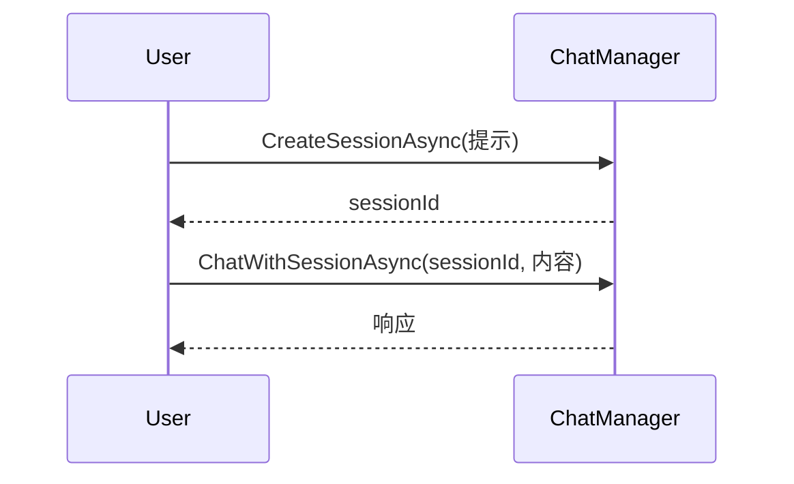
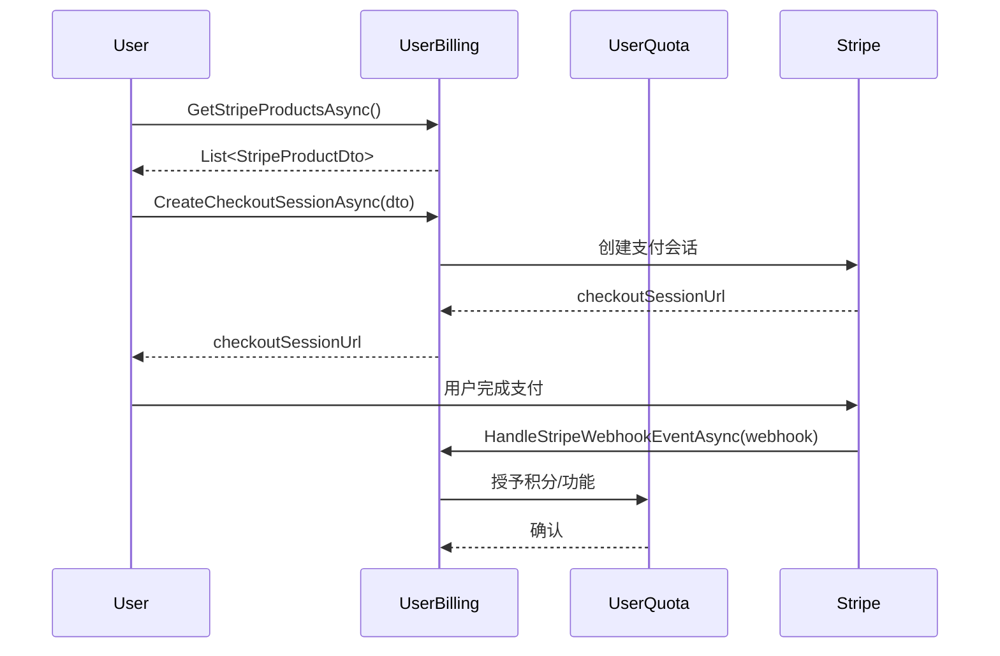
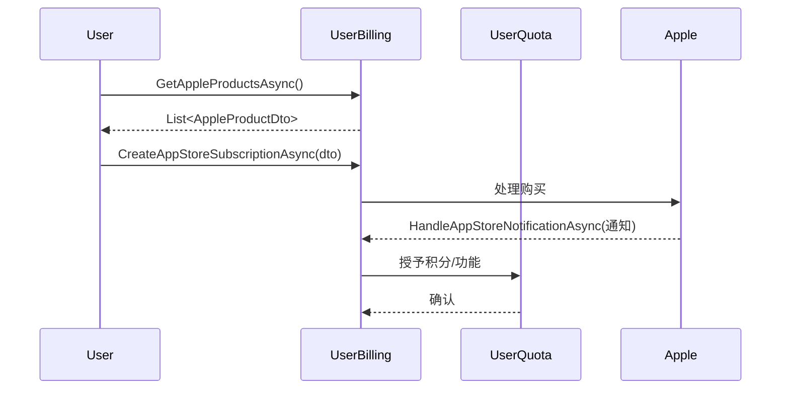
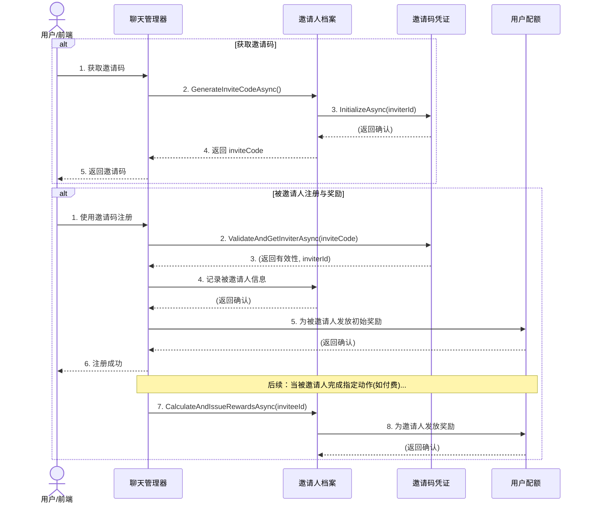

## 1. 概述

本需求旨在完成用户邀请码的**生成**与**兑换**核心流程的后端逻辑。该系统允许用户生成邀请码，并允许新用户在注册72小时内使用该邀请码完成兑换，以记录邀请关系。成功兑换后，被邀请者将获得7天的订阅体验。

**核心概念澄清**:
- **邀请码的生命周期**: 邀请码一经生成，**永久有效**，不会因时间流逝而失效。
- **被邀请人的兑换窗口**: 新注册的用户（被邀请人）必须在**注册后的72小时内**完成邀请码的兑换。超出此窗口，将无法兑换。

**范围说明**: 
- 本需求**不包含**对邀请人进行后续奖励的逻辑。
- 本需求**包含**为成功兑换的被邀请人发放初始奖励（7天订阅体验）的标记，但具体实现将以 `TODO` 形式在代码中标记。

## 2. 业务流程分析

根据提供的系统交互图，我们将业务流程分解为两个主要部分：**获取邀请码** 和 **被邀请人注册**。

### 2.1 获取邀请码 (Inviter Flow)

1.  **入口点**: `ChatManagerGAgent` 需暴露一个接口供前端调用，以启动邀请码生成流程。
2.  **核心逻辑**:
    -   `ChatManagerGAgent` 调用当前用户的 `IInvitationGAgent.GenerateInviteCodeAsync()`。
    -   `InvitationGAgent` 内部首先检查其 `InvitationState` 中是否已存在有效的 `InviteCode`。如果存在，则直接返回。
    -   如果不存在，则生成一个新的、唯一的邀请码字符串。
    -   `InvitationGAgent` 获取该邀请码对应的 `IInviteCodeGAgent` 实例，并调用 `InitializeAsync(inviterId)`，将邀请人ID注入 `InviteCodeState`，从而激活该邀请码。
    -   `InvitationGAgent` 将新生成的邀请码保存在自己的 `InvitationState` 中，并返回给 `ChatManagerGAgent`。
3.  **结果**: `ChatManagerGAgent` 将邀请码返回给前端。

### 2.2 被邀请人注册 (Invitee Flow)

1.  **入口点**: `ChatManagerGAgent` 需提供一个接口，供新用户（被邀请人）输入邀请码进行兑换。
2.  **核心逻辑**:
    -   `ChatManagerGAgent` 获取邀请码对应的 `IInviteCodeGAgent` 实例。
    -   调用 `IInviteCodeGAgent.ValidateAndGetInviterAsync()`。该方法仅验证邀请码是否存在且处于激活状态。
    -   如果邀请码有效，`ChatManagerGAgent` 获取到 `inviterId`，并继续调用当前用户的 `IUserQuotaGrain.RedeemInitialRewardAsync()`。
    -   `IUserQuotaGrain.RedeemInitialRewardAsync()` 内部将进行**时间窗口校验**（判断当前用户注册是否在72小时内）。
    -   如果所有校验通过，`ChatManagerGAgent` 调用 `inviterId` 对应的 `IInvitationGAgent` 的 `RecordNewInviteeAsync` 方法，记录被邀请人信息。
3.  **结果**: `ChatManagerGAgent` 向被邀请人确认注册/邀请兑换成功。

## 3. 系统改造点 (Grains 详细设计)

为实现上述流程，需对以下 Grains 进行具体实现与改造。

### 3.1 `InvitationGAgent` (邀请人档案)

#### 接口实现细节

-   **`Task<string> GenerateInviteCodeAsync()`**
    -   **逻辑**:
        1.  检查 `State.InviteCode` 是否已存在且有效。如果存在，直接返回。
        2.  **生成邀请码**: 调用内部辅助方法 `GenerateUniqueCodeAsync()` 生成唯一邀请码 (详见 **3.1.1**)。
        3.  获取 `IInviteCodeGAgent` (key: new invite code)。
        4.  调用 `inviteCodeGrain.InitializeAsync(this.GetPrimaryKeyString())`。
        5.  将新邀请码存入 `State.InviteCode` 并写入状态。
        6.  返回邀请码。

-   **`Task RecordNewInviteeAsync(string inviteeId)` (新增)**
    -   **目的**: 记录一个成功使用邀请码的新用户。
    -   **逻辑**:
        1.  检查 `State.Invitees` 是否已包含 `inviteeId`，避免重复记录。
        2.  创建一个新的 `InviteeInfo` 实例。
        3.  填充字段: `InviteeId = inviteeId`, `InvitedAt = DateTime.UtcNow`, `HasCompletedChat = false`, `HasPaid = false`, `RewardIssued = false`。
        4.  将该实例添加到 `State.Invitees` 字典中。
        5.  更新 `State.TotalInvites`。
        6.  写入状态。

#### 3.1.1 邀请码生成策略 (新增)

**核心思路**: 基于毫秒级UTC时间戳生成一个唯一的7位邀请码（字符集 `0-9a-zA-Z`）。

- **步骤1: 获取时间戳**
  - 获取当前UTC时间的毫秒级时间戳。
- **步骤2: 转换为Base62**
  - 将时间戳转换为62进制的字符串。这将自然地产生一个由 `0-9`、`a-z`、`A-Z` 组成的编码。
- **步骤3: 冲突处理 (判重与递增)**
  - 虽然时间戳基本唯一，但为处理极低概率的并发冲突，需要设计一个循环判重机制。
  - **伪代码**:
    ```csharp
    private async Task<string> GenerateUniqueCodeAsync()
    {
        long timestamp = DateTimeOffset.UtcNow.ToUnixTimeMilliseconds();
        while (true)
        {
            string code = ToBase62(timestamp); // 内部实现转换逻辑
            
            // 使用CommonHelper将字符串code转化为GUID
            Guid codeGrainId = CommonHelper.StringToGuid(code);
            var codeGrain = GrainFactory.GetGrain<IInviteCodeGAgent>(codeGrainId);
            var isUsed = await codeGrain.IsInitialized(); // IInviteCodeGAgent需新增IsInitialized接口
            
            if (!isUsed)
            {
                return code; // 如果未使用，则返回
            }
            
            // 如果冲突，时间戳+1，继续循环
            timestamp++; 
        }
    }
    ```
- **特点**:
  - **唯一性**: 时间戳递增保证了码的唯一性，冲突处理机制提供了最终保障。
  - **长度可控**: 生成的码长度相对固定（7位左右），适合作为邀请码使用。
  - **可逆性**: 邀请码可以被解码回其原始的时间戳（如果需要此功能）。

### 3.2 `InviteCodeGAgent` (邀请码凭证)

#### 接口实现细节

-   **`Task<bool> InitializeAsync(string inviterId)`**
    -   **逻辑**:
        1.  设置 `State.InviterId = inviterId`。
        2.  设置 `State.CreatedAt = DateTime.UtcNow`。
        3.  设置 `State.IsActive = true`。
        4.  写入状态。

-   **`Task<(bool isValid, string inviterId)> ValidateAndGetInviterAsync()`**
    -   **逻辑**:
        1.  检查 `State.IsActive` 是否为 `true` 并且 `State.InviterId` 是否已设置。
        2.  如果都满足，返回 `(true, State.InviterId)`。
        3.  否则，返回 `(false, null)`。

-   **`Task<bool> IsInitialized()` (新增)
    -   **目的**: 用于生成邀请码时的判重，检查该Grain是否已经被初始化。
    -   **逻辑**: Grain在被`InitializeAsync`调用前，其`State.InviterId`应为`null`。因此，此方法只需返回`Task.FromResult(State.InviterId != null)`即可，无需修改`State`定义。

### 3.3 `UserQuotaGrain` (用户配额)

#### 新增接口提议
-   **`Task RedeemInitialRewardAsync()`**
    -   **目的**: 为符合条件的被邀请人记录邀请关系，并为其未来的初始奖励预留标记。
    -   **先决条件**: `UserQuotaState` 必须包含用户的注册时间 (`CreatedAt`) 和一个标记是否可领取邀请奖励的状态 (`CanReceiveInviteReward`)。
    -   **校验逻辑**:
        1.  检查 `State.CanReceiveInviteReward` 是否为 `true`。如果为 `false`，则直接返回错误（如：已兑换过或已过期）。
        2.  检查当前时间是否在用户注册时间 (`State.CreatedAt`) 的**72小时之内**。如果超出，则将 `State.CanReceiveInviteReward` 设为 `false`，写入状态，并返回错误（如：已超出兑换有效期）。
    -   **执行逻辑**:
        1.  如果所有校验通过，将 `State.CanReceiveInviteReward` 设为 `false`，以确保奖励只能被触发一次。
        2.  `// TODO: 此处为发放初始奖励（7天订阅体验）的业务逻辑预留位置。`
        3.  写入状态。

### 3.4 `ChatManagerGAgent` (流程协调者)

#### API 入口改造

-   **`POST /api/app/invitation/code` (生成邀请码)**
    -   内部调用 `IInvitationGAgent.GenerateInviteCodeAsync()`。
-   **`POST /api/app/invitation/redeem` (兑换邀请码)**
    -   接收参数: `string inviteCode`。
    -   **编排逻辑**:
        1.  **翻译**: 调用 `CommonHelper.StringToGuid(inviteCode)` 获取GrainId。
        2.  **激活**: 调用 `GrainFactory.GetGrain<IInviteCodeGAgent>(grainId)`。
        3.  **验证码有效性**: 调用 `inviteCodeGrain.ValidateAndGetInviterAsync()`。
        4.  **如果码无效**: 返回错误。
        5.  **如果码有效**:
            a. 获取 `inviterId`。
            b. **优先执行兑换资格校验**: 调用当前用户的 `IUserQuotaGrain.RedeemInitialRewardAsync()`。如果返回 `false`（例如，超出72小时窗口），则流程终止，返回错误。
            c. **记录邀请关系**: 调用 `inviterId` 对应的 `IInvitationGAgent.RecordNewInviteeAsync(currentUserId)`。
            d. 返回成功。


## 附件
# 系统交互工作流

本文档概述了系统主要组件之间的关键业务流程和交互。

---

## 1. 领域模型：关键类关系

系统的核心由几个关键的 "Grains"（代理）组成，它们负责特定的领域职责。

-   **`ChatManagerGAgent`**: 用户交互的中心协调器。
    -   *通信对象*：`UserBillingGrain`（处理支付和订阅）、`InvitationGAgent`（处理邀请相关事件）和 `UserQuotaGrain`（检查和更新用户的使用情况）。
-   **`UserBillingGrain`**: 管理所有与支付相关的逻辑。
    -   *通信对象*：`UserQuotaGrain`（在成功支付后授予积分/功能）以及外部服务如 **Stripe** 和 **Apple App Store**。
-   **`InvitationGAgent`**: 处理用户邀请和奖励系统。
    -   *通信对象*：`UserQuotaGrain`（向邀请人授予奖励）。
-   **`UserQuotaGrain`**: 跟踪用户的积分、功能和使用限制。它由其他 grain 更新，但不主动发起通信。

---

## 2. 核心聊天工作流

此工作流描述了基本的用户与聊天机器人交互。

1.  **用户 -> `ChatManager`**: 通过调用 `CreateSessionAsync(prompt)` 发起对话。
2.  **`ChatManager` -> 用户**: 返回一个唯一的 `sessionId`。
3.  **用户 -> `ChatManager`**: 使用 `ChatWithSessionAsync(sessionId, content)` 在会话中发送消息。
4.  **`ChatManager` -> 用户**: 返回聊天响应。



---

## 3. Stripe 订阅工作流 (网页端)

此流程描述了用户如何通过网页界面使用 Stripe 订阅计划。

1.  **用户 -> `UserBilling`**: 使用 `GetStripeProductsAsync()` 请求可用的订阅计划。
2.  **`UserBilling` -> 用户**: 返回 `StripeProductDto` 列表。
3.  **用户 -> `UserBilling`**: 选择一个计划并调用 `CreateCheckoutSessionAsync(dto)`。
4.  **`UserBilling` -> Stripe: 创建一个新的支付会话。
5.  **`UserBilling` -> 用户**: 从 Stripe 返回 `checkoutSessionUrl`。
6.  **用户 -> Stripe**: 被重定向到 Stripe 页面完成支付。
7.  **Stripe -> `UserBilling`**: 成功支付后，发送一个 webhook 通知 (`HandleStripeWebhookEventAsync`)。
8.  **`UserBilling` -> `UserQuota`**: 使用新的订阅功能/积分为用户账户充值。



---

## 4. Apple 应用内购买工作流

此流程描述了用户如何在 iOS/macOS 应用内进行购买。

1.  **用户 -> `UserBilling`**: 使用 `GetAppleProductsAsync()` 请求可用的产品。
2.  **`UserBilling` -> 用户**: 返回 `AppleProductDto` 列表。
3.  **用户 -> `UserBilling`**: 通过调用 `CreateAppStoreSubscriptionAsync(dto)` 发起购买。
4.  **`UserBilling` -> Apple**: 将购买请求转发到 App Store。
5.  **Apple -> `UserBilling`**: 发送服务器到服务器的通知 (`HandleAppStoreNotificationAsync`) 以确认交易。
6.  **`UserBilling` -> `UserQuota`**: 使用购买的物品更新用户账户。



---

## 5. 用户邀请工作流

此流程描述了用户如何邀请他人并获得奖励。该流程涉及两个核心Grain：`InvitationGAgent` 用于管理邀请人的整体状态，`InviteCodeGAgent` 用于管理每个邀请码的生命周期。

1.  **邀请人 (用户) -> `ChatManager`**: 请求一个唯一的邀请码。
2.  **`ChatManager` -> `InvitationGAgent`**: 为当前用户调用 `GenerateInviteCodeAsync()`。
3.  **`InvitationGAgent` -> `InviteCodeGAgent`**: 创建并初始化一个新的邀请码Grain，记录下邀请人ID `InitializeAsync(inviterId)`。
4.  **`InvitationGAgent` -> `ChatManager`**: 返回新生成的 `inviteCode`。
5.  **`ChatManager` -> 邀请人**: 返回 `inviteCode`。
6.  **邀请人 -> 被邀请人**: 通过带外方式分享 `inviteCode`。
7.  **被邀请人 -> `ChatManager`**: 使用邀请码注册，触发相应逻辑。
8.  **`ChatManager` -> `InviteCodeGAgent`**: 验证邀请码的有效性 `ValidateAndGetInviterAsync()`。
9.  **`InviteCodeGAgent` -> `ChatManager`**: 返回验证结果和邀请人ID。
10. **`ChatManager` -> `InvitationGAgent` (邀请人的)**: 记录被邀请人信息。
11. **`ChatManager` -> `UserQuotaGrain` (被邀请人的)**: 为新用户发放注册奖励（如试用期）。
12. **`ChatManager` -> `InvitationGAgent` (邀请人的)**: 在被邀请人完成特定行为（如首次聊天、付费）后，调用 `CalculateAndIssueRewardsAsync` 为邀请人计算并发放奖励。
13. **`InvitationGAgent` -> `UserQuotaGrain` (邀请人的)**: 增加邀请人的积分或配额。




</rewritten_file>

