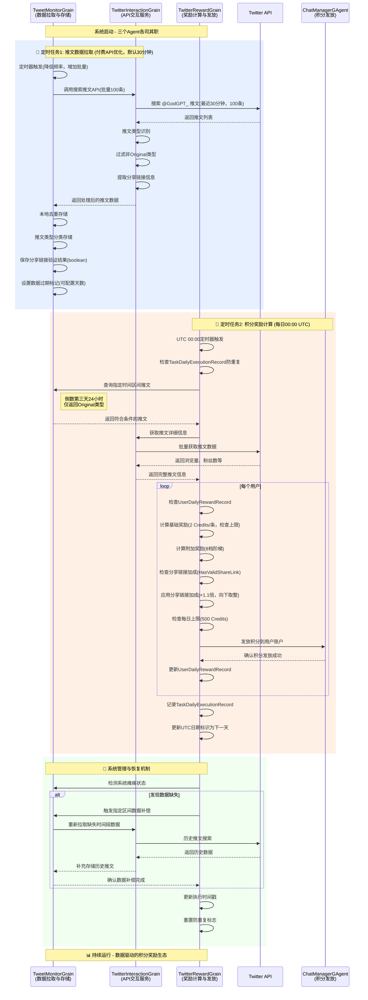
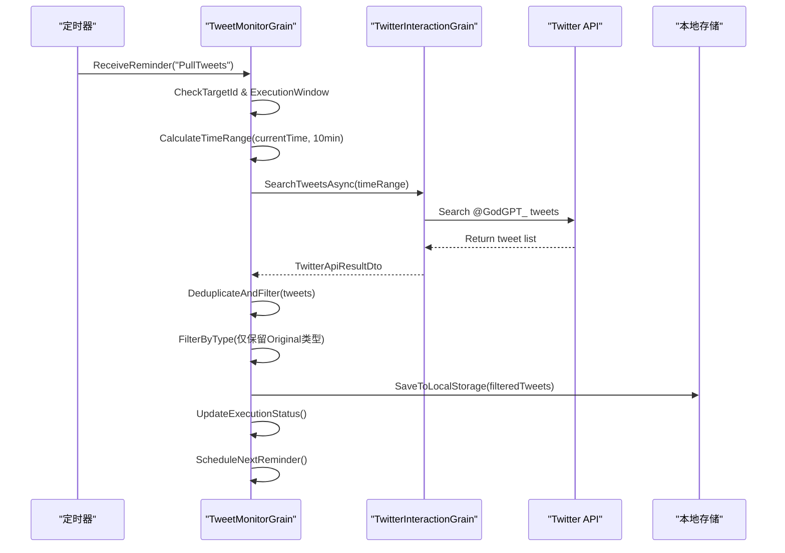
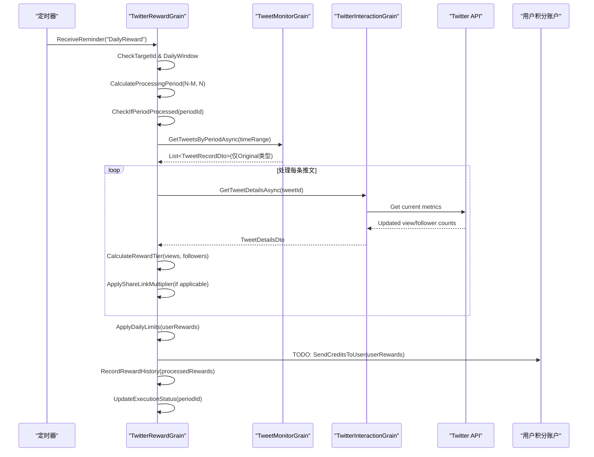
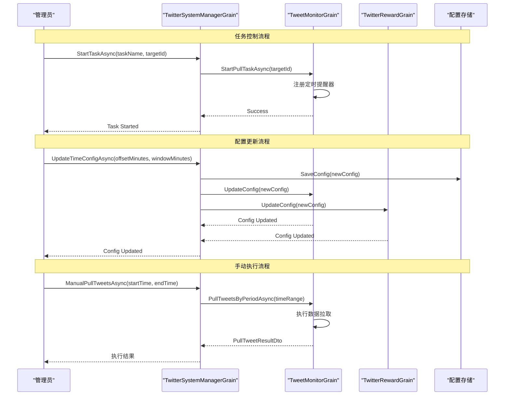
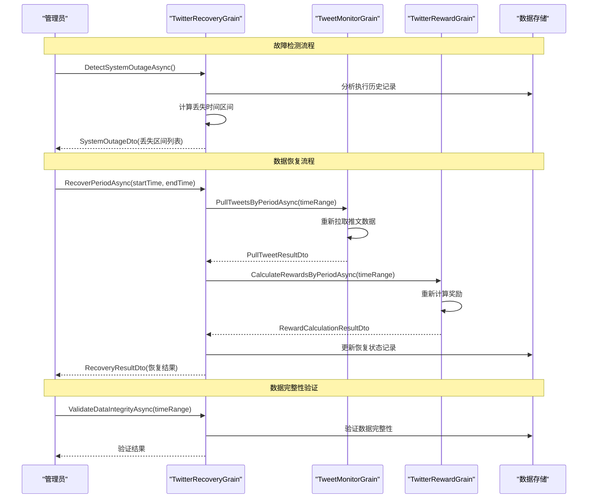
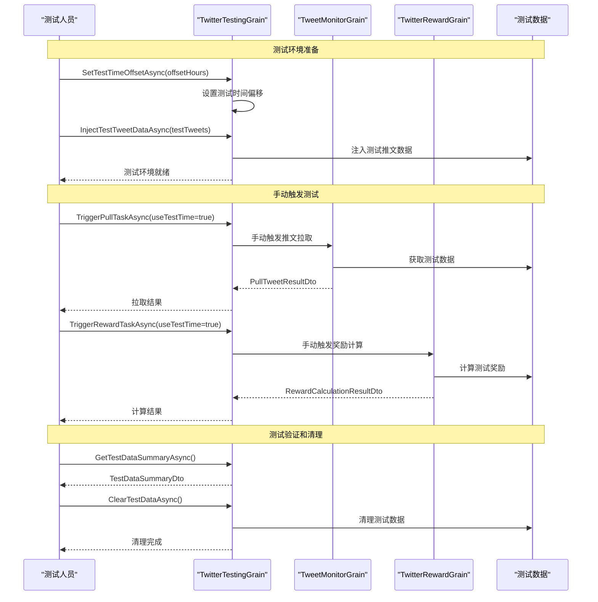

# REQ-003: Twitter Credits Reward System

## 需求概述

基于用户发送推特给用户奖励 GodGPT Credits 的系统，通过监控带有 @GodGPT_ 标签的推文，根据推文表现和用户粉丝数发放相应积分奖励。

## 技术约束

1. **架构约束**: 使用 `IGrainWithStringKey` 结构，不使用 `IChatManagerGAgent : IGAgent`
2. **模块化设计**: 功能划分合理，保持解耦合
3. **测试友好**: 时间区间需要考虑测试场景
4. **配置外置**: Twitter 交互所需的授权密钥等信息从配置文件获取
5. **开发阶段**: 积分发放暂时使用 TODO，重点计算推特ID和积分额度
6. **时间控制**: 使用UTC时间戳进行精确的时间控制和跨日检测
7. **系统恢复**: 支持系统瘫痪后的恢复和补偿机制
8. **日志**: 所有日志打印方式采用 $赋值,参考 Logger.LogWarning($"AAA: {B.C} DDD {E.F}");
9. **代码注释**: 代码注释使用英文

## 功能需求

### 4.1 基础奖励机制

- **触发条件**: 用户主动发布带有 `@GodGPT_` 的原创推文（TweetType.Original）
- **奖励额度**: 每条推文奖励 2 Credits
- **奖励上限**: 每用户最多 20 Credits（对应10条推文）
- **监控要求**: 系统监听 @GodGPT_ 的推文，记录推文ID、作者ID及发布时间
- **类型限制**: 仅限原创推文，不包括回复、转推、引用推文

### 4.2 附加奖励机制

- **执行时间**: 每日 00:00 UTC
- **检索范围**: 过去72-48小时之间（倒数第三天）的24小时内推文
- **筛选条件**: 
  - 带有 @GodGPT_ 标签的推文
  - 推文浏览量 views ≥ 20
  - **推文类型必须为 Original（原创推文）**
  - 排除 Reply（回复）、Retweet（转推）、Quote（引用推文）类型
- **奖励计算**: 根据【浏览量 + 粉丝数】档位发放 Credits

#### 奖励档位表

| 浏览量范围 | 粉丝数要求 | 奖励积分 |
|-----------|-----------|---------|
| 20-100 views | 10+ followers | 5 Credits |
| 100-300 views | 20+ followers | 10 Credits |
| 300-500 views | 30+ followers | 15 Credits |
| 500-1000 views | 50+ followers | 20 Credits |
| 1000-3000 views | 100+ followers | 30 Credits |
| 3000-5000 views | 300+ followers | 50 Credits |
| 5000-10000 views | 500+ followers | 80 Credits |
| 10000+ views | 1000+ followers | 120 Credits |

### 4.3 奖励调整规则

- **档位匹配**: 浏览量和粉丝数要求必须同时满足
- **向下调整**: 若满足浏览量区间但粉丝数未达要求，奖励按满足的最低档位发放
- **示例**: 推文1200 views，粉丝60 → 按"500-1000 views + 50+ followers"发放 20 Credits

### 4.4 分享链接加成

- **触发条件**: 推文包含有效的 godgpt 分享链接
- **链接格式**: `https://app.godgpt.fun/*`
- **加成倍数**: 所得积分 × 1.1（向下取整）
- **验证要求**: 需验证链接的有效性

### 4.5 每日限制

- **附加奖励上限**: 每用户每日最多获得 500 Credits 附加奖励
- **发放频次**: 每用户按天统计和发放，基础奖励和附加奖励一次性计算

### 4.6 数据保留

- **数据保存期**: 推文数据最多保存 5 天（可配置，默认5天）
- **记录内容**: 
  - 用户ID、推特ID、阅读数、用户粉丝数、发送时间
  - **推文类型**（Original/Reply/Retweet/Quote）- 支持未来功能扩展
  - 积分记录、处理状态、分享链接信息
  - UTC时间戳、处理时间戳等时间相关字段

### 4.7 推文类型过滤

- **监控范围**: 仅监控用户主动发送的推文，不包括回复推文
- **自我过滤**: 排除系统自身账号@自己发送的推文
- **类型标识**: 添加推文类型字段用于分类和扩展
- **内容验证**: 验证推文包含有效的 @GodGPT_ 标签

### 4.8 时间区间管理

- **区间定义**: 检索区间为 [当前UTC时间-N-M分钟, 当前UTC时间-N分钟]
- **配置参数**: 
  - N: 距离当前时间的起始偏移（默认：48小时=2880分钟）
  - M: 检索时间窗口长度（默认：24小时=1440分钟）
- **动态调整**: 支持运行时修改N和M参数
- **边界处理**: 确保时间区间不重叠，避免重复处理

## 系统架构设计

### 总体架构流程图



### Agent 分工详解

#### 🔄 Agent1: TwitterInteractionGrain  
- **设计理念**: 纯粹的API交互层，专注于与Twitter API的通信
- **核心职责**: 
  - 🔍 获取推文详情（浏览量、作者信息、发布时间）
  - 🏷️ 推文类型识别和过滤（Original/Reply/Retweet/Quote）
  - 🔗 提取和验证分享链接（检查是否包含app.godgpt.fun格式）
  - 🔐 Twitter API 认证管理和错误处理
- **交互模式**: 被动响应式，不包含定时任务逻辑
- **分享链接处理**: 提取链接信息供存储，验证有效性供奖励计算使用
- **设计优势**: 高内聚低耦合，便于API变更适配和单元测试

#### 📊 Agent2: TweetMonitorGrain  
- **设计理念**: 数据采集和存储中心，负责推文数据的生命周期管理
- **API优化策略**: 降低频率+增加批量+去重机制，充分利用付费账号优势
- **核心职责**:
  - ⏰ **定时任务1**: 可配置间隔批量拉取（默认30分钟/100条）
  - 🔄 本地去重保存，确保数据完整性（基于推文ID去重）
  - 📂 推文类型分类存储（仅保存Original类型用于奖励）
  - 🔗 保存分享链接验证结果（HasValidShareLink boolean值）
  - 🗑️ 数据清理（可配置保留期，默认5天自动删除）  
  - 📅 时间区间查询接口（支持UTC时间戳精确查询）
  - 🔧 支持按区间重新拉取数据（系统恢复机制）
- **数据流**: TweetMonitorGrain ↔ TwitterInteractionGrain ↔ Twitter API
- **配置灵活性**: 支持定时频率、批量大小和数据保留期的动态配置
- **设计优势**: 数据持久化层解耦，支持离线分析和系统恢复

#### 🎯 Agent3: TwitterRewardGrain
- **设计理念**: 奖励计算和发放引擎，严格控制奖励发放的时机和逻辑
- **核心职责**:
  - ⏰ **定时任务2**: 严格时间控制的奖励计算（每日00:00 UTC）
  - 🕒 UTC时间戳精确控制执行时机（基于UTC 0点日期标识）
  - 👤 **用户记录管理**: UserDailyRewardRecord追踪每用户每日领取状态
  - 📋 **任务记录管理**: TaskDailyExecutionRecord防重复执行机制
  - 💰 **奖励计算逻辑**: 基础奖励 + 附加奖励 + 分享链接加成(×1.1倍，向下取整)
  - 🛡️ **领取限制控制**: 基础奖励10条上限，附加奖励500 Credits上限
  - ⚙️ 可配置时间区间处理（支持N-M分钟灵活配置）
  - 🔄 系统瘫痪恢复支持（检测并补偿缺失数据）
  - 📈 积分发放历史追踪（完整审计记录）
- **业务流**: 检查记录 → 数据查询 → 奖励计算 → 积分发放 → 更新记录 → 日期更新
- **记录机制**: 基于UTC 0点时间戳的用户和任务状态管理
- **设计优势**: 业务逻辑集中管理，时间控制精确，支持系统级恢复

### 核心定时任务设计

#### 定时任务1: 推文数据拉取
- **执行频率**: 可配置间隔（默认10分钟）
- **执行逻辑**: 
  - 拉取最近一个间隔内的 @GodGPT_ 推文
  - 本地去重（基于推文ID）
  - 过滤推文类型（仅保留原创推文）
  - 排除自身账号推文
  - 验证分享链接并存储boolean结果
  - 更新本地存储
- **失败恢复**: 支持手动触发指定时间区间的数据拉取
- **配置灵活性**: 支持运行时修改拉取频率

#### 定时任务2: 积分奖励计算  
- **执行频率**: 每日00:00 UTC
- **时间控制**: 使用UTC时间戳进行精确控制
- **执行逻辑**:
  - 检查上次执行时间戳，防重复执行
  - 获取指定时间区间内的推文数据
  - 计算基础和附加奖励
  - 记录发送标志，避免重复发放
  - 更新执行时间戳
- **系统管理**:
  - 支持开启/停止定时任务
  - 支持修改时间区间参数
  - 支持手动触发指定区间的奖励计算

## 配置管理设计

### appsettings.json 配置文件
```json
{
  "TwitterReward": {
    "BearerToken": "...",
    "ApiKey": "...",
    "ApiSecret": "...",
    "MonitorHandle": "@GodGPT_",
    "ShareLinkDomain": "https://app.godgpt.fun",
    "SelfAccountId": "1234567890",
    
    // 定时任务配置 - 针对付费API优化
    "PullIntervalMinutes": 30,
    "PullBatchSize": 100,
    "PullSchedule": "*/30 * * * *",
    "RewardSchedule": "0 0 * * *",
    "EnablePullTask": true,
    "EnableRewardTask": true,
    
    // 时间区间配置
    "TimeOffsetMinutes": 2880,
    "TimeWindowMinutes": 1440,
    "TestTimeOffset": 0,
    
    // 数据管理配置
    "DataRetentionDays": 5,
    "MaxRetryAttempts": 3,
    "RetryDelayMinutes": 5,
    
    // ReminderTargetId版本控制
    "PullTaskTargetId": "12345678-1234-1234-1234-a00000000001",
    "RewardTaskTargetId": "12345678-1234-1234-1234-a00000000002"
  }
}
```

### TwitterRewardOptions 配置类
```csharp
public class TwitterRewardOptions
{
    public const string SectionName = "TwitterReward";
    
    // Twitter API 配置
    public string BearerToken { get; set; } = string.Empty;
    public string ApiKey { get; set; } = string.Empty;
    public string ApiSecret { get; set; } = string.Empty;
    public string MonitorHandle { get; set; } = "@GodGPT_";
    public string ShareLinkDomain { get; set; } = "https://app.godgpt.fun";
    public string SelfAccountId { get; set; } = string.Empty;
    
    // 定时任务配置
    public int PullIntervalMinutes { get; set; } = 30;
    public int PullBatchSize { get; set; } = 100;
    public string PullSchedule { get; set; } = "*/30 * * * *";
    public string RewardSchedule { get; set; } = "0 0 * * *";
    public bool EnablePullTask { get; set; } = true;
    public bool EnableRewardTask { get; set; } = true;
    
    // 时间区间配置
    public int TimeOffsetMinutes { get; set; } = 2880;  // 48小时
    public int TimeWindowMinutes { get; set; } = 1440;  // 24小时
    public int TestTimeOffset { get; set; } = 0;
    
    // 数据管理配置
    public int DataRetentionDays { get; set; } = 5;
    public int MaxRetryAttempts { get; set; } = 3;
    public int RetryDelayMinutes { get; set; } = 5;
    
    // ReminderTargetId版本控制
    public string PullTaskTargetId { get; set; } = "12345678-1234-1234-1234-a00000000001";
    public string RewardTaskTargetId { get; set; } = "12345678-1234-1234-1234-a00000000002";
}
```

### 依赖注入配置注册
```csharp
// 在 Startup.cs 或 Program.cs 中注册
public void ConfigureServices(IServiceCollection services)
{
    // 注册Twitter奖励配置
    services.Configure<TwitterRewardOptions>(
        Configuration.GetSection(TwitterRewardOptions.SectionName));
    
    // 其他服务注册...
}
```

### 在Grain中使用配置
```csharp
public class TwitterRewardGrain : IGrainWithStringKey, ITwitterRewardGrain
{
    private readonly TwitterRewardOptions _options;
    
    public TwitterRewardGrain(IOptions<TwitterRewardOptions> options)
    {
        _options = options.Value;
    }
    
    public async Task CalculateRewardsAsync()
    {
        // 使用配置参数
        var pullInterval = _options.PullIntervalMinutes;
        var batchSize = _options.PullBatchSize;
        var retentionDays = _options.DataRetentionDays;
        var timeOffset = _options.TimeOffsetMinutes;
        
        // 业务逻辑...
    }
}

public class TweetMonitorGrain : IGrainWithStringKey, ITweetMonitorGrain
{
    private readonly TwitterRewardOptions _options;
    
    public TweetMonitorGrain(IOptions<TwitterRewardOptions> options)
    {
        _options = options.Value;
    }
    
    public async Task StartPullTaskAsync()
    {
        // 使用配置参数
        if (!_options.EnablePullTask)
        {
            return; // 任务被禁用
        }
        
        var intervalMinutes = _options.PullIntervalMinutes;
        var batchSize = _options.PullBatchSize;
        var targetId = _options.PullTaskTargetId;
        
        // 启动定时任务...
    }
}

public class TwitterInteractionGrain : IGrainWithStringKey, ITwitterInteractionGrain
{
    private readonly TwitterRewardOptions _options;
    
    public TwitterInteractionGrain(IOptions<TwitterRewardOptions> options)
    {
        _options = options.Value;
    }
    
    public async Task<List<TweetDto>> SearchTweetsAsync()
    {
        // 使用配置参数
        var bearerToken = _options.BearerToken;
        var monitorHandle = _options.MonitorHandle;
        var batchSize = _options.PullBatchSize;
        var selfAccountId = _options.SelfAccountId;
        
        // Twitter API 调用...
    }
}
```

### 配置验证和默认值管理
```csharp
public class TwitterRewardOptionsValidator : IValidateOptions<TwitterRewardOptions>
{
    public ValidateOptionsResult Validate(string name, TwitterRewardOptions options)
    {
        if (string.IsNullOrEmpty(options.BearerToken))
        {
            return ValidateOptionsResult.Fail("Twitter BearerToken is required");
        }
        
        if (options.PullIntervalMinutes < 1 || options.PullIntervalMinutes > 1440)
        {
            return ValidateOptionsResult.Fail("PullIntervalMinutes must be between 1 and 1440");
        }
        
        if (options.PullBatchSize < 1 || options.PullBatchSize > 500)
        {
            return ValidateOptionsResult.Fail("PullBatchSize must be between 1 and 500");
        }
        
        if (options.DataRetentionDays < 1 || options.DataRetentionDays > 30)
        {
            return ValidateOptionsResult.Fail("DataRetentionDays must be between 1 and 30");
        }
        
        return ValidateOptionsResult.Success;
    }
}

// 在依赖注入中注册验证器
services.AddSingleton<IValidateOptions<TwitterRewardOptions>, TwitterRewardOptionsValidator>();
```

### 配置热更新支持
```csharp
public class TwitterRewardGrain : IGrainWithStringKey, ITwitterRewardGrain
{
    private readonly IOptionsMonitor<TwitterRewardOptions> _optionsMonitor;
    
    public TwitterRewardGrain(IOptionsMonitor<TwitterRewardOptions> optionsMonitor)
    {
        _optionsMonitor = optionsMonitor;
    }
    
    public async Task CalculateRewardsAsync()
    {
        // 获取最新配置（支持热更新）
        var options = _optionsMonitor.CurrentValue;
        
        var retentionDays = options.DataRetentionDays;
        var timeOffset = options.TimeOffsetMinutes;
        
        // 业务逻辑...
    }
}
```

## 数据模型

### TweetRecord
```csharp
public class TweetRecord
{
    public string TweetId { get; set; }
    public string AuthorId { get; set; }
    public string AuthorHandle { get; set; }
    public DateTime CreatedAt { get; set; }
    public int CreatedAtTimestamp { get; set; }  // UTC时间戳(秒)
    public TweetType Type { get; set; }          // 推文类型 - 关键字段，支持未来扩展
    public int ViewCount { get; set; }
    public int FollowerCount { get; set; }
    public bool HasValidShareLink { get; set; }  // 是否包含有效分享链接(boolean，优化存储)
    public bool IsProcessed { get; set; }        // 是否已处理
    public int ProcessedTimestamp { get; set; }  // 处理时间戳
    public int DataRetentionExpiry { get; set; } // 数据过期时间戳(可配置天数后)
}

public enum TweetType
{
    Original = 0,    // 原创推文
    Reply = 1,       // 回复推文
    Retweet = 2,     // 转推
    Quote = 3        // 引用推文
}
```

### RewardRecord
```csharp
public class RewardRecord
{
    public string UserId { get; set; }
    public DateTime RewardDate { get; set; }
    public int RewardDateTimestamp { get; set; }     // UTC时间戳(秒)
    public int BaseRewards { get; set; }
    public int BonusRewards { get; set; }
    public int TotalRewards { get; set; }
    public List<string> ProcessedTweetIds { get; set; }
    public bool IsSent { get; set; }                 // 是否已发送
    public int SentTimestamp { get; set; }           // 发送时间戳
    public string ProcessingPeriod { get; set; }     // 处理区间标识
}
```

### TaskExecutionRecord
```csharp
public class TaskExecutionRecord
{
    public string TaskName { get; set; }
    public int LastExecutionTimestamp { get; set; }  // 上次执行时间戳
    public int LastSuccessTimestamp { get; set; }    // 上次成功时间戳
    public string LastProcessedPeriod { get; set; }  // 上次处理的时间区间
    public bool IsEnabled { get; set; }              // 任务是否启用
    public int RetryCount { get; set; }              // 重试次数
    public string LastError { get; set; }            // 最后一次错误信息
}
```

### UserDailyRewardRecord - 用户每日领取记录
```csharp
public class UserDailyRewardRecord
{
    public string UserId { get; set; }
    public int UtcDateTimestamp { get; set; }        // UTC 0点时间戳作为日期标识
    public int BaseTweetCount { get; set; }          // 当天已领取基础奖励的推文数
    public int BaseTotalRewards { get; set; }        // 当天基础奖励总计
    public bool HasReceivedBonusReward { get; set; } // 是否已领取当天附加奖励
    public int BonusTotalRewards { get; set; }       // 当天附加奖励总计
    public List<string> ProcessedTweetIds { get; set; } // 已处理的推文ID列表
    public int CreatedTimestamp { get; set; }        // 记录创建时间戳
    public int UpdatedTimestamp { get; set; }        // 记录更新时间戳
}
```

### TaskDailyExecutionRecord - 任务每日执行记录
```csharp
public class TaskDailyExecutionRecord
{
    public string TaskName { get; set; }             // 任务名称（如"RewardCalculation"）
    public int UtcDateTimestamp { get; set; }        // UTC 0点时间戳作为日期标识
    public bool IsExecuted { get; set; }             // 当天是否已执行
    public int ExecutionTimestamp { get; set; }      // 执行时间戳
    public bool IsSuccessful { get; set; }           // 是否执行成功
    public int ProcessedUserCount { get; set; }      // 处理的用户数量
    public int TotalRewardsSent { get; set; }        // 发送的总奖励数
    public string ProcessingPeriod { get; set; }     // 处理的时间区间标识
    public string ErrorMessage { get; set; }         // 错误信息（如有）
}
```

### TimeRange
```csharp
public class TimeRange
{
    public int StartTimestamp { get; set; }    // 开始时间戳
    public int EndTimestamp { get; set; }      // 结束时间戳
    public string PeriodId { get; set; }       // 区间唯一标识
    
    // 根据当前时间和配置计算时间区间
    public static TimeRange CalculateRange(int currentTimestamp, int offsetMinutes, int windowMinutes)
    {
        var endTimestamp = currentTimestamp - (offsetMinutes * 60);
        var startTimestamp = endTimestamp - (windowMinutes * 60);
        
        return new TimeRange
        {
            StartTimestamp = startTimestamp,
            EndTimestamp = endTimestamp,
            PeriodId = $"{startTimestamp}-{endTimestamp}"
        };
    }
}
```

### UtcDateHelper - UTC日期时间戳工具类
```csharp
public static class UtcDateHelper
{
    /// <summary>
    /// 获取当前UTC日期的0点时间戳
    /// </summary>
    public static int GetCurrentUtcDateTimestamp()
    {
        var utcNow = DateTime.UtcNow;
        var utcDate = new DateTime(utcNow.Year, utcNow.Month, utcNow.Day, 0, 0, 0, DateTimeKind.Utc);
        return (int)((DateTimeOffset)utcDate).ToUnixTimeSeconds();
    }
    
    /// <summary>
    /// 获取下一个UTC日期的0点时间戳
    /// </summary>
    public static int GetNextUtcDateTimestamp(int currentUtcDateTimestamp)
    {
        return currentUtcDateTimestamp + (24 * 60 * 60); // 加24小时
    }
    
    /// <summary>
    /// 检查时间戳是否为今天UTC日期
    /// </summary>
    public static bool IsToday(int utcDateTimestamp)
    {
        return utcDateTimestamp == GetCurrentUtcDateTimestamp();
    }
    
    /// <summary>
    /// 从UTC时间戳转换为可读日期字符串
    /// </summary>
    public static string ToDateString(int utcDateTimestamp)
    {
        var dateTime = DateTimeOffset.FromUnixTimeSeconds(utcDateTimestamp).DateTime;
        return dateTime.ToString("yyyy-MM-dd UTC");
    }
}
```

## 推文类型字段的重要性与扩展性

### 当前核心用途
- **奖励机制筛选**: 推文类型是奖励发放的核心筛选条件，只有 `TweetType.Original` 类型的推文才能获得积分
- **反刷分保护**: 防止用户通过回复、转推等方式恶意刷取积分，确保奖励机制的公平性
- **数据完整性**: 为所有推文记录完整的类型信息，支持后续分析和处理

### 未来扩展潜力
- **差异化奖励策略**: 
  - 为不同类型推文设置不同的奖励倍率
  - 引入转推、回复的二级奖励机制
  - 基于推文类型的营销活动策划
  
- **用户行为分析**:
  - 分析用户在不同推文类型上的表现差异
  - 追踪用户互动偏好和参与模式
  - 生成用户画像和行为报告
  
- **营销效果评估**:
  - 评估不同推文类型的传播效果
  - 分析原创内容vs转发内容的影响力
  - 优化内容策略和用户激励机制

### 数据分析价值
- **内容质量评估**: 通过推文类型分析内容的原创性和质量
- **社交影响力测量**: 区分直接影响(原创)和间接影响(转发/回复)
- **参与度深度分析**: 了解用户在不同互动类型上的活跃程度
- **竞争对手分析**: 对比不同推文类型在行业中的表现

### 技术实现保障
- **存储优化**: 推文类型字段占用空间小，但提供强大的筛选和分析能力
- **查询效率**: 支持基于推文类型的高效索引和查询
- **向前兼容**: 设计支持未来新增推文类型的扩展需求
- **测试覆盖**: 推文类型识别和处理逻辑的全面测试保障

## 测试考虑

### 时间相关测试
- **配置化时间偏移**: 支持测试环境时间偏移
- **模拟时间区间**: 支持模拟不同时间段的推文数据
- **定时任务测试**: 支持手动触发定时任务进行测试

### 边界条件测试
- **积分上限验证**: 测试每日积分上限机制
- **重复处理防护**: 测试同一推文不会重复发放积分
- **API异常处理**: 测试Twitter API异常情况的处理

## 实施计划

### Phase 1: 基础架构
- 创建三个 Grain 的基础结构
- 实现配置管理
- 建立数据模型

### Phase 2: Twitter 集成
- 实现 Twitter API 交互
- 推文监控和数据存储
- 分享链接验证

### Phase 3: 奖励计算
- 实现奖励计算逻辑
- 每日限制和重复防护
- 定时任务调度

### Phase 4: 测试和优化
- 完善测试覆盖
- 性能优化
- 监控和日志

## 系统管理功能

### 定时任务控制
- **开启定时任务**: 通过配置或事件启用特定定时任务
- **停止定时任务**: 安全停止定时任务，保证数据完整性
- **修改执行区间**: 动态调整时间偏移和窗口参数
- **手动触发**: 支持手动触发指定时间区间的任务执行

### 系统恢复机制
- **瘫痪检测**: 通过时间戳监控检测系统异常停机
- **数据补偿**: 支持按时间区间重新拉取和处理数据
- **状态恢复**: 从上次成功执行点恢复任务状态
- **重复防护**: 通过唯一标识防止重复处理和发放

### UTC时间戳控制
- **精确时机**: 使用UTC秒级时间戳进行精确控制
- **跨日检测**: 基于UTC时间戳的准确跨日边界检测
- **版本控制**: ReminderTargetId机制确保单实例执行
- **状态追踪**: 记录每个阶段的执行时间戳

### 管理接口设计
```csharp
// 系统管理事件
public class TwitterTaskControlGEvent : EventBase
{
    public string TaskName { get; set; }        // 任务名称
    public TaskControlAction Action { get; set; } // 控制动作
    public int TimeOffsetMinutes { get; set; }   // 时间偏移
    public int TimeWindowMinutes { get; set; }   // 时间窗口
    public string TargetPeriod { get; set; }     // 目标处理区间
}

public enum TaskControlAction
{
    Start,           // 启动任务
    Stop,            // 停止任务
    UpdateConfig,    // 更新配置
    ManualTrigger,   // 手动触发
    RecoverPeriod    // 恢复指定区间
}
```

## 详细业务流程设计

### 流程1: 推文数据拉取流程

#### 业务描述
每10分钟定时拉取最新的@GodGPT_推文，进行去重、分类、过滤后存储到本地。

#### 涉及类和接口

**主要Grain类**:
- `TweetMonitorGrain : IGrainWithStringKey, IRemindable`
- `TwitterInteractionGrain : IGrainWithStringKey`

**核心接口**:
```csharp
public interface ITweetMonitorGrain : IGrainWithStringKey
{
    // 定时任务控制
    Task<bool> StartPullTaskAsync(string targetId);
    Task<bool> StopPullTaskAsync();
    Task<TaskExecutionStatusDto> GetTaskStatusAsync();
    
    // 数据拉取
    Task<PullTweetResultDto> PullTweetsAsync(PullTweetRequestDto request);
    Task<PullTweetResultDto> PullTweetsByPeriodAsync(int startTimestamp, int endTimestamp);
    
    // 数据查询（仅返回Original类型推文）
    Task<List<TweetRecordDto>> GetTweetsByPeriodAsync(int startTimestamp, int endTimestamp);
    Task<List<TweetRecordDto>> GetUnprocessedTweetsAsync(int maxCount = 100);
    
    // 数据管理
    Task<int> CleanupExpiredDataAsync();
    Task<DataStatisticsDto> GetDataStatisticsAsync();
}

public interface ITwitterInteractionGrain : IGrainWithStringKey
{
    // Twitter API 交互
    Task<TwitterApiResultDto> SearchTweetsAsync(SearchTweetsRequestDto request);
    Task<TweetDetailsDto> GetTweetDetailsAsync(string tweetId);
    Task<UserInfoDto> GetUserInfoAsync(string userId);
    Task<bool> ValidateShareLinkAsync(string url);
    
    // 推文类型识别和过滤
    Task<TweetType> DetermineTweetTypeAsync(string tweetId);
    Task<bool> IsOriginalTweetAsync(string tweetId);
}
```

**请求/响应DTO**:
```csharp
public class PullTweetRequestDto
{
    public int StartTimestamp { get; set; }
    public int EndTimestamp { get; set; }
    public int MaxResults { get; set; } = 100;
    public bool ForceRefresh { get; set; } = false;
    public List<TweetType> AllowedTypes { get; set; } = new List<TweetType> { TweetType.Original }; // 默认仅原创推文
}

public class PullTweetResultDto
{
    public bool Success { get; set; }
    public int TotalFound { get; set; }
    public int NewTweets { get; set; }
    public int DuplicateSkipped { get; set; }
    public int FilteredOut { get; set; }
    public int TypeFilteredOut { get; set; }        // 因推文类型被过滤的数量
    public Dictionary<TweetType, int> TypeStatistics { get; set; } // 各类型推文统计
    public List<string> ProcessedTweetIds { get; set; }
    public string ErrorMessage { get; set; }
    public int ProcessingTimestamp { get; set; }
}

public class TaskExecutionStatusDto
{
    public string TaskName { get; set; }
    public bool IsEnabled { get; set; }
    public bool IsRunning { get; set; }
    public int LastExecutionTimestamp { get; set; }
    public int LastSuccessTimestamp { get; set; }
    public int NextScheduledTimestamp { get; set; }
    public int RetryCount { get; set; }
    public string LastError { get; set; }
}
```

#### 执行步骤泳道图



### 流程2: 积分奖励计算流程

#### 业务描述
每日00:00 UTC执行，获取指定时间区间内的推文，计算基础和附加奖励，记录发送状态。

#### 涉及类和接口

**主要Grain类**:
- `TwitterRewardGrain : IGrainWithStringKey, IRemindable`
- `TweetMonitorGrain : IGrainWithStringKey`
- `TwitterInteractionGrain : IGrainWithStringKey`

**核心接口**:
```csharp
public interface ITwitterRewardGrain : IGrainWithStringKey
{
    // 定时任务控制
    Task<bool> StartRewardTaskAsync(string targetId);
    Task<bool> StopRewardTaskAsync();
    Task<TaskExecutionStatusDto> GetTaskStatusAsync();
    
    // 奖励计算
    Task<RewardCalculationResultDto> CalculateRewardsAsync(RewardCalculationRequestDto request);
    Task<RewardCalculationResultDto> CalculateRewardsByPeriodAsync(int startTimestamp, int endTimestamp);
    
    // 奖励查询
    Task<List<RewardRecordDto>> GetRewardHistoryAsync(string userId, int days = 30);
    Task<RewardStatisticsDto> GetRewardStatisticsAsync(int startTimestamp, int endTimestamp);
    
    // 系统管理
    Task<bool> UpdateTimeConfigAsync(int offsetMinutes, int windowMinutes);
    Task<List<string>> GetProcessedPeriodsAsync(int days = 7);
}
```

**请求/响应DTO**:
```csharp
public class RewardCalculationRequestDto
{
    public int StartTimestamp { get; set; }
    public int EndTimestamp { get; set; }
    public bool ForceRecalculate { get; set; } = false;
    public List<string> TargetUserIds { get; set; } // 可选，指定用户
}

public class RewardCalculationResultDto
{
    public bool Success { get; set; }
    public int ProcessedTweets { get; set; }
    public int AffectedUsers { get; set; }
    public int TotalBaseRewards { get; set; }
    public int TotalBonusRewards { get; set; }
    public int TotalCreditsAwarded { get; set; }
    public List<UserRewardDto> UserRewards { get; set; }
    public string ProcessingPeriod { get; set; }
    public string ErrorMessage { get; set; }
    public int CalculationTimestamp { get; set; }
}

public class UserRewardDto
{
    public string UserId { get; set; }
    public string UserHandle { get; set; }
    public int BaseRewards { get; set; }
    public int BonusRewards { get; set; }
    public int TotalRewards { get; set; }
    public int ProcessedTweetCount { get; set; }
    public List<TweetRewardDetailDto> TweetDetails { get; set; }
    public bool RewardsSent { get; set; }
}

public class TweetRewardDetailDto
{
    public string TweetId { get; set; }
    public int ViewCount { get; set; }
    public int FollowerCount { get; set; }
    public int BaseReward { get; set; }
    public int BonusReward { get; set; }
    public bool HasShareLink { get; set; }
    public double ShareLinkMultiplier { get; set; }
    public int FinalReward { get; set; }
    public string RewardTier { get; set; }
}
```

#### 执行步骤泳道图



### 流程3: 系统管理控制流程

#### 业务描述
通过管理接口控制定时任务的开启、停止、配置修改等操作。

#### 执行步骤泳道图



#### 涉及类和接口

**管理接口**:
```csharp
public interface ITwitterSystemManagerGrain : IGrainWithStringKey
{
    // 任务控制
    Task<bool> StartTaskAsync(string taskName, string targetId);
    Task<bool> StopTaskAsync(string taskName);
    Task<List<TaskExecutionStatusDto>> GetAllTaskStatusAsync();
    
    // 配置管理
    Task<bool> UpdateTimeConfigAsync(string taskName, int offsetMinutes, int windowMinutes);
    Task<TwitterRewardConfigDto> GetCurrentConfigAsync();
    Task<bool> SetConfigAsync(TwitterRewardConfigDto config);
    
    // 手动执行
    Task<PullTweetResultDto> ManualPullTweetsAsync(int startTimestamp, int endTimestamp);
    Task<RewardCalculationResultDto> ManualCalculateRewardsAsync(int startTimestamp, int endTimestamp);
    
    // 系统状态
    Task<SystemHealthDto> GetSystemHealthAsync();
    Task<List<string>> GetProcessingHistoryAsync(int days = 7);
}
```

**配置和状态DTO**:
```csharp
public class TwitterRewardConfigDto
{
    public string MonitorHandle { get; set; }
    public string SelfAccountId { get; set; }
    public bool EnablePullTask { get; set; }
    public bool EnableRewardTask { get; set; }
    public int TimeOffsetMinutes { get; set; }
    public int TimeWindowMinutes { get; set; }
    public int DataRetentionDays { get; set; }
    public int MaxRetryAttempts { get; set; }
    public string PullTaskTargetId { get; set; }
    public string RewardTaskTargetId { get; set; }
}

public class SystemHealthDto
{
    public bool IsHealthy { get; set; }
    public DateTime LastUpdateTime { get; set; }
    public int ActiveTasks { get; set; }
    public int PendingTweets { get; set; }
    public int PendingRewards { get; set; }
    public List<string> Warnings { get; set; }
    public List<string> Errors { get; set; }
    public Dictionary<string, object> Metrics { get; set; }
}
```

### 流程4: 数据恢复补偿流程

#### 业务描述
系统故障后，检测丢失的时间区间，支持按区间重新拉取和处理数据。

#### 执行步骤泳道图



#### 涉及类和接口

**恢复接口**:
```csharp
public interface ITwitterRecoveryGrain : IGrainWithStringKey
{
    // 故障检测
    Task<List<MissingPeriodDto>> DetectMissingPeriodsAsync(int startTimestamp, int endTimestamp);
    Task<SystemOutageDto> DetectSystemOutageAsync();
    
    // 数据恢复
    Task<RecoveryResultDto> RecoverPeriodAsync(int startTimestamp, int endTimestamp);
    Task<RecoveryResultDto> RecoverMultiplePeriodsAsync(List<TimeRange> periods);
    
    // 状态验证
    Task<bool> ValidateDataIntegrityAsync(int startTimestamp, int endTimestamp);
    Task<DataIntegrityReportDto> GenerateIntegrityReportAsync(int days = 7);
}
```

**恢复相关DTO**:
```csharp
public class MissingPeriodDto
{
    public int StartTimestamp { get; set; }
    public int EndTimestamp { get; set; }
    public string PeriodId { get; set; }
    public string MissingType { get; set; } // "TweetData", "RewardCalculation", "Both"
    public int ExpectedTweetCount { get; set; }
    public int ActualTweetCount { get; set; }
    public bool HasRewardRecord { get; set; }
}

public class SystemOutageDto
{
    public bool OutageDetected { get; set; }
    public int OutageStartTimestamp { get; set; }
    public int OutageEndTimestamp { get; set; }
    public int OutageDurationMinutes { get; set; }
    public List<MissingPeriodDto> AffectedPeriods { get; set; }
    public string RecoveryPlan { get; set; }
}

public class RecoveryResultDto
{
    public bool Success { get; set; }
    public int RecoveredTweets { get; set; }
    public int RecalculatedRewards { get; set; }
    public int AffectedUsers { get; set; }
    public List<string> ProcessedPeriods { get; set; }
    public List<string> FailedPeriods { get; set; }
    public string ErrorMessage { get; set; }
    public int RecoveryTimestamp { get; set; }
}
```

## 独立测试接口设计

### 测试流程泳道图



### 测试专用接口
```csharp
public interface ITwitterTestingGrain : IGrainWithStringKey
{
    // 时间控制测试
    Task<bool> SetTestTimeOffsetAsync(int offsetHours);
    Task<int> GetCurrentTestTimestampAsync();
    Task<bool> SimulateTimePassageAsync(int minutes);
    
    // 数据模拟
    Task<bool> InjectTestTweetDataAsync(List<TweetRecordDto> testTweets);
    Task<bool> ClearTestDataAsync();
    Task<TestDataSummaryDto> GetTestDataSummaryAsync();
    
    // 任务触发测试
    Task<PullTweetResultDto> TriggerPullTaskAsync(bool useTestTime = true);
    Task<RewardCalculationResultDto> TriggerRewardTaskAsync(bool useTestTime = true);
    
    // 状态重置
    Task<bool> ResetAllTaskStatesAsync();
    Task<bool> ResetExecutionHistoryAsync();
}

public class TestDataSummaryDto
{
    public int TotalTestTweets { get; set; }
    public int TestUsers { get; set; }
    public Dictionary<string, int> TweetsByType { get; set; }
    public Dictionary<string, int> TweetsByTimeRange { get; set; }
    public int CurrentTestTimeOffset { get; set; }
    public bool IsTestModeActive { get; set; }
}
```

## 系统事件定义

### 控制事件
```csharp
[GenerateSerializer]
public class TwitterTaskControlGEvent : EventBase
{
    [Id(0)] public string TaskName { get; set; }
    [Id(1)] public TaskControlAction Action { get; set; }
    [Id(2)] public int TimeOffsetMinutes { get; set; }
    [Id(3)] public int TimeWindowMinutes { get; set; }
    [Id(4)] public string TargetPeriod { get; set; }
    [Id(5)] public string TargetId { get; set; }
}

[GenerateSerializer]
public class TwitterConfigUpdateGEvent : EventBase
{
    [Id(0)] public TwitterRewardConfigDto Config { get; set; }
    [Id(1)] public string UpdatedBy { get; set; }
    [Id(2)] public int UpdateTimestamp { get; set; }
}
```

### 状态事件
```csharp
[GenerateSerializer]
public class TweetPullCompletedSEvent : TwitterSEventBase
{
    [Id(0)] public PullTweetResultDto Result { get; set; }
    [Id(1)] public int ExecutionTimestamp { get; set; }
}

[GenerateSerializer]
public class RewardCalculationCompletedSEvent : TwitterSEventBase
{
    [Id(0)] public RewardCalculationResultDto Result { get; set; }
    [Id(1)] public string ProcessingPeriod { get; set; }
    [Id(2)] public int ExecutionTimestamp { get; set; }
}

[GenerateSerializer]
public class TaskConfigUpdatedSEvent : TwitterSEventBase
{
    [Id(0)] public string TaskName { get; set; }
    [Id(1)] public TwitterRewardConfigDto NewConfig { get; set; }
    [Id(2)] public int UpdateTimestamp { get; set; }
}
```

## 风险评估

1. **Twitter API 限制**: 需要考虑API调用频率限制和配额管理
2. **数据一致性**: 分布式环境下的数据一致性保证
3. **时区处理**: UTC时间和本地时间的正确处理
4. **异常恢复**: 系统异常时的数据恢复机制
5. **重复执行**: 防止系统重启后的重复任务执行
6. **时间偏移**: 测试环境和生产环境的时间配置管理

---

## 🔌 第三方对接指南

### 概述
本指南为第三方开发者提供完整的Twitter积分奖励系统集成方案，包括部署配置、API对接和运维管理等关键环节。

---

## 📋 部署配置指南

### 1. 配置文件设置

#### appsettings.json 必要配置
```json
{
  "TwitterReward": {
    // === Twitter API 配置 (必填) ===
    "BearerToken": "YOUR_TWITTER_BEARER_TOKEN",
    "ApiKey": "YOUR_TWITTER_API_KEY", 
    "ApiSecret": "YOUR_TWITTER_API_SECRET",
    "MonitorHandle": "@GodGPT_",
    "SelfAccountId": "YOUR_TWITTER_ACCOUNT_ID",
    
    // === 分享链接配置 ===
    "ShareLinkDomain": "https://app.godgpt.fun",
    "ShareLinkMultiplier": 1.1,
    
    // === 定时任务配置 ===
    "PullIntervalMinutes": 30,
    "PullBatchSize": 100,
    "EnablePullTask": true,
    "EnableRewardTask": true,
    "PullTaskTargetId": "12345678-1234-1234-1234-a00000000001",
    "RewardTaskTargetId": "12345678-1234-1234-1234-a00000000002",
    
    // === 时间控制配置 ===
    "TimeOffsetMinutes": 2880,  // 48小时偏移
    "TimeWindowMinutes": 1440,  // 24小时窗口
    
    // === 数据管理配置 ===
    "DataRetentionDays": 5,
    "MaxDailyCreditsPerUser": 500,
    "MaxRetryAttempts": 3,
    "RetryDelayMinutes": 5
  }
}
```

#### appsettings.Production.json 生产环境配置
```json
{
  "TwitterReward": {
    "BearerToken": "${TWITTER_BEARER_TOKEN}",
    "ApiKey": "${TWITTER_API_KEY}",
    "ApiSecret": "${TWITTER_API_SECRET}",
    "SelfAccountId": "${TWITTER_ACCOUNT_ID}",
    "PullIntervalMinutes": 30,
    "EnablePullTask": true,
    "EnableRewardTask": true,
    "DataRetentionDays": 7
  }
}
```

### 2. 依赖注入配置

#### Startup.cs 或 Program.cs 服务注册
```csharp
public void ConfigureServices(IServiceCollection services)
{
    // 注册Twitter奖励系统配置
    services.Configure<TwitterRewardOptions>(
        Configuration.GetSection(TwitterRewardOptions.SectionName));
    
    // 注册配置验证器
    services.AddSingleton<IValidateOptions<TwitterRewardOptions>, 
        TwitterRewardOptionsValidator>();
    
    // 注册HTTP客户端 (Twitter API调用)
    services.AddHttpClient("TwitterApi", client =>
    {
        client.BaseAddress = new Uri("https://api.twitter.com/");
        client.DefaultRequestHeaders.Add("User-Agent", "GodGPT-Bot/1.0");
    });
    
    // 注册依赖服务
    services.AddScoped<ITwitterApiService, TwitterApiService>();
    services.AddScoped<IChatManagerGAgent, ChatManagerGAgent>(); // 积分发放服务
}

// Orleans 配置
public void ConfigureOrleans(ISiloBuilder siloBuilder)
{
    siloBuilder
        .UseInMemoryReminderService() // 或使用持久化提醒服务
        .AddMemoryGrainStorage("TwitterStorage") // 或使用持久化存储
        .ConfigureApplicationParts(parts =>
        {
            parts.AddApplicationPart(typeof(TwitterInteractionGrain).Assembly)
                 .WithReferences();
        });
}
```

---

## 🚀 系统初始化和启动

### 1. 系统管理器初始化
```csharp
// 获取系统管理器Grain
var systemManager = grainFactory.GetGrain<ITwitterSystemManagerGrain>("TwitterSystemManager");

// 检查系统健康状态
var healthStatus = await systemManager.GetSystemHealthAsync();
if (!healthStatus.IsHealthy)
{
    logger.LogWarning($"Twitter system health issues detected: {string.Join(", ", healthStatus.Warnings)}");
}

// 获取当前配置
var currentConfig = await systemManager.GetCurrentConfigAsync();
logger.LogInformation($"Twitter reward system loaded with config version: {currentConfig.PullTaskTargetId}");
```

### 2. 自动启动定时任务
```csharp
public async Task StartTwitterRewardSystemAsync()
{
    var systemManager = grainFactory.GetGrain<ITwitterSystemManagerGrain>("TwitterSystemManager");
    
    try 
    {
        // 启动推文拉取任务
        var pullTaskStarted = await systemManager.StartTaskAsync(
            "TweetPullTask", 
            "12345678-1234-1234-1234-a00000000001"
        );
        
        // 启动奖励计算任务  
        var rewardTaskStarted = await systemManager.StartTaskAsync(
            "RewardCalculationTask",
            "12345678-1234-1234-1234-a00000000002"
        );
        
        if (pullTaskStarted && rewardTaskStarted)
        {
            logger.LogInformation("Twitter reward system started successfully");
        }
        else
        {
            logger.LogError("Failed to start some Twitter reward tasks");
        }
    }
    catch (Exception ex)
    {
        logger.LogError(ex, "Error starting Twitter reward system");
        throw;
    }
}
```

---

## ⚙️ 定时任务管理API

### 1. 启动定时任务
```csharp
// 启动推文监控任务
var systemManager = grainFactory.GetGrain<ITwitterSystemManagerGrain>("TwitterSystemManager");
var success = await systemManager.StartTaskAsync("TweetPullTask", "unique-target-id-001");

// 启动奖励计算任务
var rewardSuccess = await systemManager.StartTaskAsync("RewardCalculationTask", "unique-target-id-002");
```

### 2. 停止定时任务
```csharp
// 停止推文监控任务
var stopSuccess = await systemManager.StopTaskAsync("TweetPullTask");

// 停止奖励计算任务
var stopRewardSuccess = await systemManager.StopTaskAsync("RewardCalculationTask");

// 获取停止后的状态
var taskStatuses = await systemManager.GetAllTaskStatusAsync();
foreach (var status in taskStatuses)
{
    logger.LogInformation($"Task {status.TaskName}: Running={status.IsRunning}, Enabled={status.IsEnabled}");
}
```

### 3. 修改定时任务参数
```csharp
// 修改时间区间配置
var configUpdated = await systemManager.UpdateTimeConfigAsync(
    taskName: "RewardCalculationTask",
    offsetMinutes: 2880,  // 48小时偏移
    windowMinutes: 1440   // 24小时窗口
);

// 更新完整配置
var newConfig = new TwitterRewardConfigDto
{
    EnablePullTask = true,
    EnableRewardTask = true,
    TimeOffsetMinutes = 2880,
    TimeWindowMinutes = 1440,
    PullIntervalMinutes = 30,
    PullBatchSize = 100,
    DataRetentionDays = 7,
    MaxDailyCreditsPerUser = 500
};

var setConfigSuccess = await systemManager.SetConfigAsync(newConfig);
```

### 4. 手动触发执行
```csharp
// 手动触发推文拉取
var pullResult = await systemManager.ManualPullTweetsAsync(
    startTimestamp: DateTimeOffset.UtcNow.AddHours(-2).ToUnixTimeSeconds(),
    endTimestamp: DateTimeOffset.UtcNow.ToUnixTimeSeconds()
);

// 手动触发奖励计算
var rewardResult = await systemManager.ManualCalculateRewardsAsync(
    startTimestamp: DateTimeOffset.UtcNow.AddDays(-1).ToUnixTimeSeconds(),
    endTimestamp: DateTimeOffset.UtcNow.ToUnixTimeSeconds()
);

logger.LogInformation($"Manual pull result: {pullResult.NewTweets} new tweets, {pullResult.TotalFound} total");
logger.LogInformation($"Manual reward result: {rewardResult.UsersRewarded} users rewarded, {rewardResult.TotalCreditsDistributed} credits distributed");
```

---

## 📊 监控和状态查询

### 1. 系统健康监控
```csharp
public async Task<SystemHealthResponse> CheckSystemHealthAsync()
{
    var systemManager = grainFactory.GetGrain<ITwitterSystemManagerGrain>("TwitterSystemManager");
    
    // 获取系统健康状态
    var health = await systemManager.GetSystemHealthAsync();
    
    // 获取所有任务状态
    var taskStatuses = await systemManager.GetAllTaskStatusAsync();
    
    // 获取处理历史
    var history = await systemManager.GetProcessingHistoryAsync(days: 7);
    
    return new SystemHealthResponse
    {
        IsHealthy = health.IsHealthy,
        ActiveTasks = health.ActiveTasks,
        PendingTweets = health.PendingTweets,
        PendingRewards = health.PendingRewards,
        Warnings = health.Warnings,
        Errors = health.Errors,
        TaskStatuses = taskStatuses,
        ProcessingHistory = history
    };
}
```

### 2. 数据统计查询
```csharp
// 获取推文监控统计
var tweetMonitor = grainFactory.GetGrain<ITweetMonitorGrain>("TweetMonitor");
var statistics = await tweetMonitor.GetDataStatisticsAsync();

// 获取奖励计算统计  
var rewardGrain = grainFactory.GetGrain<ITwitterRewardGrain>("TwitterReward");
var rewardStats = await rewardGrain.GetRewardStatisticsAsync(
    startTimestamp: DateTimeOffset.UtcNow.AddDays(-7).ToUnixTimeSeconds(),
    endTimestamp: DateTimeOffset.UtcNow.ToUnixTimeSeconds()
);

logger.LogInformation($"Tweet statistics: {statistics.TotalTweets} total, {statistics.UnprocessedTweets} unprocessed");
logger.LogInformation($"Reward statistics: {rewardStats.TotalUsersRewarded} users, {rewardStats.TotalCreditsDistributed} credits");
```

---

## 🛠️ 故障恢复和维护

### 1. 检测系统故障
```csharp
var recoveryGrain = grainFactory.GetGrain<ITwitterRecoveryGrain>("TwitterRecovery");

// 检测系统中断
var outage = await recoveryGrain.DetectSystemOutageAsync();
if (outage.OutageDetected)
{
    logger.LogWarning($"System outage detected: {outage.OutageDurationMinutes} minutes, {outage.AffectedPeriods.Count} affected periods");
    
    // 执行数据恢复
    var recoveryResult = await recoveryGrain.RecoverMultiplePeriodsAsync(
        outage.AffectedPeriods.Select(p => new TimeRange 
        { 
            StartTimestamp = p.StartTimestamp, 
            EndTimestamp = p.EndTimestamp 
        }).ToList()
    );
    
    logger.LogInformation($"Recovery completed: {recoveryResult.RecoveredTweets} tweets, {recoveryResult.AffectedUsers} users");
}
```

### 2. 数据完整性验证
```csharp
// 验证数据完整性
var isIntegrityValid = await recoveryGrain.ValidateDataIntegrityAsync(
    startTimestamp: DateTimeOffset.UtcNow.AddDays(-7).ToUnixTimeSeconds(),
    endTimestamp: DateTimeOffset.UtcNow.ToUnixTimeSeconds()
);

if (!isIntegrityValid)
{
    // 生成完整性报告
    var integrityReport = await recoveryGrain.GenerateIntegrityReportAsync(days: 7);
    
    logger.LogWarning($"Data integrity issues found: {integrityReport.MissingPeriods} missing periods");
    logger.LogInformation($"Recommended actions: {integrityReport.RecommendedActions}");
}
```

### 3. 数据清理维护
```csharp
// 清理过期数据
var tweetMonitor = grainFactory.GetGrain<ITweetMonitorGrain>("TweetMonitor");
var cleanedCount = await tweetMonitor.CleanupExpiredDataAsync();

logger.LogInformation($"Cleaned up {cleanedCount} expired tweet records");
```

---

## 🧪 测试环境支持

### 1. 测试数据注入
```csharp
var testingGrain = grainFactory.GetGrain<ITwitterTestingGrain>("TwitterTesting");

// 设置测试时间偏移
await testingGrain.SetTestTimeOffsetAsync(offsetHours: -48);

// 生成测试推文数据
var testTweets = await testingGrain.GenerateMockTweetDataAsync(
    count: 100,
    timeRange: new TimeRangeDto 
    { 
        StartTimeUtc = DateTimeOffset.UtcNow.AddDays(-3).ToUnixTimeSeconds(),
        EndTimeUtc = DateTimeOffset.UtcNow.AddDays(-2).ToUnixTimeSeconds()
    },
    tweetType: TweetType.Original
);

// 注入测试数据
await testingGrain.InjectTestTweetDataAsync(testTweets);

// 手动触发测试
var pullResult = await testingGrain.TriggerPullTaskAsync(useTestTime: true);
var rewardResult = await testingGrain.TriggerRewardTaskAsync(useTestTime: true);
```

### 2. 测试场景执行
```csharp
// 执行压力测试
var stressConfig = new StressTestConfigDto
{
    TestName = "High Volume Tweet Processing",
    ConcurrentUsers = 50,
    TotalTweets = 5000,
    TestDurationMinutes = 30,
    TweetsPerMinute = 200,
    IncludeRewardCalculation = true
};

var stressResult = await testingGrain.ExecuteStressTestAsync(stressConfig);
logger.LogInformation($"Stress test result: {stressResult.TotalTweetsProcessed} tweets processed, {stressResult.AverageProcessingTime}ms avg time");
```

---

## 📈 集成示例：Web API控制器

### TwitterManagementController.cs
```csharp
[ApiController]
[Route("api/[controller]")]
public class TwitterManagementController : ControllerBase
{
    private readonly IGrainFactory _grainFactory;
    private readonly ILogger<TwitterManagementController> _logger;
    
    public TwitterManagementController(IGrainFactory grainFactory, ILogger<TwitterManagementController> logger)
    {
        _grainFactory = grainFactory;
        _logger = logger;
    }
    
    /// <summary>
    /// 启动Twitter奖励系统
    /// </summary>
    [HttpPost("start")]
    public async Task<IActionResult> StartSystem()
    {
        try
        {
            var systemManager = _grainFactory.GetGrain<ITwitterSystemManagerGrain>("TwitterSystemManager");
            
            var pullTaskStarted = await systemManager.StartTaskAsync("TweetPullTask", Guid.NewGuid().ToString());
            var rewardTaskStarted = await systemManager.StartTaskAsync("RewardCalculationTask", Guid.NewGuid().ToString());
            
            return Ok(new { 
                Success = pullTaskStarted && rewardTaskStarted,
                PullTaskStarted = pullTaskStarted,
                RewardTaskStarted = rewardTaskStarted
            });
        }
        catch (Exception ex)
        {
            _logger.LogError(ex, "Error starting Twitter system");
            return BadRequest(new { Error = ex.Message });
        }
    }
    
    /// <summary>
    /// 停止Twitter奖励系统
    /// </summary>
    [HttpPost("stop")]
    public async Task<IActionResult> StopSystem()
    {
        try
        {
            var systemManager = _grainFactory.GetGrain<ITwitterSystemManagerGrain>("TwitterSystemManager");
            
            var pullTaskStopped = await systemManager.StopTaskAsync("TweetPullTask");
            var rewardTaskStopped = await systemManager.StopTaskAsync("RewardCalculationTask");
            
            return Ok(new { 
                Success = pullTaskStopped && rewardTaskStopped,
                PullTaskStopped = pullTaskStopped,
                RewardTaskStopped = rewardTaskStopped
            });
        }
        catch (Exception ex)
        {
            _logger.LogError(ex, "Error stopping Twitter system");
            return BadRequest(new { Error = ex.Message });
        }
    }
    
    /// <summary>
    /// 获取系统状态
    /// </summary>
    [HttpGet("status")]
    public async Task<IActionResult> GetSystemStatus()
    {
        try
        {
            var systemManager = _grainFactory.GetGrain<ITwitterSystemManagerGrain>("TwitterSystemManager");
            
            var health = await systemManager.GetSystemHealthAsync();
            var taskStatuses = await systemManager.GetAllTaskStatusAsync();
            
            return Ok(new {
                Health = health,
                TaskStatuses = taskStatuses
            });
        }
        catch (Exception ex)
        {
            _logger.LogError(ex, "Error getting system status");
            return BadRequest(new { Error = ex.Message });
        }
    }
    
    /// <summary>
    /// 更新系统配置
    /// </summary>
    [HttpPut("config")]
    public async Task<IActionResult> UpdateConfig([FromBody] TwitterRewardConfigDto config)
    {
        try
        {
            var systemManager = _grainFactory.GetGrain<ITwitterSystemManagerGrain>("TwitterSystemManager");
            var success = await systemManager.SetConfigAsync(config);
            
            return Ok(new { Success = success });
        }
        catch (Exception ex)
        {
            _logger.LogError(ex, "Error updating config");
            return BadRequest(new { Error = ex.Message });
        }
    }
    
    /// <summary>
    /// 手动触发奖励计算
    /// </summary>
    [HttpPost("manual-reward-calculation")]
    public async Task<IActionResult> TriggerManualRewardCalculation([FromQuery] DateTime? startTime, [FromQuery] DateTime? endTime)
    {
        try
        {
            var systemManager = _grainFactory.GetGrain<ITwitterSystemManagerGrain>("TwitterSystemManager");
            
            var start = startTime ?? DateTime.UtcNow.AddDays(-1);
            var end = endTime ?? DateTime.UtcNow;
            
            var result = await systemManager.ManualCalculateRewardsAsync(
                ((DateTimeOffset)start).ToUnixTimeSeconds(),
                ((DateTimeOffset)end).ToUnixTimeSeconds()
            );
            
            return Ok(result);
        }
        catch (Exception ex)
        {
            _logger.LogError(ex, "Error triggering manual reward calculation");
            return BadRequest(new { Error = ex.Message });
        }
    }
}
```

---

## 🔍 故障排查清单

### 常见问题和解决方案

#### 1. 定时任务未启动
**症状**: TaskStatus显示IsRunning=false
**排查步骤**:
```csharp
// 检查任务状态
var taskStatuses = await systemManager.GetAllTaskStatusAsync();
foreach (var status in taskStatuses)
{
    if (!status.IsRunning && status.IsEnabled)
    {
        // 尝试重新启动
        await systemManager.StartTaskAsync(status.TaskName, Guid.NewGuid().ToString());
    }
}
```

#### 2. Twitter API配额耗尽
**症状**: ErrorMessage包含"Rate limit exceeded"
**解决方案**:
```csharp
// 检查API配额状态
var interactionGrain = _grainFactory.GetGrain<ITwitterInteractionGrain>("TwitterInteraction");
var quotaInfo = await interactionGrain.GetApiQuotaInfoAsync();

if (quotaInfo.Remaining < 10)
{
    // 临时降低拉取频率
    await systemManager.UpdateTimeConfigAsync("TweetPullTask", offsetMinutes: 2880, windowMinutes: 60);
}
```

#### 3. 数据不一致
**症状**: 奖励计算结果异常
**解决方案**:
```csharp
// 运行数据完整性检查
var recoveryGrain = _grainFactory.GetGrain<ITwitterRecoveryGrain>("TwitterRecovery");
var integrityReport = await recoveryGrain.GenerateIntegrityReportAsync(days: 7);

if (!integrityReport.IsDataComplete)
{
    // 执行数据恢复
    foreach (var missingPeriod in integrityReport.MissingData)
    {
        await recoveryGrain.RecoverPeriodAsync(missingPeriod.StartTimestamp, missingPeriod.EndTimestamp);
    }
}
```

---

## 📋 部署检查清单

### 部署前验证
- [ ] Twitter API密钥配置正确
- [ ] 配置文件验证通过
- [ ] Orleans集群正常运行
- [ ] 数据库连接正常
- [ ] HTTP客户端配置正确

### 部署后验证
- [ ] 系统健康检查通过
- [ ] 定时任务成功启动
- [ ] 推文数据正常拉取
- [ ] 奖励计算功能正常
- [ ] 监控指标正常采集

### 性能监控指标
- **推文拉取频率**: 每30分钟一次
- **API调用成功率**: >95%
- **奖励计算准确性**: 100%
- **系统响应时间**: <2秒
- **数据完整性**: 无缺失时间段

---

通过以上完整的对接指南，第三方开发者可以快速集成Twitter积分奖励系统，并进行有效的运维管理。建议在生产环境部署前，先在测试环境验证所有功能模块。 