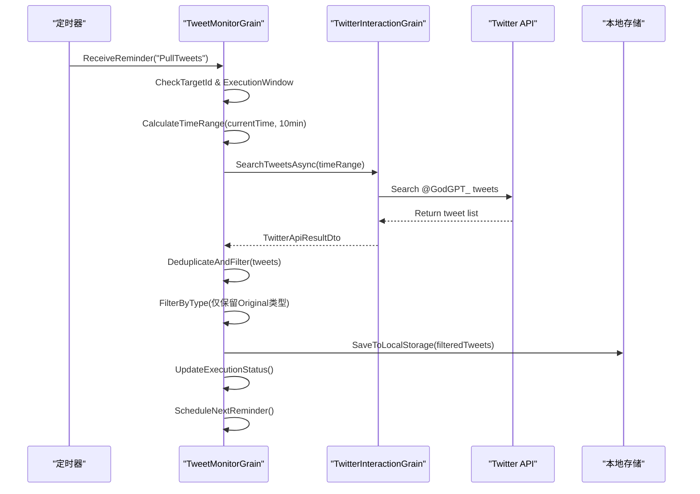
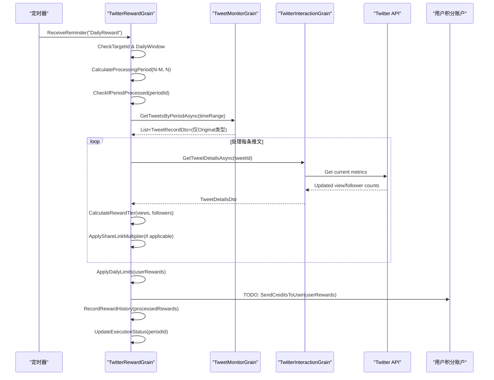
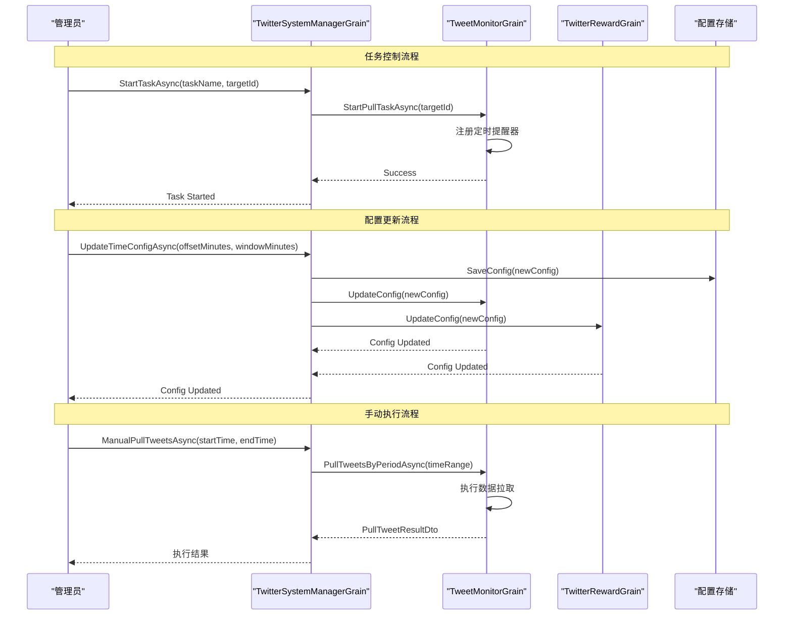
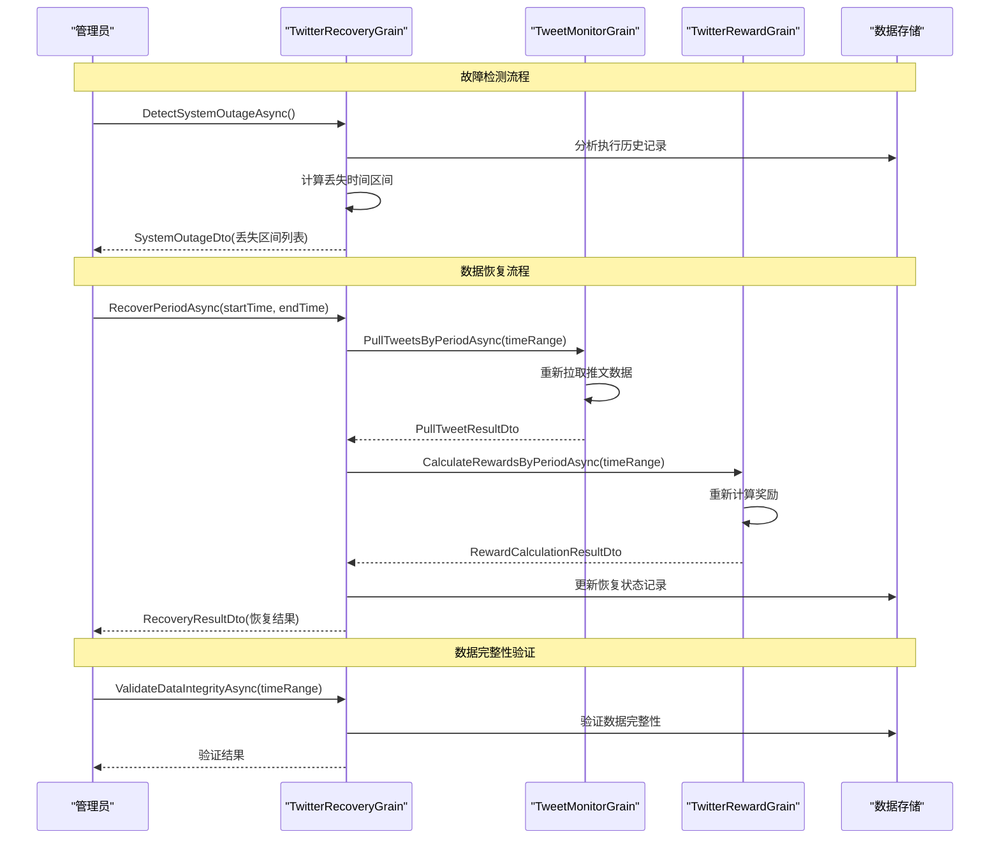
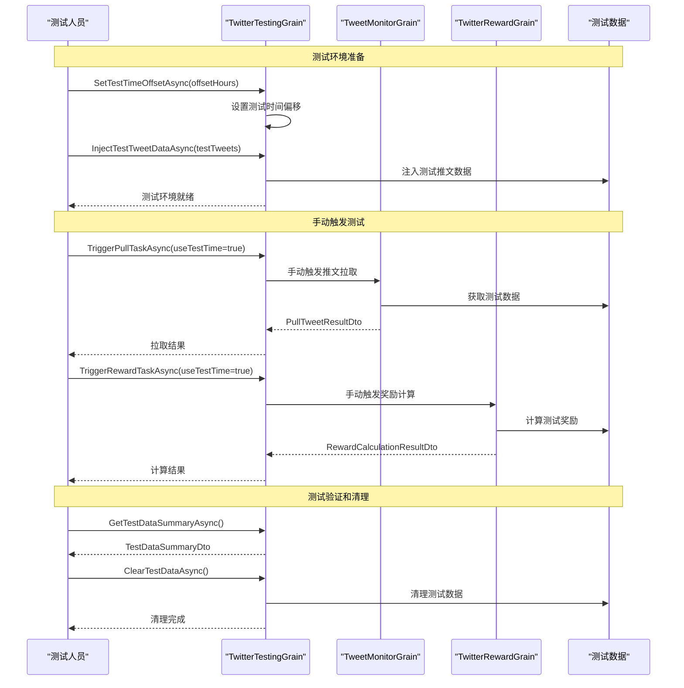

# REQ-003: Twitter Credits Reward System

## 需求概述

基于用户发送推特给用户奖励 GodGPT Credits 的系统，通过监控带有 @GodGPT_ 标签的推文，根据推文表现和用户粉丝数发放相应积分奖励。

## 技术约束

1. **架构约束**: 使用 `IGrainWithStringKey` 结构，不使用 `IChatManagerGAgent : IGAgent`
2. **模块化设计**: 功能划分合理，保持解耦合
3. **测试友好**: 时间区间需要考虑测试场景
4. **配置外置**: Twitter 交互所需的授权密钥等信息从配置文件获取
5. **开发阶段**: 积分发放暂时使用 TODO，重点计算推特ID和积分额度
6. **时间控制**: 使用UTC时间戳进行精确的时间控制和跨日检测
7. **系统恢复**: 支持系统瘫痪后的恢复和补偿机制

## 功能需求

### 4.1 基础奖励机制

- **触发条件**: 用户主动发布带有 `@GodGPT_` 的原创推文（TweetType.Original）
- **奖励额度**: 每条推文奖励 2 Credits
- **奖励上限**: 每用户最多 20 Credits（对应10条推文）
- **监控要求**: 系统监听 @GodGPT_ 的推文，记录推文ID、作者ID及发布时间
- **类型限制**: 仅限原创推文，不包括回复、转推、引用推文

### 4.2 附加奖励机制

- **执行时间**: 每日 00:00 UTC
- **检索范围**: 过去72-48小时之间（倒数第三天）的24小时内推文
- **筛选条件**: 
  - 带有 @GodGPT_ 标签的推文
  - 推文浏览量 views ≥ 20
  - **推文类型必须为 Original（原创推文）**
  - 排除 Reply（回复）、Retweet（转推）、Quote（引用推文）类型
- **奖励计算**: 根据【浏览量 + 粉丝数】档位发放 Credits

#### 奖励档位表

| 浏览量范围 | 粉丝数要求 | 奖励积分 |
|-----------|-----------|---------|
| 20-100 views | 10+ followers | 5 Credits |
| 100-300 views | 20+ followers | 10 Credits |
| 300-500 views | 30+ followers | 15 Credits |
| 500-1000 views | 50+ followers | 20 Credits |
| 1000-3000 views | 100+ followers | 30 Credits |
| 3000-5000 views | 300+ followers | 50 Credits |
| 5000-10000 views | 500+ followers | 80 Credits |
| 10000+ views | 1000+ followers | 120 Credits |

### 4.3 奖励调整规则

- **档位匹配**: 浏览量和粉丝数要求必须同时满足
- **向下调整**: 若满足浏览量区间但粉丝数未达要求，奖励按满足的最低档位发放
- **示例**: 推文1200 views，粉丝60 → 按"500-1000 views + 50+ followers"发放 20 Credits

### 4.4 分享链接加成

- **触发条件**: 推文包含有效的 godgpt 分享链接
- **链接格式**: `https://app.godgpt.fun/*`
- **加成倍数**: 所得积分 × 1.1（向下取整）
- **验证要求**: 需验证链接的有效性

### 4.5 每日限制

- **附加奖励上限**: 每用户每日最多获得 500 Credits 附加奖励
- **发放频次**: 每用户按天统计和发放，基础奖励和附加奖励一次性计算

### 4.6 数据保留

- **数据保存期**: 推文数据最多保存 7 天
- **记录内容**: 用户ID、推特ID、阅读数、用户粉丝数、发送时间、积分记录

### 4.7 推文类型过滤

- **监控范围**: 仅监控用户主动发送的推文，不包括回复推文
- **自我过滤**: 排除系统自身账号@自己发送的推文
- **类型标识**: 添加推文类型字段用于分类和扩展
- **内容验证**: 验证推文包含有效的 @GodGPT_ 标签

### 4.8 时间区间管理

- **区间定义**: 检索区间为 [当前UTC时间-N-M分钟, 当前UTC时间-N分钟]
- **配置参数**: 
  - N: 距离当前时间的起始偏移（默认：48小时=2880分钟）
  - M: 检索时间窗口长度（默认：24小时=1440分钟）
- **动态调整**: 支持运行时修改N和M参数
- **边界处理**: 确保时间区间不重叠，避免重复处理

## 系统架构设计

### Agent 分工

#### Agent1: TwitterInteractionGrain
- **职责**: 被动与 Twitter API 交互
- **功能**: 
  - 获取推文详情（浏览量、作者信息）
  - 验证分享链接有效性
  - 推文类型识别和过滤
  - Twitter API 认证管理

#### Agent2: TweetMonitorGrain  
- **职责**: 定时拉取和存储推文数据
- **功能**:
  - **定时任务1**: 每10分钟拉取最新推文ID
  - 本地去重保存，确保数据更新
  - 推文类型分类存储
  - 数据清理（7天过期）
  - 时间区间查询接口
  - 支持按区间重新拉取数据（系统恢复）

#### Agent3: TwitterRewardGrain
- **职责**: 定时计算和发放积分
- **功能**:
  - **定时任务2**: 严格时间控制的奖励计算
  - UTC时间戳精确控制执行时机
  - 防重复发送机制（发送标志管理）
  - 可配置时间区间处理
  - 系统瘫痪恢复支持
  - 积分发放历史追踪

### 核心定时任务设计

#### 定时任务1: 推文数据拉取
- **执行频率**: 每10分钟
- **执行逻辑**: 
  - 拉取最近10分钟内的 @GodGPT_ 推文
  - 本地去重（基于推文ID）
  - 过滤推文类型（仅保留原创推文）
  - 排除自身账号推文
  - 更新本地存储
- **失败恢复**: 支持手动触发指定时间区间的数据拉取

#### 定时任务2: 积分奖励计算  
- **执行频率**: 每日00:00 UTC
- **时间控制**: 使用UTC时间戳进行精确控制
- **执行逻辑**:
  - 检查上次执行时间戳，防重复执行
  - 获取指定时间区间内的推文数据
  - 计算基础和附加奖励
  - 记录发送标志，避免重复发放
  - 更新执行时间戳
- **系统管理**:
  - 支持开启/停止定时任务
  - 支持修改时间区间参数
  - 支持手动触发指定区间的奖励计算

## 配置项设计

```json
{
  "TwitterReward": {
    "BearerToken": "...",
    "ApiKey": "...",
    "ApiSecret": "...",
    "MonitorHandle": "@GodGPT_",
    "ShareLinkDomain": "https://app.godgpt.fun",
    "SelfAccountId": "1234567890",  // 系统自身Twitter账号ID，用于过滤
    
    // 定时任务配置
    "PullSchedule": "*/10 * * * *",  // 每10分钟拉取推文
    "RewardSchedule": "0 0 * * *",   // 每日00:00 UTC计算奖励
    "EnablePullTask": true,          // 是否启用推文拉取任务
    "EnableRewardTask": true,        // 是否启用奖励计算任务
    
    // 时间区间配置
    "TimeOffsetMinutes": 2880,       // N: 距离当前时间的起始偏移(48小时)
    "TimeWindowMinutes": 1440,       // M: 检索时间窗口长度(24小时)
    "TestTimeOffset": 0,             // 测试时的时间偏移(小时)
    
    // 系统管理
    "DataRetentionDays": 7,
    "MaxRetryAttempts": 3,
    "RetryDelayMinutes": 5,
    
    // ReminderTargetId版本控制
    "PullTaskTargetId": "12345678-1234-1234-1234-a00000000001",
    "RewardTaskTargetId": "12345678-1234-1234-1234-a00000000002"
  }
}
```

## 数据模型

### TweetRecord
```csharp
public class TweetRecord
{
    public string TweetId { get; set; }
    public string AuthorId { get; set; }
    public string AuthorHandle { get; set; }
    public DateTime CreatedAt { get; set; }
    public int CreatedAtTimestamp { get; set; }  // UTC时间戳(秒)
    public TweetType Type { get; set; }          // 推文类型
    public int ViewCount { get; set; }
    public int FollowerCount { get; set; }
    public bool HasShareLink { get; set; }
    public string ShareLinkUrl { get; set; }
    public bool IsShareLinkValid { get; set; }
    public bool IsProcessed { get; set; }        // 是否已处理
    public int ProcessedTimestamp { get; set; }  // 处理时间戳
}

public enum TweetType
{
    Original = 0,    // 原创推文
    Reply = 1,       // 回复推文
    Retweet = 2,     // 转推
    Quote = 3        // 引用推文
}
```

### RewardRecord
```csharp
public class RewardRecord
{
    public string UserId { get; set; }
    public DateTime RewardDate { get; set; }
    public int RewardDateTimestamp { get; set; }     // UTC时间戳(秒)
    public int BaseRewards { get; set; }
    public int BonusRewards { get; set; }
    public int TotalRewards { get; set; }
    public List<string> ProcessedTweetIds { get; set; }
    public bool IsSent { get; set; }                 // 是否已发送
    public int SentTimestamp { get; set; }           // 发送时间戳
    public string ProcessingPeriod { get; set; }     // 处理区间标识
}
```

### TaskExecutionRecord
```csharp
public class TaskExecutionRecord
{
    public string TaskName { get; set; }
    public int LastExecutionTimestamp { get; set; }  // 上次执行时间戳
    public int LastSuccessTimestamp { get; set; }    // 上次成功时间戳
    public string LastProcessedPeriod { get; set; }  // 上次处理的时间区间
    public bool IsEnabled { get; set; }              // 任务是否启用
    public int RetryCount { get; set; }              // 重试次数
    public string LastError { get; set; }            // 最后一次错误信息
}
```

### TimeRange
```csharp
public class TimeRange
{
    public int StartTimestamp { get; set; }    // 开始时间戳
    public int EndTimestamp { get; set; }      // 结束时间戳
    public string PeriodId { get; set; }       // 区间唯一标识
    
    // 根据当前时间和配置计算时间区间
    public static TimeRange CalculateRange(int currentTimestamp, int offsetMinutes, int windowMinutes)
    {
        var endTimestamp = currentTimestamp - (offsetMinutes * 60);
        var startTimestamp = endTimestamp - (windowMinutes * 60);
        
        return new TimeRange
        {
            StartTimestamp = startTimestamp,
            EndTimestamp = endTimestamp,
            PeriodId = $"{startTimestamp}-{endTimestamp}"
        };
    }
}
```

## 测试考虑

### 时间相关测试
- **配置化时间偏移**: 支持测试环境时间偏移
- **模拟时间区间**: 支持模拟不同时间段的推文数据
- **定时任务测试**: 支持手动触发定时任务进行测试

### 边界条件测试
- **积分上限验证**: 测试每日积分上限机制
- **重复处理防护**: 测试同一推文不会重复发放积分
- **API异常处理**: 测试Twitter API异常情况的处理

## 实施计划

### Phase 1: 基础架构
- 创建三个 Grain 的基础结构
- 实现配置管理
- 建立数据模型

### Phase 2: Twitter 集成
- 实现 Twitter API 交互
- 推文监控和数据存储
- 分享链接验证

### Phase 3: 奖励计算
- 实现奖励计算逻辑
- 每日限制和重复防护
- 定时任务调度

### Phase 4: 测试和优化
- 完善测试覆盖
- 性能优化
- 监控和日志

## 系统管理功能

### 定时任务控制
- **开启定时任务**: 通过配置或事件启用特定定时任务
- **停止定时任务**: 安全停止定时任务，保证数据完整性
- **修改执行区间**: 动态调整时间偏移和窗口参数
- **手动触发**: 支持手动触发指定时间区间的任务执行

### 系统恢复机制
- **瘫痪检测**: 通过时间戳监控检测系统异常停机
- **数据补偿**: 支持按时间区间重新拉取和处理数据
- **状态恢复**: 从上次成功执行点恢复任务状态
- **重复防护**: 通过唯一标识防止重复处理和发放

### UTC时间戳控制
- **精确时机**: 使用UTC秒级时间戳进行精确控制
- **跨日检测**: 基于UTC时间戳的准确跨日边界检测
- **版本控制**: ReminderTargetId机制确保单实例执行
- **状态追踪**: 记录每个阶段的执行时间戳

### 管理接口设计
```csharp
// 系统管理事件
public class TwitterTaskControlGEvent : EventBase
{
    public string TaskName { get; set; }        // 任务名称
    public TaskControlAction Action { get; set; } // 控制动作
    public int TimeOffsetMinutes { get; set; }   // 时间偏移
    public int TimeWindowMinutes { get; set; }   // 时间窗口
    public string TargetPeriod { get; set; }     // 目标处理区间
}

public enum TaskControlAction
{
    Start,           // 启动任务
    Stop,            // 停止任务
    UpdateConfig,    // 更新配置
    ManualTrigger,   // 手动触发
    RecoverPeriod    // 恢复指定区间
}
```

## 详细业务流程设计

### 流程1: 推文数据拉取流程

#### 业务描述
每10分钟定时拉取最新的@GodGPT_推文，进行去重、分类、过滤后存储到本地。

#### 涉及类和接口

**主要Grain类**:
- `TweetMonitorGrain : IGrainWithStringKey, IRemindable`
- `TwitterInteractionGrain : IGrainWithStringKey`

**核心接口**:
```csharp
public interface ITweetMonitorGrain : IGrainWithStringKey
{
    // 定时任务控制
    Task<bool> StartPullTaskAsync(string targetId);
    Task<bool> StopPullTaskAsync();
    Task<TaskExecutionStatusDto> GetTaskStatusAsync();
    
    // 数据拉取
    Task<PullTweetResultDto> PullTweetsAsync(PullTweetRequestDto request);
    Task<PullTweetResultDto> PullTweetsByPeriodAsync(int startTimestamp, int endTimestamp);
    
    // 数据查询（仅返回Original类型推文）
    Task<List<TweetRecordDto>> GetTweetsByPeriodAsync(int startTimestamp, int endTimestamp);
    Task<List<TweetRecordDto>> GetUnprocessedTweetsAsync(int maxCount = 100);
    
    // 数据管理
    Task<int> CleanupExpiredDataAsync();
    Task<DataStatisticsDto> GetDataStatisticsAsync();
}

public interface ITwitterInteractionGrain : IGrainWithStringKey
{
    // Twitter API 交互
    Task<TwitterApiResultDto> SearchTweetsAsync(SearchTweetsRequestDto request);
    Task<TweetDetailsDto> GetTweetDetailsAsync(string tweetId);
    Task<UserInfoDto> GetUserInfoAsync(string userId);
    Task<bool> ValidateShareLinkAsync(string url);
    
    // 推文类型识别和过滤
    Task<TweetType> DetermineTweetTypeAsync(string tweetId);
    Task<bool> IsOriginalTweetAsync(string tweetId);
}
```

**请求/响应DTO**:
```csharp
public class PullTweetRequestDto
{
    public int StartTimestamp { get; set; }
    public int EndTimestamp { get; set; }
    public int MaxResults { get; set; } = 100;
    public bool ForceRefresh { get; set; } = false;
    public List<TweetType> AllowedTypes { get; set; } = new List<TweetType> { TweetType.Original }; // 默认仅原创推文
}

public class PullTweetResultDto
{
    public bool Success { get; set; }
    public int TotalFound { get; set; }
    public int NewTweets { get; set; }
    public int DuplicateSkipped { get; set; }
    public int FilteredOut { get; set; }
    public int TypeFilteredOut { get; set; }        // 因推文类型被过滤的数量
    public Dictionary<TweetType, int> TypeStatistics { get; set; } // 各类型推文统计
    public List<string> ProcessedTweetIds { get; set; }
    public string ErrorMessage { get; set; }
    public int ProcessingTimestamp { get; set; }
}

public class TaskExecutionStatusDto
{
    public string TaskName { get; set; }
    public bool IsEnabled { get; set; }
    public bool IsRunning { get; set; }
    public int LastExecutionTimestamp { get; set; }
    public int LastSuccessTimestamp { get; set; }
    public int NextScheduledTimestamp { get; set; }
    public int RetryCount { get; set; }
    public string LastError { get; set; }
}
```

#### 执行步骤泳道图



### 流程2: 积分奖励计算流程

#### 业务描述
每日00:00 UTC执行，获取指定时间区间内的推文，计算基础和附加奖励，记录发送状态。

#### 涉及类和接口

**主要Grain类**:
- `TwitterRewardGrain : IGrainWithStringKey, IRemindable`
- `TweetMonitorGrain : IGrainWithStringKey`
- `TwitterInteractionGrain : IGrainWithStringKey`

**核心接口**:
```csharp
public interface ITwitterRewardGrain : IGrainWithStringKey
{
    // 定时任务控制
    Task<bool> StartRewardTaskAsync(string targetId);
    Task<bool> StopRewardTaskAsync();
    Task<TaskExecutionStatusDto> GetTaskStatusAsync();
    
    // 奖励计算
    Task<RewardCalculationResultDto> CalculateRewardsAsync(RewardCalculationRequestDto request);
    Task<RewardCalculationResultDto> CalculateRewardsByPeriodAsync(int startTimestamp, int endTimestamp);
    
    // 奖励查询
    Task<List<RewardRecordDto>> GetRewardHistoryAsync(string userId, int days = 30);
    Task<RewardStatisticsDto> GetRewardStatisticsAsync(int startTimestamp, int endTimestamp);
    
    // 系统管理
    Task<bool> UpdateTimeConfigAsync(int offsetMinutes, int windowMinutes);
    Task<List<string>> GetProcessedPeriodsAsync(int days = 7);
}
```

**请求/响应DTO**:
```csharp
public class RewardCalculationRequestDto
{
    public int StartTimestamp { get; set; }
    public int EndTimestamp { get; set; }
    public bool ForceRecalculate { get; set; } = false;
    public List<string> TargetUserIds { get; set; } // 可选，指定用户
}

public class RewardCalculationResultDto
{
    public bool Success { get; set; }
    public int ProcessedTweets { get; set; }
    public int AffectedUsers { get; set; }
    public int TotalBaseRewards { get; set; }
    public int TotalBonusRewards { get; set; }
    public int TotalCreditsAwarded { get; set; }
    public List<UserRewardDto> UserRewards { get; set; }
    public string ProcessingPeriod { get; set; }
    public string ErrorMessage { get; set; }
    public int CalculationTimestamp { get; set; }
}

public class UserRewardDto
{
    public string UserId { get; set; }
    public string UserHandle { get; set; }
    public int BaseRewards { get; set; }
    public int BonusRewards { get; set; }
    public int TotalRewards { get; set; }
    public int ProcessedTweetCount { get; set; }
    public List<TweetRewardDetailDto> TweetDetails { get; set; }
    public bool RewardsSent { get; set; }
}

public class TweetRewardDetailDto
{
    public string TweetId { get; set; }
    public int ViewCount { get; set; }
    public int FollowerCount { get; set; }
    public int BaseReward { get; set; }
    public int BonusReward { get; set; }
    public bool HasShareLink { get; set; }
    public double ShareLinkMultiplier { get; set; }
    public int FinalReward { get; set; }
    public string RewardTier { get; set; }
}
```

#### 执行步骤泳道图



### 流程3: 系统管理控制流程

#### 业务描述
通过管理接口控制定时任务的开启、停止、配置修改等操作。

#### 执行步骤泳道图



#### 涉及类和接口

**管理接口**:
```csharp
public interface ITwitterSystemManagerGrain : IGrainWithStringKey
{
    // 任务控制
    Task<bool> StartTaskAsync(string taskName, string targetId);
    Task<bool> StopTaskAsync(string taskName);
    Task<List<TaskExecutionStatusDto>> GetAllTaskStatusAsync();
    
    // 配置管理
    Task<bool> UpdateTimeConfigAsync(string taskName, int offsetMinutes, int windowMinutes);
    Task<TwitterRewardConfigDto> GetCurrentConfigAsync();
    Task<bool> SetConfigAsync(TwitterRewardConfigDto config);
    
    // 手动执行
    Task<PullTweetResultDto> ManualPullTweetsAsync(int startTimestamp, int endTimestamp);
    Task<RewardCalculationResultDto> ManualCalculateRewardsAsync(int startTimestamp, int endTimestamp);
    
    // 系统状态
    Task<SystemHealthDto> GetSystemHealthAsync();
    Task<List<string>> GetProcessingHistoryAsync(int days = 7);
}
```

**配置和状态DTO**:
```csharp
public class TwitterRewardConfigDto
{
    public string MonitorHandle { get; set; }
    public string SelfAccountId { get; set; }
    public bool EnablePullTask { get; set; }
    public bool EnableRewardTask { get; set; }
    public int TimeOffsetMinutes { get; set; }
    public int TimeWindowMinutes { get; set; }
    public int DataRetentionDays { get; set; }
    public int MaxRetryAttempts { get; set; }
    public string PullTaskTargetId { get; set; }
    public string RewardTaskTargetId { get; set; }
}

public class SystemHealthDto
{
    public bool IsHealthy { get; set; }
    public DateTime LastUpdateTime { get; set; }
    public int ActiveTasks { get; set; }
    public int PendingTweets { get; set; }
    public int PendingRewards { get; set; }
    public List<string> Warnings { get; set; }
    public List<string> Errors { get; set; }
    public Dictionary<string, object> Metrics { get; set; }
}
```

### 流程4: 数据恢复补偿流程

#### 业务描述
系统故障后，检测丢失的时间区间，支持按区间重新拉取和处理数据。

#### 执行步骤泳道图



#### 涉及类和接口

**恢复接口**:
```csharp
public interface ITwitterRecoveryGrain : IGrainWithStringKey
{
    // 故障检测
    Task<List<MissingPeriodDto>> DetectMissingPeriodsAsync(int startTimestamp, int endTimestamp);
    Task<SystemOutageDto> DetectSystemOutageAsync();
    
    // 数据恢复
    Task<RecoveryResultDto> RecoverPeriodAsync(int startTimestamp, int endTimestamp);
    Task<RecoveryResultDto> RecoverMultiplePeriodsAsync(List<TimeRange> periods);
    
    // 状态验证
    Task<bool> ValidateDataIntegrityAsync(int startTimestamp, int endTimestamp);
    Task<DataIntegrityReportDto> GenerateIntegrityReportAsync(int days = 7);
}
```

**恢复相关DTO**:
```csharp
public class MissingPeriodDto
{
    public int StartTimestamp { get; set; }
    public int EndTimestamp { get; set; }
    public string PeriodId { get; set; }
    public string MissingType { get; set; } // "TweetData", "RewardCalculation", "Both"
    public int ExpectedTweetCount { get; set; }
    public int ActualTweetCount { get; set; }
    public bool HasRewardRecord { get; set; }
}

public class SystemOutageDto
{
    public bool OutageDetected { get; set; }
    public int OutageStartTimestamp { get; set; }
    public int OutageEndTimestamp { get; set; }
    public int OutageDurationMinutes { get; set; }
    public List<MissingPeriodDto> AffectedPeriods { get; set; }
    public string RecoveryPlan { get; set; }
}

public class RecoveryResultDto
{
    public bool Success { get; set; }
    public int RecoveredTweets { get; set; }
    public int RecalculatedRewards { get; set; }
    public int AffectedUsers { get; set; }
    public List<string> ProcessedPeriods { get; set; }
    public List<string> FailedPeriods { get; set; }
    public string ErrorMessage { get; set; }
    public int RecoveryTimestamp { get; set; }
}
```

## 独立测试接口设计

### 测试流程泳道图



### 测试专用接口
```csharp
public interface ITwitterTestingGrain : IGrainWithStringKey
{
    // 时间控制测试
    Task<bool> SetTestTimeOffsetAsync(int offsetHours);
    Task<int> GetCurrentTestTimestampAsync();
    Task<bool> SimulateTimePassageAsync(int minutes);
    
    // 数据模拟
    Task<bool> InjectTestTweetDataAsync(List<TweetRecordDto> testTweets);
    Task<bool> ClearTestDataAsync();
    Task<TestDataSummaryDto> GetTestDataSummaryAsync();
    
    // 任务触发测试
    Task<PullTweetResultDto> TriggerPullTaskAsync(bool useTestTime = true);
    Task<RewardCalculationResultDto> TriggerRewardTaskAsync(bool useTestTime = true);
    
    // 状态重置
    Task<bool> ResetAllTaskStatesAsync();
    Task<bool> ResetExecutionHistoryAsync();
}

public class TestDataSummaryDto
{
    public int TotalTestTweets { get; set; }
    public int TestUsers { get; set; }
    public Dictionary<string, int> TweetsByType { get; set; }
    public Dictionary<string, int> TweetsByTimeRange { get; set; }
    public int CurrentTestTimeOffset { get; set; }
    public bool IsTestModeActive { get; set; }
}
```

## 系统事件定义

### 控制事件
```csharp
[GenerateSerializer]
public class TwitterTaskControlGEvent : EventBase
{
    [Id(0)] public string TaskName { get; set; }
    [Id(1)] public TaskControlAction Action { get; set; }
    [Id(2)] public int TimeOffsetMinutes { get; set; }
    [Id(3)] public int TimeWindowMinutes { get; set; }
    [Id(4)] public string TargetPeriod { get; set; }
    [Id(5)] public string TargetId { get; set; }
}

[GenerateSerializer]
public class TwitterConfigUpdateGEvent : EventBase
{
    [Id(0)] public TwitterRewardConfigDto Config { get; set; }
    [Id(1)] public string UpdatedBy { get; set; }
    [Id(2)] public int UpdateTimestamp { get; set; }
}
```

### 状态事件
```csharp
[GenerateSerializer]
public class TweetPullCompletedSEvent : TwitterSEventBase
{
    [Id(0)] public PullTweetResultDto Result { get; set; }
    [Id(1)] public int ExecutionTimestamp { get; set; }
}

[GenerateSerializer]
public class RewardCalculationCompletedSEvent : TwitterSEventBase
{
    [Id(0)] public RewardCalculationResultDto Result { get; set; }
    [Id(1)] public string ProcessingPeriod { get; set; }
    [Id(2)] public int ExecutionTimestamp { get; set; }
}

[GenerateSerializer]
public class TaskConfigUpdatedSEvent : TwitterSEventBase
{
    [Id(0)] public string TaskName { get; set; }
    [Id(1)] public TwitterRewardConfigDto NewConfig { get; set; }
    [Id(2)] public int UpdateTimestamp { get; set; }
}
```

## 风险评估

1. **Twitter API 限制**: 需要考虑API调用频率限制和配额管理
2. **数据一致性**: 分布式环境下的数据一致性保证
3. **时区处理**: UTC时间和本地时间的正确处理
4. **异常恢复**: 系统异常时的数据恢复机制
5. **重复执行**: 防止系统重启后的重复任务执行
6. **时间偏移**: 测试环境和生产环境的时间配置管理 