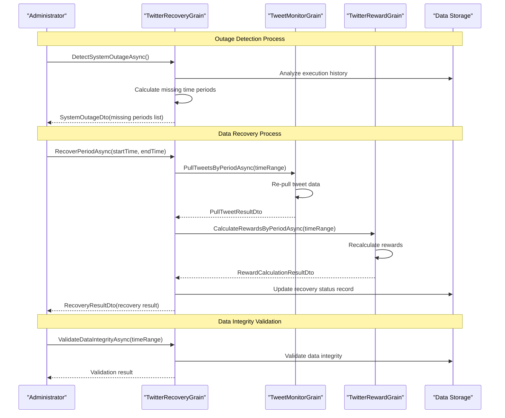
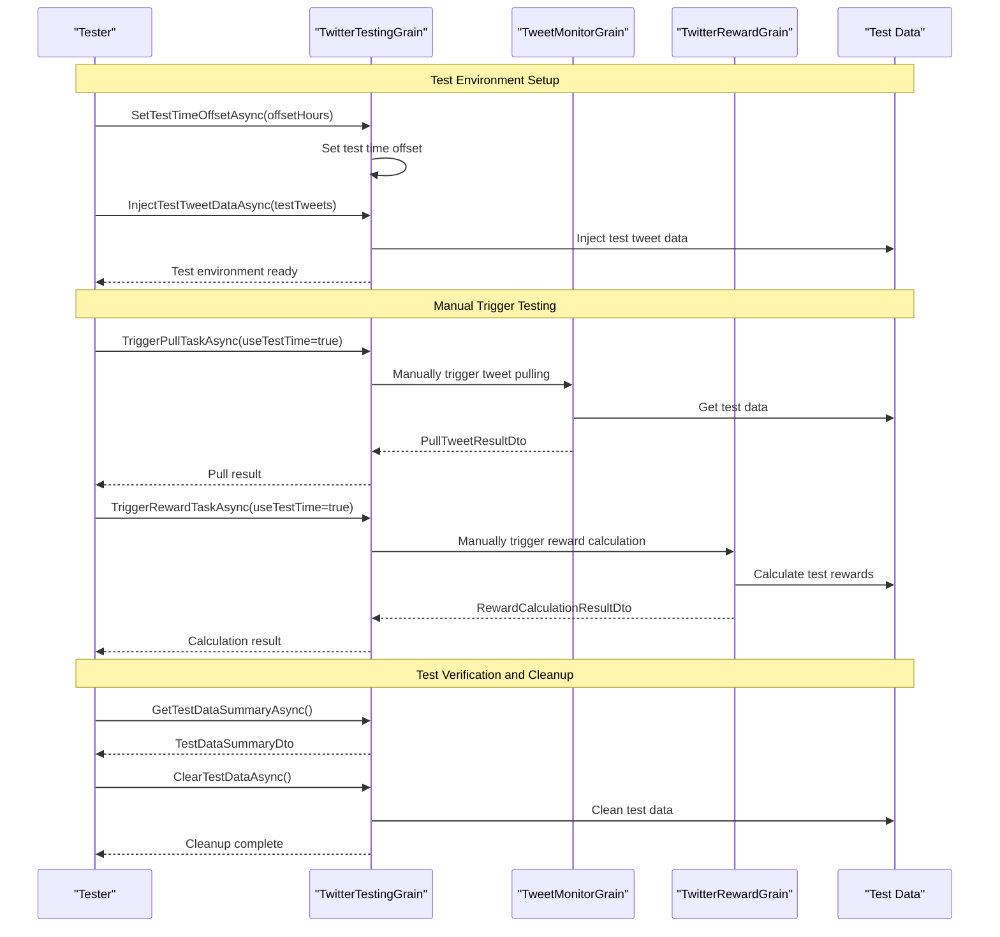

```mermaid
sequenceDiagram
    participant Admin as "管理员"
    participant TSM as "TwitterSystemManagerGrain"
    participant TMG as "TweetMonitorGrain"
    participant TRG as "TwitterRewardGrain"
    participant Config as "配置存储"

    Note over Admin,Config: 任务控制流程
    Admin->>TSM: StartTaskAsync(taskName, targetId)
    TSM->>TMG: StartPullTaskAsync(targetId)
    TMG->>TMG: 注册定时提醒器
    TMG-->>TSM: Success
    TSM-->>Admin: Task Started
    
    Note over Admin,Config: 配置更新流程
    Admin->>TSM: UpdateTimeConfigAsync(offsetMinutes, windowMinutes)
    TSM->>Config: SaveConfig(newConfig)
    TSM->>TMG: UpdateConfig(newConfig)
    TSM->>TRG: UpdateConfig(newConfig)
    TMG-->>TSM: Config Updated
    TRG-->>TSM: Config Updated
    TSM-->>Admin: Config Updated
    
    Note over Admin,Config: 手动执行流程
    Admin->>TSM: ManualPullTweetsAsync(startTime, endTime)
    TSM->>TMG: PullTweetsByPeriodAsync(timeRange)
    TMG->>TMG: Execute data pulling
    TMG-->>TSM: PullTweetResultDto
    TSM-->>Admin: Execution result
```

# REQ-003: Twitter Credits Reward System

## 需求概述

基于用户发送推特给用户奖励 GodGPT Credits 的系统，通过监控带有 @GodGPT_ 标签的推文，根据推文表现和用户粉丝数发放相应积分奖励。

## 技术约束

1. **架构约束**: 使用 `IGrainWithStringKey` 结构，不使用 `IChatManagerGAgent : IGAgent`
2. **模块化设计**: 功能划分合理，保持解耦合
3. **测试友好**: 时间区间需要考虑测试场景
4. **配置外置**: Twitter 交互所需的授权密钥等信息从配置文件获取
5. **开发阶段**: 积分发放暂时使用 TODO，重点计算推特ID和积分额度
6. **时间控制**: 使用UTC时间戳进行精确的时间控制和跨日检测
7. **系统恢复**: 支持系统瘫痪后的恢复和补偿机制
8. **日志**: 所有日志打印方式采用 $赋值,参考 Logger.LogWarning($"AAA: {B.C} DDD {E.F}");
9. **代码注释**: 代码注释使用英文

## 功能需求

### 4.1 基础奖励机制

- **触发条件**: 用户主动发布带有 `@GodGPT_` 的原创推文（TweetType.Original）
- **奖励额度**: 每条推文奖励 2 Credits
- **奖励上限**: 每用户最多 20 Credits（对应10条推文）
- **监控要求**: 系统监听 @GodGPT_ 的推文，记录推文ID、作者ID及发布时间
- **类型限制**: 仅限原创推文，不包括回复、转推、引用推文

### 4.2 附加奖励机制

- **执行时间**: 每日 00:00 UTC
- **检索范围**: 过去72-48小时之间（倒数第三天）的24小时内推文
- **筛选条件**: 
  - 带有 @GodGPT_ 标签的推文
  - 推文浏览量 views ≥ 20
  - **推文类型必须为 Original（原创推文）**
  - 排除 Reply（回复）、Retweet（转推）、Quote（引用推文）类型
- **奖励计算**: 根据【浏览量 + 粉丝数】档位发放 Credits

#### 奖励档位表

| 浏览量范围 | 粉丝数要求 | 奖励积分 |
|-----------|-----------|---------|
| 20-100 views | 10+ followers | 5 Credits |
| 100-300 views | 20+ followers | 10 Credits |
| 300-500 views | 30+ followers | 15 Credits |
| 500-1000 views | 50+ followers | 20 Credits |
| 1000-3000 views | 100+ followers | 30 Credits |
| 3000-5000 views | 300+ followers | 50 Credits |
| 5000-10000 views | 500+ followers | 80 Credits |
| 10000+ views | 1000+ followers | 120 Credits |

### 4.3 奖励调整规则

- **档位匹配**: 浏览量和粉丝数要求必须同时满足
- **向下调整**: 若满足浏览量区间但粉丝数未达要求，奖励按满足的最低档位发放
- **示例**: 推文1200 views，粉丝60 → 按"500-1000 views + 50+ followers"发放 20 Credits

### 4.4 分享链接加成

- **触发条件**: 推文包含有效的 godgpt 分享链接
- **链接格式**: `https://app.godgpt.fun/*`
- **加成倍数**: 所得积分 × 1.1（向下取整）
- **验证要求**: 需验证链接的有效性

### 4.5 每日限制

- **附加奖励上限**: 每用户每日最多获得 500 Credits 附加奖励
- **发放频次**: 每用户按天统计和发放，基础奖励和附加奖励一次性计算

### 4.6 数据保留

- **数据保存期**: 推文数据最多保存 5 天（可配置，默认5天）
- **记录内容**: 
  - 用户ID、推特ID、阅读数、用户粉丝数、发送时间
  - **推文类型**（Original/Reply/Retweet/Quote）- 支持未来功能扩展
  - 积分记录、处理状态、分享链接信息
  - UTC时间戳、处理时间戳等时间相关字段

### 4.7 推文类型过滤

- **监控范围**: 仅监控用户主动发送的推文，不包括回复推文
- **自我过滤**: 排除系统自身账号@自己发送的推文
- **类型标识**: 添加推文类型字段用于分类和扩展
- **内容验证**: 验证推文包含有效的 @GodGPT_ 标签

### 4.8 时间区间管理

- **区间定义**: 检索区间为 [当前UTC时间-N-M分钟, 当前UTC时间-N分钟]
- **配置参数**: 
  - N: 距离当前时间的起始偏移（默认：48小时=2880分钟）
  - M: 检索时间窗口长度（默认：24小时=1440分钟）
- **动态调整**: 支持运行时修改N和M参数
- **边界处理**: 确保时间区间不重叠，避免重复处理

## 系统架构设计

### 总体架构流程图

```mermaid
sequenceDiagram
    participant TM as TweetMonitorGrain<br/>(Data Pull & Storage)
    participant TI as TwitterInteractionGrain<br/>(API Interaction Service)
    participant TR as TwitterRewardGrain<br/>(Reward Calculation & Distribution)
    participant TA as Twitter API
    participant CM as ChatManagerGAgent<br/>(Credit Distribution)
    
    Note over TM,TR: System Startup - Three Agents with Distinct Responsibilities
    
    rect rgb(230, 240, 255)
        Note over TM,TI: 🔄 Scheduled Task 1: Tweet Data Pull (Paid API Optimization, Default 30min)
        
        TM->>TM: Timer Triggered(Lower Frequency, Increase Batch Size)
        TM->>TI: Call Search Tweet API(Batch 100 items)
        TI->>TA: Search @GodGPT_ Tweets(Last 30min, 100 items)
        TA-->>TI: Return Tweet List
        
        TI->>TI: Tweet Type Recognition
        TI->>TI: Filter Non-Original Types
        TI->>TI: Extract Share Link Information
        TI-->>TM: Return Processed Tweet Data
        
        TM->>TM: Local Deduplication Storage
        TM->>TM: Tweet Type Classification Storage
        TM->>TM: Save Share Link Validation Result(boolean)
        TM->>TM: Set Data Expiration Mark(Configurable Days)
    end
    
    rect rgb(255, 240, 230)
        Note over TR,CM: 🎯 Scheduled Task 2: Credit Reward Calculation (Daily 00:00 UTC)
        
        TR->>TR: UTC 00:00 Timer Triggered
        TR->>TR: Check TaskDailyExecutionRecord for Duplication Prevention
        TR->>TM: Query Tweets in Specified Time Range
        Note right of TM: Third Day Back 24 Hours<br/>Return Original Type Only
        TM-->>TR: Return Qualified Tweets
        
        TR->>TI: Get Tweet Detailed Information
        TI->>TA: Batch Get Tweet Data
        TA-->>TI: Return View Count, Follower Count etc
        TI-->>TR: Return Complete Tweet Information
        
        loop For Each User
            TR->>TR: Check UserDailyRewardRecord
            TR->>TR: Calculate Base Reward(2 Credits/tweet, Check Limit)
            TR->>TR: Calculate Bonus Reward(8 Tier System)
            TR->>TR: Check Share Link Bonus(HasValidShareLink)
            TR->>TR: Apply Share Link Bonus(×1.1, Round Down)
            TR->>TR: Check Daily Limit(500 Credits)
            
            TR->>CM: Distribute Credits to User Account
            CM-->>TR: Confirm Credit Distribution Success
            TR->>TR: Update UserDailyRewardRecord
        end
        
        TR->>TR: Record TaskDailyExecutionRecord
        TR->>TR: Update UTC Date Identifier to Next Day
    end
    
    rect rgb(240, 255, 240)
        Note over TM,TR: 🔧 System Management & Recovery Mechanism
        
        TR->>TM: Detect System Outage Status
        alt Data Loss Detected
            TR->>TM: Trigger Specified Range Data Compensation
            TM->>TI: Re-pull Missing Time Period Data
            TI->>TA: Historical Tweet Search
            TA-->>TI: Return Historical Data
            TI-->>TM: Supplement Store Historical Tweets
            TM-->>TR: Confirm Data Compensation Complete
        end
        
        TR->>TR: Update Execution Timestamp
        TR->>TR: Reset Duplication Prevention Flag
    end
    
    Note over TM,TR: 📊 Continuous Operation - Data-Driven Credit Reward Ecosystem
```



### Agent 分工详解

#### 🔄 Agent1: TwitterInteractionGrain  
- **设计理念**: 纯粹的API交互层，专注于与Twitter API的通信
- **核心职责**: 
  - 🔍 获取推文详情（浏览量、作者信息、发布时间）
  - 🏷️ 推文类型识别和过滤（Original/Reply/Retweet/Quote）
  - 🔗 提取和验证分享链接（检查是否包含app.godgpt.fun格式）
  - 🔐 Twitter API 认证管理和错误处理
- **交互模式**: 被动响应式，不包含定时任务逻辑
- **分享链接处理**: 提取链接信息供存储，验证有效性供奖励计算使用
- **设计优势**: 高内聚低耦合，便于API变更适配和单元测试

#### 📊 Agent2: TweetMonitorGrain  
- **设计理念**: 数据采集和存储中心，负责推文数据的生命周期管理
- **API优化策略**: 降低频率+增加批量+去重机制，充分利用付费账号优势
- **核心职责**:
  - ⏰ **定时任务1**: 可配置间隔批量拉取（默认30分钟/100条）
  - 🔄 本地去重保存，确保数据完整性（基于推文ID去重）
  - 📂 推文类型分类存储（仅保存Original类型用于奖励）
  - 🔗 保存分享链接验证结果（HasValidShareLink boolean值）
  - 🗑️ 数据清理（可配置保留期，默认5天自动删除）  
  - 📅 时间区间查询接口（支持UTC时间戳精确查询）
  - 🔧 支持按区间重新拉取数据（系统恢复机制）
- **数据流**: TweetMonitorGrain ↔ TwitterInteractionGrain ↔ Twitter API
- **配置灵活性**: 支持定时频率、批量大小和数据保留期的动态配置
- **设计优势**: 数据持久化层解耦，支持离线分析和系统恢复

#### 🎯 Agent3: TwitterRewardGrain
- **设计理念**: 奖励计算和发放引擎，严格控制奖励发放的时机和逻辑
- **核心职责**:
  - ⏰ **定时任务2**: 严格时间控制的奖励计算（每日00:00 UTC）
  - 🕒 UTC时间戳精确控制执行时机（基于UTC 0点日期标识）
  - 👤 **用户记录管理**: UserDailyRewardRecord追踪每用户每日领取状态
  - 📋 **任务记录管理**: TaskDailyExecutionRecord防重复执行机制
  - 💰 **奖励计算逻辑**: 基础奖励 + 附加奖励 + 分享链接加成(×1.1倍，向下取整)
  - 🛡️ **领取限制控制**: 基础奖励10条上限，附加奖励500 Credits上限
  - ⚙️ 可配置时间区间处理（支持N-M分钟灵活配置）
  - 🔄 系统瘫痪恢复支持（检测并补偿缺失数据）
  - 📈 积分发放历史追踪（完整审计记录）
- **业务流**: 检查记录 → 数据查询 → 奖励计算 → 积分发放 → 更新记录 → 日期更新
- **记录机制**: 基于UTC 0点时间戳的用户和任务状态管理
- **设计优势**: 业务逻辑集中管理，时间控制精确，支持系统级恢复

### 核心定时任务设计

#### 定时任务1: 推文数据拉取
- **执行频率**: 可配置间隔（默认10分钟）
- **执行逻辑**: 
  - 拉取最近一个间隔内的 @GodGPT_ 推文
  - 本地去重（基于推文ID）
  - 过滤推文类型（仅保留原创推文）
  - 排除自身账号推文
  - 验证分享链接并存储boolean结果
  - 更新本地存储
- **失败恢复**: 支持手动触发指定时间区间的数据拉取
- **配置灵活性**: 支持运行时修改拉取频率

#### 定时任务2: 积分奖励计算  
- **执行频率**: 每日00:00 UTC
- **时间控制**: 使用UTC时间戳进行精确控制
- **执行逻辑**:
  - 检查上次执行时间戳，防重复执行
  - 获取指定时间区间内的推文数据
  - 计算基础和附加奖励
  - 记录发送标志，避免重复发放
  - 更新执行时间戳
- **系统管理**:
  - 支持开启/停止定时任务
  - 支持修改时间区间参数
  - 支持手动触发指定区间的奖励计算

## 配置管理设计

### appsettings.json 配置文件
```json
{
  "TwitterReward": {
    "BearerToken": "...",
    "ApiKey": "...",
    "ApiSecret": "...",
    "MonitorHandle": "@GodGPT_",
    "ShareLinkDomain": "https://app.godgpt.fun",
    "SelfAccountId": "1234567890",
    
    // 定时任务配置 - 针对付费API优化
    "PullIntervalMinutes": 30,
    "PullBatchSize": 100,
    "PullSchedule": "*/30 * * * *",
    "RewardSchedule": "0 0 * * *",
    "EnablePullTask": true,
    "EnableRewardTask": true,
    
    // 时间区间配置
    "TimeOffsetMinutes": 2880,
    "TimeWindowMinutes": 1440,
    "TestTimeOffset": 0,
    
    // 数据管理配置
    "DataRetentionDays": 5,
    "MaxRetryAttempts": 3,
    "RetryDelayMinutes": 5,
    
    // ReminderTargetId版本控制
    "PullTaskTargetId": "12345678-1234-1234-1234-a00000000001",
    "RewardTaskTargetId": "12345678-1234-1234-1234-a00000000002"
  }
}
```

### TwitterRewardOptions 配置类
```csharp
public class TwitterRewardOptions
{
    public const string SectionName = "TwitterReward";
    
    // Twitter API 配置
    public string BearerToken { get; set; } = string.Empty;
    public string ApiKey { get; set; } = string.Empty;
    public string ApiSecret { get; set; } = string.Empty;
    public string MonitorHandle { get; set; } = "@GodGPT_";
    public string ShareLinkDomain { get; set; } = "https://app.godgpt.fun";
    public string SelfAccountId { get; set; } = string.Empty;
    
    // 定时任务配置
    public int PullIntervalMinutes { get; set; } = 30;
    public int PullBatchSize { get; set; } = 100;
    public string PullSchedule { get; set; } = "*/30 * * * *";
    public string RewardSchedule { get; set; } = "0 0 * * *";
    public bool EnablePullTask { get; set; } = true;
    public bool EnableRewardTask { get; set; } = true;
    
    // 时间区间配置
    public int TimeOffsetMinutes { get; set; } = 2880;  // 48小时
    public int TimeWindowMinutes { get; set; } = 1440;  // 24小时
    public int TestTimeOffset { get; set; } = 0;
    
    // 数据管理配置
    public int DataRetentionDays { get; set; } = 5;
    public int MaxRetryAttempts { get; set; } = 3;
    public int RetryDelayMinutes { get; set; } = 5;
    
    // ReminderTargetId版本控制
    public string PullTaskTargetId { get; set; } = "12345678-1234-1234-1234-a00000000001";
    public string RewardTaskTargetId { get; set; } = "12345678-1234-1234-1234-a00000000002";
}
```

### 依赖注入配置注册
```csharp
// 在 Startup.cs 或 Program.cs 中注册
public void ConfigureServices(IServiceCollection services)
{
    // 注册Twitter奖励配置
    services.Configure<TwitterRewardOptions>(
        Configuration.GetSection(TwitterRewardOptions.SectionName));
    
    // 其他服务注册...
}
```

### 在Grain中使用配置
```csharp
public class TwitterRewardGrain : IGrainWithStringKey, ITwitterRewardGrain
{
    private readonly TwitterRewardOptions _options;
    
    public TwitterRewardGrain(IOptions<TwitterRewardOptions> options)
    {
        _options = options.Value;
    }
    
    public async Task CalculateRewardsAsync()
    {
        // 使用配置参数
        var pullInterval = _options.PullIntervalMinutes;
        var batchSize = _options.PullBatchSize;
        var retentionDays = _options.DataRetentionDays;
        var timeOffset = _options.TimeOffsetMinutes;
        
        // 业务逻辑...
    }
}

public class TweetMonitorGrain : IGrainWithStringKey, ITweetMonitorGrain
{
    private readonly TwitterRewardOptions _options;
    
    public TweetMonitorGrain(IOptions<TwitterRewardOptions> options)
    {
        _options = options.Value;
    }
    
    public async Task StartPullTaskAsync()
    {
        // 使用配置参数
        if (!_options.EnablePullTask)
        {
            return; // 任务被禁用
        }
        
        var intervalMinutes = _options.PullIntervalMinutes;
        var batchSize = _options.PullBatchSize;
        var targetId = _options.PullTaskTargetId;
        
        // 启动定时任务...
    }
}

public class TwitterInteractionGrain : IGrainWithStringKey, ITwitterInteractionGrain
{
    private readonly TwitterRewardOptions _options;
    
    public TwitterInteractionGrain(IOptions<TwitterRewardOptions> options)
    {
        _options = options.Value;
    }
    
    public async Task<List<TweetDto>> SearchTweetsAsync()
    {
        // 使用配置参数
        var bearerToken = _options.BearerToken;
        var monitorHandle = _options.MonitorHandle;
        var batchSize = _options.PullBatchSize;
        var selfAccountId = _options.SelfAccountId;
        
        // Twitter API 调用...
    }
}
```

### 配置验证和默认值管理
```csharp
public class TwitterRewardOptionsValidator : IValidateOptions<TwitterRewardOptions>
{
    public ValidateOptionsResult Validate(string name, TwitterRewardOptions options)
    {
        if (string.IsNullOrEmpty(options.BearerToken))
        {
            return ValidateOptionsResult.Fail("Twitter BearerToken is required");
        }
        
        if (options.PullIntervalMinutes < 1 || options.PullIntervalMinutes > 1440)
        {
            return ValidateOptionsResult.Fail("PullIntervalMinutes must be between 1 and 1440");
        }
        
        if (options.PullBatchSize < 1 || options.PullBatchSize > 500)
        {
            return ValidateOptionsResult.Fail("PullBatchSize must be between 1 and 500");
        }
        
        if (options.DataRetentionDays < 1 || options.DataRetentionDays > 30)
        {
            return ValidateOptionsResult.Fail("DataRetentionDays must be between 1 and 30");
        }
        
        return ValidateOptionsResult.Success;
    }
}

// 在依赖注入中注册验证器
services.AddSingleton<IValidateOptions<TwitterRewardOptions>, TwitterRewardOptionsValidator>();
```

### 配置热更新支持
```csharp
public class TwitterRewardGrain : IGrainWithStringKey, ITwitterRewardGrain
{
    private readonly IOptionsMonitor<TwitterRewardOptions> _optionsMonitor;
    
    public TwitterRewardGrain(IOptionsMonitor<TwitterRewardOptions> optionsMonitor)
    {
        _optionsMonitor = optionsMonitor;
    }
    
    public async Task CalculateRewardsAsync()
    {
        // 获取最新配置（支持热更新）
        var options = _optionsMonitor.CurrentValue;
        
        var retentionDays = options.DataRetentionDays;
        var timeOffset = options.TimeOffsetMinutes;
        
        // 业务逻辑...
    }
}
```

## 数据模型

### TweetRecord
```csharp
public class TweetRecord
{
    public string TweetId { get; set; }
    public string AuthorId { get; set; }
    public string AuthorHandle { get; set; }
    public DateTime CreatedAt { get; set; }
    public int CreatedAtTimestamp { get; set; }  // UTC timestamp (seconds)
    public TweetType Type { get; set; }          // Tweet type - key field for future extension
    public int ViewCount { get; set; }
    public int FollowerCount { get; set; }
    public bool HasValidShareLink { get; set; }  // Whether contains valid share link (boolean, storage optimization)
    public bool IsProcessed { get; set; }        // Whether already processed
    public int ProcessedTimestamp { get; set; }  // Processing timestamp
    public int DataRetentionExpiry { get; set; } // Data expiration timestamp (after configurable days)
}

public enum TweetType
{
    Original = 0,    // Original tweet
    Reply = 1,       // Reply tweet
    Retweet = 2,     // Retweet
    Quote = 3        // Quote tweet
}
```

### RewardRecord
```csharp
public class RewardRecord
{
    public string UserId { get; set; }
    public DateTime RewardDate { get; set; }
    public int RewardDateTimestamp { get; set; }     // UTC timestamp (seconds)
    public int BaseRewards { get; set; }
    public int BonusRewards { get; set; }
    public int TotalRewards { get; set; }
    public List<string> ProcessedTweetIds { get; set; }
    public bool IsSent { get; set; }                 // Whether already sent
    public int SentTimestamp { get; set; }           // Sent timestamp
    public string ProcessingPeriod { get; set; }     // Processing period identifier
}
```

### TaskExecutionRecord
```csharp
public class TaskExecutionRecord
{
    public string TaskName { get; set; }
    public int LastExecutionTimestamp { get; set; }  // Last execution timestamp
    public int LastSuccessTimestamp { get; set; }    // Last success timestamp
    public string LastProcessedPeriod { get; set; }  // Last processed time period
    public bool IsEnabled { get; set; }              // Whether task is enabled
    public int RetryCount { get; set; }              // Retry count
    public string LastError { get; set; }            // Last error message
}
```

### UserDailyRewardRecord - 用户每日领取记录
```csharp
public class UserDailyRewardRecord
{
    public string UserId { get; set; }
    public int UtcDateTimestamp { get; set; }        // UTC 0 o'clock timestamp as date identifier
    public int BaseTweetCount { get; set; }          // Number of tweets that received base rewards today
    public int BaseTotalRewards { get; set; }        // Total base rewards today
    public bool HasReceivedBonusReward { get; set; } // Whether received bonus reward today
    public int BonusTotalRewards { get; set; }       // Total bonus rewards today
    public List<string> ProcessedTweetIds { get; set; } // List of processed tweet IDs
    public int CreatedTimestamp { get; set; }        // Record creation timestamp
    public int UpdatedTimestamp { get; set; }        // Record update timestamp
}
```

### TaskDailyExecutionRecord - 任务每日执行记录
```csharp
public class TaskDailyExecutionRecord
{
    public string TaskName { get; set; }             // Task name (e.g. "RewardCalculation")
    public int UtcDateTimestamp { get; set; }        // UTC 0 o'clock timestamp as date identifier
    public bool IsExecuted { get; set; }             // Whether executed today
    public int ExecutionTimestamp { get; set; }      // Execution timestamp
    public bool IsSuccessful { get; set; }           // Whether execution was successful
    public int ProcessedUserCount { get; set; }      // Number of users processed
    public int TotalRewardsSent { get; set; }        // Total rewards sent
    public string ProcessingPeriod { get; set; }     // Processing time period identifier
    public string ErrorMessage { get; set; }         // Error message (if any)
}
```

### TimeRange
```csharp
public class TimeRange
{
    public int StartTimestamp { get; set; }    // Start timestamp
    public int EndTimestamp { get; set; }      // End timestamp
    public string PeriodId { get; set; }       // Unique period identifier
    
    // Calculate time range based on current time and configuration
    public static TimeRange CalculateRange(int currentTimestamp, int offsetMinutes, int windowMinutes)
    {
        var endTimestamp = currentTimestamp - (offsetMinutes * 60);
        var startTimestamp = endTimestamp - (windowMinutes * 60);
        
        return new TimeRange
        {
            StartTimestamp = startTimestamp,
            EndTimestamp = endTimestamp,
            PeriodId = $"{startTimestamp}-{endTimestamp}"
        };
    }
}
```

### UtcDateHelper - UTC日期时间戳工具类
```csharp
public static class UtcDateHelper
{
    /// <summary>
    /// Get current UTC date 0 o'clock timestamp
    /// </summary>
    public static int GetCurrentUtcDateTimestamp()
    {
        var utcNow = DateTime.UtcNow;
        var utcDate = new DateTime(utcNow.Year, utcNow.Month, utcNow.Day, 0, 0, 0, DateTimeKind.Utc);
        return (int)((DateTimeOffset)utcDate).ToUnixTimeSeconds();
    }
    
    /// <summary>
    /// Get next UTC date 0 o'clock timestamp
    /// </summary>
    public static int GetNextUtcDateTimestamp(int currentUtcDateTimestamp)
    {
        return currentUtcDateTimestamp + (24 * 60 * 60); // Add 24 hours
    }
    
    /// <summary>
    /// Check if timestamp is today's UTC date
    /// </summary>
    public static bool IsToday(int utcDateTimestamp)
    {
        return utcDateTimestamp == GetCurrentUtcDateTimestamp();
    }
    
    /// <summary>
    /// Convert UTC timestamp to readable date string
    /// </summary>
    public static string ToDateString(int utcDateTimestamp)
    {
        var dateTime = DateTimeOffset.FromUnixTimeSeconds(utcDateTimestamp).DateTime;
        return dateTime.ToString("yyyy-MM-dd UTC");
    }
}
```

## 推文类型字段的重要性与扩展性

### 当前核心用途
- **奖励机制筛选**: 推文类型是奖励发放的核心筛选条件，只有 `TweetType.Original` 类型的推文才能获得积分
- **反刷分保护**: 防止用户通过回复、转推等方式恶意刷取积分，确保奖励机制的公平性
- **数据完整性**: 为所有推文记录完整的类型信息，支持后续分析和处理

### 未来扩展潜力
- **差异化奖励策略**: 
  - 为不同类型推文设置不同的奖励倍率
  - 引入转推、回复的二级奖励机制
  - 基于推文类型的营销活动策划
  
- **用户行为分析**:
  - 分析用户在不同推文类型上的表现差异
  - 追踪用户互动偏好和参与模式
  - 生成用户画像和行为报告
  
- **营销效果评估**:
  - 评估不同推文类型的传播效果
  - 分析原创内容vs转发内容的影响力
  - 优化内容策略和用户激励机制

### 数据分析价值
- **内容质量评估**: 通过推文类型分析内容的原创性和质量
- **社交影响力测量**: 区分直接影响(原创)和间接影响(转发/回复)
- **参与度深度分析**: 了解用户在不同互动类型上的活跃程度
- **竞争对手分析**: 对比不同推文类型在行业中的表现

### 技术实现保障
- **存储优化**: 推文类型字段占用空间小，但提供强大的筛选和分析能力
- **查询效率**: 支持基于推文类型的高效索引和查询
- **向前兼容**: 设计支持未来新增推文类型的扩展需求
- **测试覆盖**: 推文类型识别和处理逻辑的全面测试保障

## 测试考虑

### 时间相关测试
- **配置化时间偏移**: 支持测试环境时间偏移
- **模拟时间区间**: 支持模拟不同时间段的推文数据
- **定时任务测试**: 支持手动触发定时任务进行测试

### 边界条件测试
- **积分上限验证**: 测试每日积分上限机制
- **重复处理防护**: 测试同一推文不会重复发放积分
- **API异常处理**: 测试Twitter API异常情况的处理

## 实施计划

### Phase 1: 基础架构
- 创建三个 Grain 的基础结构
- 实现配置管理
- 建立数据模型

### Phase 2: Twitter 集成
- 实现 Twitter API 交互
- 推文监控和数据存储
- 分享链接验证

### Phase 3: 奖励计算
- 实现奖励计算逻辑
- 每日限制和重复防护
- 定时任务调度

### Phase 4: 测试和优化
- 完善测试覆盖
- 性能优化
- 监控和日志

## 系统管理功能

### 定时任务控制
- **开启定时任务**: 通过配置或事件启用特定定时任务
- **停止定时任务**: 安全停止定时任务，保证数据完整性
- **修改执行区间**: 动态调整时间偏移和窗口参数
- **手动触发**: 支持手动触发指定时间区间的任务执行

### 系统恢复机制
- **瘫痪检测**: 通过时间戳监控检测系统异常停机
- **数据补偿**: 支持按时间区间重新拉取和处理数据
- **状态恢复**: 从上次成功执行点恢复任务状态
- **重复防护**: 通过唯一标识防止重复处理和发放

### UTC时间戳控制
- **精确时机**: 使用UTC秒级时间戳进行精确控制
- **跨日检测**: 基于UTC时间戳的准确跨日边界检测
- **版本控制**: ReminderTargetId机制确保单实例执行
- **状态追踪**: 记录每个阶段的执行时间戳

### 管理接口设计
```csharp
// System management event
public class TwitterTaskControlGEvent : EventBase
{
    public string TaskName { get; set; }        // Task name
    public TaskControlAction Action { get; set; } // Control action
    public int TimeOffsetMinutes { get; set; }   // Time offset
    public int TimeWindowMinutes { get; set; }   // Time window
    public string TargetPeriod { get; set; }     // Target processing period
}

public enum TaskControlAction
{
    Start,           // Start task
    Stop,            // Stop task
    UpdateConfig,    // Update config
    ManualTrigger,   // Manual trigger
    RecoverPeriod    // Recover specified period
}
```

## 详细业务流程设计

### 流程1: 推文数据拉取流程

#### 业务描述
每10分钟定时拉取最新的@GodGPT_推文，进行去重、分类、过滤后存储到本地。

#### 涉及类和接口

**主要Grain类**:
- `TweetMonitorGrain : IGrainWithStringKey, IRemindable`
- `TwitterInteractionGrain : IGrainWithStringKey`

**核心接口**:
```csharp
public interface ITweetMonitorGrain : IGrainWithStringKey
{
    // Scheduled task control
    Task<bool> StartPullTaskAsync(string targetId);
    Task<bool> StopPullTaskAsync();
    Task<TaskExecutionStatusDto> GetTaskStatusAsync();
    
    // Data pulling
    Task<PullTweetResultDto> PullTweetsAsync(PullTweetRequestDto request);
    Task<PullTweetResultDto> PullTweetsByPeriodAsync(int startTimestamp, int endTimestamp);
    
    // Data query (return Original type tweets only)
    Task<List<TweetRecordDto>> GetTweetsByPeriodAsync(int startTimestamp, int endTimestamp);
    Task<List<TweetRecordDto>> GetUnprocessedTweetsAsync(int maxCount = 100);
    
    // Data management
    Task<int> CleanupExpiredDataAsync();
    Task<DataStatisticsDto> GetDataStatisticsAsync();
}

public interface ITwitterInteractionGrain : IGrainWithStringKey
{
    // Twitter API interaction
    Task<TwitterApiResultDto> SearchTweetsAsync(SearchTweetsRequestDto request);
    Task<TweetDetailsDto> GetTweetDetailsAsync(string tweetId);
    Task<UserInfoDto> GetUserInfoAsync(string userId);
    Task<bool> ValidateShareLinkAsync(string url);
    
    // Tweet type recognition and filtering
    Task<TweetType> DetermineTweetTypeAsync(string tweetId);
    Task<bool> IsOriginalTweetAsync(string tweetId);
}
```

**请求/响应DTO**:
```csharp
public class PullTweetRequestDto
{
    public int StartTimestamp { get; set; }
    public int EndTimestamp { get; set; }
    public int MaxResults { get; set; } = 100;
    public bool ForceRefresh { get; set; } = false;
    public List<TweetType> AllowedTypes { get; set; } = new List<TweetType> { TweetType.Original }; // Default to original tweets only
}

public class PullTweetResultDto
{
    public bool Success { get; set; }
    public int TotalFound { get; set; }
    public int NewTweets { get; set; }
    public int DuplicateSkipped { get; set; }
    public int FilteredOut { get; set; }
    public int TypeFilteredOut { get; set; }        // Number filtered out due to tweet type
    public Dictionary<TweetType, int> TypeStatistics { get; set; } // Statistics by tweet type
    public List<string> ProcessedTweetIds { get; set; }
    public string ErrorMessage { get; set; }
    public int ProcessingTimestamp { get; set; }
}

public class TaskExecutionStatusDto
{
    public string TaskName { get; set; }
    public bool IsEnabled { get; set; }
    public bool IsRunning { get; set; }
    public int LastExecutionTimestamp { get; set; }
    public int LastSuccessTimestamp { get; set; }
    public int NextScheduledTimestamp { get; set; }
    public int RetryCount { get; set; }
    public string LastError { get; set; }
}
```

#### 执行步骤泳道图



```mermaid
sequenceDiagram
    participant Timer as "定时器"
    participant TMG as "TweetMonitorGrain"
    participant TIG as "TwitterInteractionGrain"
    participant API as "Twitter API"
    participant Storage as "本地存储"

    Timer->>TMG: ReceiveReminder("PullTweets")
    TMG->>TMG: CheckTargetId & ExecutionWindow
    TMG->>TMG: CalculateTimeRange(currentTime, 10min)
    TMG->>TIG: SearchTweetsAsync(timeRange)
    TIG->>API: Search @GodGPT_ tweets
    API-->>TIG: Return tweet list
    TIG-->>TMG: TwitterApiResultDto
         TMG->>TMG: DeduplicateAndFilter(tweets)
     TMG->>TMG: FilterByType(仅保留Original类型)
     TMG->>Storage: SaveToLocalStorage(filteredTweets)
    TMG->>TMG: UpdateExecutionStatus()
    TMG->>TMG: ScheduleNextReminder()
```

### 流程2: 积分奖励计算流程

#### 业务描述
每日00:00 UTC执行，获取指定时间区间内的推文，计算基础和附加奖励，记录发送状态。

#### 涉及类和接口

**主要Grain类**:
- `TwitterRewardGrain : IGrainWithStringKey, IRemindable`
- `TweetMonitorGrain : IGrainWithStringKey`
- `TwitterInteractionGrain : IGrainWithStringKey`

**核心接口**:
```csharp
public interface ITwitterRewardGrain : IGrainWithStringKey
{
    // Scheduled task control
    Task<bool> StartRewardTaskAsync(string targetId);
    Task<bool> StopRewardTaskAsync();
    Task<TaskExecutionStatusDto> GetTaskStatusAsync();
    
    // Reward calculation
    Task<RewardCalculationResultDto> CalculateRewardsAsync(RewardCalculationRequestDto request);
    Task<RewardCalculationResultDto> CalculateRewardsByPeriodAsync(int startTimestamp, int endTimestamp);
    
    // Reward query
    Task<List<RewardRecordDto>> GetRewardHistoryAsync(string userId, int days = 30);
    Task<RewardStatisticsDto> GetRewardStatisticsAsync(int startTimestamp, int endTimestamp);
    
    // System management
    Task<bool> UpdateTimeConfigAsync(int offsetMinutes, int windowMinutes);
    Task<List<string>> GetProcessedPeriodsAsync(int days = 7);
}
```

**请求/响应DTO**:
```csharp
public class RewardCalculationRequestDto
{
    public int StartTimestamp { get; set; }
    public int EndTimestamp { get; set; }
    public bool ForceRecalculate { get; set; } = false;
    public List<string> TargetUserIds { get; set; } // Optional, specific users
}

public class RewardCalculationResultDto
{
    public bool Success { get; set; }
    public int ProcessedTweets { get; set; }
    public int AffectedUsers { get; set; }
    public int TotalBaseRewards { get; set; }
    public int TotalBonusRewards { get; set; }
    public int TotalCreditsAwarded { get; set; }
    public List<UserRewardDto> UserRewards { get; set; }
    public string ProcessingPeriod { get; set; }
    public string ErrorMessage { get; set; }
    public int CalculationTimestamp { get; set; }
}

public class UserRewardDto
{
    public string UserId { get; set; }
    public string UserHandle { get; set; }
    public int BaseRewards { get; set; }
    public int BonusRewards { get; set; }
    public int TotalRewards { get; set; }
    public int ProcessedTweetCount { get; set; }
    public List<TweetRewardDetailDto> TweetDetails { get; set; }
    public bool RewardsSent { get; set; }
}

public class TweetRewardDetailDto
{
    public string TweetId { get; set; }
    public int ViewCount { get; set; }
    public int FollowerCount { get; set; }
    public int BaseReward { get; set; }
    public int BonusReward { get; set; }
    public bool HasShareLink { get; set; }
    public double ShareLinkMultiplier { get; set; }
    public int FinalReward { get; set; }
    public string RewardTier { get; set; }
}
```

#### 执行步骤泳道图



```mermaid
sequenceDiagram
    participant Timer as "定时器"
    participant TRG as "TwitterRewardGrain"
    participant TMG as "TweetMonitorGrain"
    participant TIG as "TwitterInteractionGrain"
    participant API as "Twitter API"
    participant UserAccount as "用户积分账户"

    Timer->>TRG: ReceiveReminder("DailyReward")
    TRG->>TRG: CheckTargetId & DailyWindow
    TRG->>TRG: CalculateProcessingPeriod(N-M, N)
         TRG->>TRG: CheckIfPeriodProcessed(periodId)
     TRG->>TMG: GetTweetsByPeriodAsync(timeRange)
     TMG-->>TRG: List<TweetRecordDto>(仅Original类型)
    
    loop 处理每条推文
        TRG->>TIG: GetTweetDetailsAsync(tweetId)
        TIG->>API: Get current metrics
        API-->>TIG: Updated view/follower counts
        TIG-->>TRG: TweetDetailsDto
        TRG->>TRG: CalculateRewardTier(views, followers)
        TRG->>TRG: ApplyShareLinkMultiplier(if applicable)
    end
    
    TRG->>TRG: ApplyDailyLimits(userRewards)
    TRG->>UserAccount: TODO: SendCreditsToUser(userRewards)
    TRG->>TRG: RecordRewardHistory(processedRewards)
    TRG->>TRG: UpdateExecutionStatus(periodId)
```

### 流程3: 系统管理控制流程

#### 业务描述
通过管理接口控制定时任务的开启、停止、配置修改等操作。

#### 执行步骤泳道图



#### 涉及类和接口

**管理接口**:
```csharp
public interface ITwitterSystemManagerGrain : IGrainWithStringKey
{
    // Task control
    Task<bool> StartTaskAsync(string taskName, string targetId);
    Task<bool> StopTaskAsync(string taskName);
    Task<List<TaskExecutionStatusDto>> GetAllTaskStatusAsync();
    
    // Configuration management
    Task<bool> UpdateTimeConfigAsync(string taskName, int offsetMinutes, int windowMinutes);
    Task<TwitterRewardConfigDto> GetCurrentConfigAsync();
    Task<bool> SetConfigAsync(TwitterRewardConfigDto config);
    
    // Manual execution
    Task<PullTweetResultDto> ManualPullTweetsAsync(int startTimestamp, int endTimestamp);
    Task<RewardCalculationResultDto> ManualCalculateRewardsAsync(int startTimestamp, int endTimestamp);
    
    // System status
    Task<SystemHealthDto> GetSystemHealthAsync();
    Task<List<string>> GetProcessingHistoryAsync(int days = 7);
}
```

**配置和状态DTO**:
```csharp
public class TwitterRewardConfigDto
{
    public string MonitorHandle { get; set; }
    public string SelfAccountId { get; set; }
    public bool EnablePullTask { get; set; }
    public bool EnableRewardTask { get; set; }
    public int TimeOffsetMinutes { get; set; }
    public int TimeWindowMinutes { get; set; }
    public int DataRetentionDays { get; set; }
    public int MaxRetryAttempts { get; set; }
    public string PullTaskTargetId { get; set; }
    public string RewardTaskTargetId { get; set; }
}

public class SystemHealthDto
{
    public bool IsHealthy { get; set; }
    public DateTime LastUpdateTime { get; set; }
    public int ActiveTasks { get; set; }
    public int PendingTweets { get; set; }
    public int PendingRewards { get; set; }
    public List<string> Warnings { get; set; }
    public List<string> Errors { get; set; }
    public Dictionary<string, object> Metrics { get; set; }
}
```

### 流程4: 数据恢复补偿流程

#### 业务描述
系统故障后，检测丢失的时间区间，支持按区间重新拉取和处理数据。

#### 执行步骤泳道图



#### 涉及类和接口

**恢复接口**:
```csharp
public interface ITwitterRecoveryGrain : IGrainWithStringKey
{
    // Outage detection
    Task<List<MissingPeriodDto>> DetectMissingPeriodsAsync(int startTimestamp, int endTimestamp);
    Task<SystemOutageDto> DetectSystemOutageAsync();
    
    // Data recovery
    Task<RecoveryResultDto> RecoverPeriodAsync(int startTimestamp, int endTimestamp);
    Task<RecoveryResultDto> RecoverMultiplePeriodsAsync(List<TimeRange> periods);
    
    // Status validation
    Task<bool> ValidateDataIntegrityAsync(int startTimestamp, int endTimestamp);
    Task<DataIntegrityReportDto> GenerateIntegrityReportAsync(int days = 7);
}
```

**恢复相关DTO**:
```csharp
public class MissingPeriodDto
{
    public int StartTimestamp { get; set; }
    public int EndTimestamp { get; set; }
    public string PeriodId { get; set; }
    public string MissingType { get; set; } // "TweetData", "RewardCalculation", "Both"
    public int ExpectedTweetCount { get; set; }
    public int ActualTweetCount { get; set; }
    public bool HasRewardRecord { get; set; }
}

public class SystemOutageDto
{
    public bool OutageDetected { get; set; }
    public int OutageStartTimestamp { get; set; }
    public int OutageEndTimestamp { get; set; }
    public int OutageDurationMinutes { get; set; }
    public List<MissingPeriodDto> AffectedPeriods { get; set; }
    public string RecoveryPlan { get; set; }
}

public class RecoveryResultDto
{
    public bool Success { get; set; }
    public int RecoveredTweets { get; set; }
    public int RecalculatedRewards { get; set; }
    public int AffectedUsers { get; set; }
    public List<string> ProcessedPeriods { get; set; }
    public List<string> FailedPeriods { get; set; }
    public string ErrorMessage { get; set; }
    public int RecoveryTimestamp { get; set; }
}
```

## 补充缺失的接口定义

### ITwitterTestingGrain - 测试专用重置接口

```csharp
public interface ITwitterTestingGrain : IGrainWithStringKey
{
    // User status reset (new)
    Task<ResetOperationResultDto> ResetUserDailyStatusAsync(string userId, int utcDateTimestamp, string resetReason);
    Task<GrainResultDto<UserDailyRewardRecord>> GetUserDailyStatusAsync(string userId, int utcDateTimestamp);
    
    // Task status reset (new)
    Task<ResetOperationResultDto> ResetTaskExecutionStatusAsync(string taskName, int utcDateTimestamp, string resetReason);
    Task<GrainResultDto<TaskDailyExecutionRecord>> GetTaskExecutionStatusAsync(string taskName, int utcDateTimestamp);
    
    // Batch reset operations (new)
    Task<List<ResetOperationResultDto>> BatchResetUserStatusAsync(List<UserResetRequestDto> requests);
    Task<ResetOperationResultDto> ResetAllUserStatusForDateAsync(int utcDateTimestamp, string resetReason);
    
    // Security check (new)
    Task<bool> ValidateResetPermissionAsync(string operatorId, string userId);
    Task<List<ResetOperationLogDto>> GetResetOperationHistoryAsync(int days = 7);
    
    // Existing test interfaces
    Task<bool> SetTestTimeOffsetAsync(int offsetHours);
    Task<int> GetCurrentTestTimestampAsync();
    Task<bool> SimulateTimePassageAsync(int minutes);
    Task<bool> InjectTestTweetDataAsync(List<TweetRecordDto> testTweets);
    Task<bool> ClearTestDataAsync();
    Task<TestDataSummaryDto> GetTestDataSummaryAsync();
    Task<PullTweetResultDto> TriggerPullTaskAsync(bool useTestTime = true);
    Task<RewardCalculationResultDto> TriggerRewardTaskAsync(bool useTestTime = true);
    Task<bool> ResetAllTaskStatesAsync();
    Task<bool> ResetExecutionHistoryAsync();
}
```

### ITwitterSystemManagerGrain - 补充简化接口

```csharp
public interface ITwitterSystemManagerGrain : IGrainWithStringKey
{
    // Simplified APIs (configuration-driven)
    Task<bool> StartTweetMonitorAsync();
    Task<bool> StartRewardCalculationAsync();
    Task<bool> StopTweetMonitorAsync();
    Task<bool> StopRewardCalculationAsync();
    
    // Simplified manual trigger APIs
    Task<PullTweetResultDto> ManualPullTweetsAsync();
    Task<RewardCalculationResultDto> ManualCalculateRewardsAsync();
    
    // Configuration management interfaces
    Task<GrainResultDto<TwitterRewardConfigDto>> GetCurrentConfigAsync();
    Task<bool> SetConfigAsync(TwitterRewardConfigDto config);
    
    // System health and history interfaces
    Task<GrainResultDto<SystemHealthDto>> GetSystemHealthAsync();
    Task<List<string>> GetProcessingHistoryAsync(int days = 7);
    Task<List<TaskExecutionStatusDto>> GetAllTaskStatusAsync();
    
    // Existing interfaces
    Task<bool> StartTaskAsync(string taskName, string targetId);
    Task<bool> StopTaskAsync(string taskName);
    Task<bool> UpdateTimeConfigAsync(string taskName, int offsetMinutes, int windowMinutes);
    Task<PullTweetResultDto> ManualPullTweetsAsync(int startTimestamp, int endTimestamp);
    Task<RewardCalculationResultDto> ManualCalculateRewardsAsync(int startTimestamp, int endTimestamp);
}
```

### 补充的DTO定义

```csharp
// 重置操作相关DTO
[GenerateSerializer]
public class ResetOperationResultDto
{
    [Id(0)] public bool Success { get; set; }
    [Id(1)] public string ErrorMessage { get; set; }
    [Id(2)] public int ResetTimestamp { get; set; }
    [Id(3)] public string OperatorId { get; set; }
    [Id(4)] public string ResetReason { get; set; }
    [Id(5)] public object BeforeStatus { get; set; }
    [Id(6)] public object AfterStatus { get; set; }
}

[GenerateSerializer]
public class UserResetRequestDto
{
    [Id(0)] public string UserId { get; set; }
    [Id(1)] public int UtcDateTimestamp { get; set; }
    [Id(2)] public string ResetReason { get; set; }
}

[GenerateSerializer]
public class ResetOperationLogDto
{
    [Id(0)] public int OperationTimestamp { get; set; }
    [Id(1)] public string OperationType { get; set; }  // "UserStatus", "TaskStatus"
    [Id(2)] public string TargetId { get; set; }       // UserId or TaskName
    [Id(3)] public int TargetDate { get; set; }        // UTC Date Timestamp
    [Id(4)] public string OperatorId { get; set; }
    [Id(5)] public string ResetReason { get; set; }
    [Id(6)] public bool Success { get; set; }
    [Id(7)] public string ErrorMessage { get; set; }
}

// Data statistics DTO
[GenerateSerializer]
public class DataStatisticsDto
{
    [Id(0)] public int TotalTweets { get; set; }
    [Id(1)] public int TweetsLast24Hours { get; set; }
    [Id(2)] public int TweetsLast7Days { get; set; }
    [Id(3)] public Dictionary<TweetType, int> TweetsByType { get; set; }
    [Id(4)] public Dictionary<string, int> TweetsByDate { get; set; }
    [Id(5)] public int UniqueUsers { get; set; }
    [Id(6)] public int DataRetentionDays { get; set; }
    [Id(7)] public int NextCleanupTimestamp { get; set; }
}

[GenerateSerializer]
public class RewardStatisticsDto
{
    [Id(0)] public int TotalRewardsDistributed { get; set; }
    [Id(1)] public int TotalUsersRewarded { get; set; }
    [Id(2)] public int RewardsLast24Hours { get; set; }
    [Id(3)] public int RewardsLast7Days { get; set; }
    [Id(4)] public Dictionary<string, int> RewardsByDate { get; set; }
    [Id(5)] public Dictionary<string, int> RewardsByTier { get; set; }
    [Id(6)] public decimal AverageRewardPerUser { get; set; }
    [Id(7)] public decimal AverageRewardPerTweet { get; set; }
}

// System health DTO  
[GenerateSerializer]
public class SystemHealthDto
{
    [Id(0)] public bool IsHealthy { get; set; }
    [Id(1)] public DateTime LastUpdateTime { get; set; }
    [Id(2)] public int ActiveTasks { get; set; }
    [Id(3)] public int PendingTweets { get; set; }
    [Id(4)] public int PendingRewards { get; set; }
    [Id(5)] public List<string> Warnings { get; set; }
    [Id(6)] public List<string> Errors { get; set; }
    [Id(7)] public Dictionary<string, object> Metrics { get; set; }
}

// Configuration DTO
[GenerateSerializer]
public class TwitterRewardConfigDto
{
    [Id(0)] public string MonitorHandle { get; set; }
    [Id(1)] public string SelfAccountId { get; set; }
    [Id(2)] public bool EnablePullTask { get; set; }
    [Id(3)] public bool EnableRewardTask { get; set; }
    [Id(4)] public int TimeOffsetMinutes { get; set; }
    [Id(5)] public int TimeWindowMinutes { get; set; }
    [Id(6)] public int DataRetentionDays { get; set; }
    [Id(7)] public int MaxRetryAttempts { get; set; }
    [Id(8)] public string PullTaskTargetId { get; set; }
    [Id(9)] public string RewardTaskTargetId { get; set; }
    [Id(10)] public int PullIntervalMinutes { get; set; }
    [Id(11)] public int PullBatchSize { get; set; }
}
```

### 补充的Grain接口

#### ITweetMonitorGrain - 补充数据统计接口
```csharp
public interface ITweetMonitorGrain : IGrainWithStringKey
{
    // Missing data statistics interface
    Task<GrainResultDto<DataStatisticsDto>> GetDataStatisticsAsync();
    
    // Existing interfaces remain unchanged
    Task<bool> StartPullTaskAsync(string targetId);
    Task<bool> StopPullTaskAsync();
    Task<TaskExecutionStatusDto> GetTaskStatusAsync();
    Task<PullTweetResultDto> PullTweetsAsync(PullTweetRequestDto request);
    Task<PullTweetResultDto> PullTweetsByPeriodAsync(int startTimestamp, int endTimestamp);
    Task<List<TweetRecordDto>> GetTweetsByPeriodAsync(int startTimestamp, int endTimestamp);
    Task<List<TweetRecordDto>> GetUnprocessedTweetsAsync(int maxCount = 100);
    Task<int> CleanupExpiredDataAsync();
}
```

#### ITwitterRewardGrain - 补充统计接口
```csharp
public interface ITwitterRewardGrain : IGrainWithStringKey
{
    // Missing statistics interface
    Task<GrainResultDto<RewardStatisticsDto>> GetRewardStatisticsAsync(int startTimestamp, int endTimestamp);
    
    // Existing interfaces remain unchanged
    Task<bool> StartRewardTaskAsync(string targetId);
    Task<bool> StopRewardTaskAsync();
    Task<TaskExecutionStatusDto> GetTaskStatusAsync();
    Task<RewardCalculationResultDto> CalculateRewardsAsync(RewardCalculationRequestDto request);
    Task<RewardCalculationResultDto> CalculateRewardsByPeriodAsync(int startTimestamp, int endTimestamp);
    Task<List<RewardRecordDto>> GetRewardHistoryAsync(string userId, int days = 30);
    Task<bool> UpdateTimeConfigAsync(int offsetMinutes, int windowMinutes);
    Task<List<string>> GetProcessedPeriodsAsync(int days = 7);
}
```

## 独立测试接口设计

### 测试流程泳道图



### 测试专用接口
```csharp
public interface ITwitterTestingGrain : IGrainWithStringKey
{
    // Time control testing
    Task<bool> SetTestTimeOffsetAsync(int offsetHours);
    Task<int> GetCurrentTestTimestampAsync();
    Task<bool> SimulateTimePassageAsync(int minutes);
    
    // Data simulation
    Task<bool> InjectTestTweetDataAsync(List<TweetRecordDto> testTweets);
    Task<bool> ClearTestDataAsync();
    Task<TestDataSummaryDto> GetTestDataSummaryAsync();
    
    // Task trigger testing
    Task<PullTweetResultDto> TriggerPullTaskAsync(bool useTestTime = true);
    Task<RewardCalculationResultDto> TriggerRewardTaskAsync(bool useTestTime = true);
    
    // State reset
    Task<bool> ResetAllTaskStatesAsync();
    Task<bool> ResetExecutionHistoryAsync();
}

public class TestDataSummaryDto
{
    public int TotalTestTweets { get; set; }
    public int TestUsers { get; set; }
    public Dictionary<string, int> TweetsByType { get; set; }
    public Dictionary<string, int> TweetsByTimeRange { get; set; }
    public int CurrentTestTimeOffset { get; set; }
    public bool IsTestModeActive { get; set; }
}
```

## 系统事件定义

### Control Events
```csharp
[GenerateSerializer]
public class TwitterTaskControlGEvent : EventBase
{
    [Id(0)] public string TaskName { get; set; }
    [Id(1)] public TaskControlAction Action { get; set; }
    [Id(2)] public int TimeOffsetMinutes { get; set; }
    [Id(3)] public int TimeWindowMinutes { get; set; }
    [Id(4)] public string TargetPeriod { get; set; }
    [Id(5)] public string TargetId { get; set; }
}

[GenerateSerializer]
public class TwitterConfigUpdateGEvent : EventBase
{
    [Id(0)] public TwitterRewardConfigDto Config { get; set; }
    [Id(1)] public string UpdatedBy { get; set; }
    [Id(2)] public int UpdateTimestamp { get; set; }
}
```

### Status Events
```csharp
[GenerateSerializer]
public class TweetPullCompletedSEvent : TwitterSEventBase
{
    [Id(0)] public PullTweetResultDto Result { get; set; }
    [Id(1)] public int ExecutionTimestamp { get; set; }
}

[GenerateSerializer]
public class RewardCalculationCompletedSEvent : TwitterSEventBase
{
    [Id(0)] public RewardCalculationResultDto Result { get; set; }
    [Id(1)] public string ProcessingPeriod { get; set; }
    [Id(2)] public int ExecutionTimestamp { get; set; }
}

[GenerateSerializer]
public class TaskConfigUpdatedSEvent : TwitterSEventBase
{
    [Id(0)] public string TaskName { get; set; }
    [Id(1)] public TwitterRewardConfigDto NewConfig { get; set; }
    [Id(2)] public int UpdateTimestamp { get; set; }
}
```

## 风险评估

1. **Twitter API 限制**: 需要考虑API调用频率限制和配额管理
2. **数据一致性**: 分布式环境下的数据一致性保证
3. **时区处理**: UTC时间和本地时间的正确处理
4. **异常恢复**: 系统异常时的数据恢复机制
5. **重复执行**: 防止系统重启后的重复任务执行
6. **时间偏移**: 测试环境和生产环境的时间配置管理 