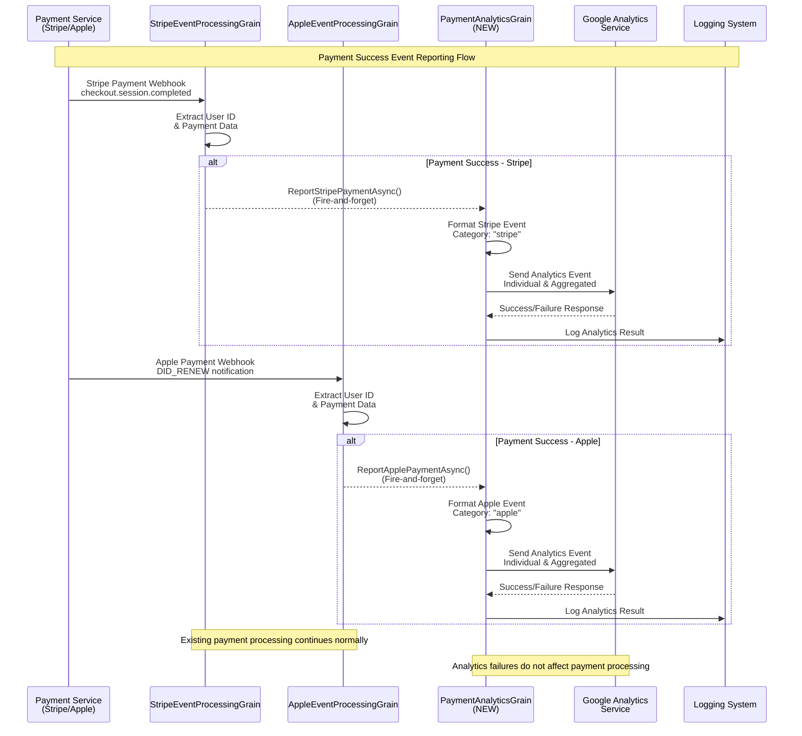
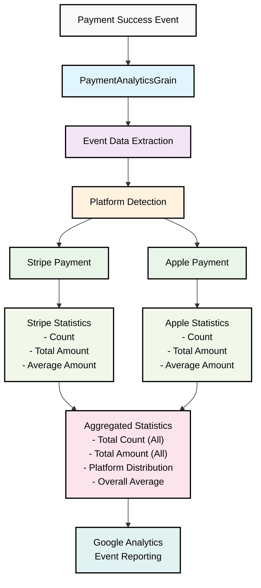

# REQ-004: Payment Analytics System - Payment Success Event Reporting

## 1. System Overview

The GodGPT Payment Analytics System is designed to implement simple count reporting for all successful payment events. The system will build upon the existing StripeEventProcessingGrain and AppleEventProcessingGrain to add payment success event reporting functionality, reporting count events to Google Analytics each time a payment succeeds.

### Core Features

**1. Simple Payment Count Reporting**
- Monitor successful payment events from all payment platforms
- Real-time count reporting on payment completion
- Unified event reporting without platform distinction

**2. Minimal Data Collection**
- Individual payment success count reporting
- Unified payment success events
- No payment type categorization required

**3. Minimal Integration**
- StripeEventProcessingGrain integration
- AppleEventProcessingGrain integration
- Fire-and-forget async reporting

## 2. Requirements

### 2.1 Core Requirements

#### R1: Payment Success Event Detection
- **Description**: Detect successful payment events from both platforms
- **Sources**: 
  - StripeEventProcessingGrain: checkout.session.completed events
  - AppleEventProcessingGrain: DID_RENEW, successful subscription events
- **Trigger**: Immediately after payment success confirmation

#### R2: Event Data Collection
- **Description**: Collect minimal payment information for count tracking
- **Required Data**:
  - Event Type: "payment_success"
  - Timestamp
  - Session ID (optional)
  - Engagement time

#### R3: Unified Reporting
- **Description**: Report payment success events as simple count events
- **Categories**:
  - Single event type: "payment_success"
  - No platform distinction required
- **Reporting**: Real-time per transaction count

### 2.2 Technical Requirements

#### T1: Minimal Integration Impact
- **Description**: Integrate without disrupting existing payment processing
- **Approach**: Add analytics calls to existing success workflows
- **Constraint**: No modification to core payment processing logic

#### T2: Async Processing
- **Description**: All analytics reporting must be asynchronous
- **Implementation**: Fire-and-forget pattern
- **Error Handling**: Failed analytics calls should not affect payment success

## 3. Implementation Architecture

### 3.1 System Components

```
Payment Processing Grains
├── StripeEventProcessingGrain
│   └── ParseEventAndGetUserIdAsync()
│       └── [NEW] ReportPaymentSuccessAsync()
└── AppleEventProcessingGrain
    └── ParseEventAndGetUserIdAsync()
        └── [NEW] ReportPaymentSuccessAsync()

Analytics System
├── PaymentAnalyticsGrain [NEW]
│   ├── ReportPaymentSuccessAsync()
│   ├── TestConnectionAsync()
│   └── GetServiceStatusAsync()
└── External Analytics Service
    └── Google Analytics Integration
```

### 3.2 Data Flow



### 3.3 Analytics Data Structure Flow



## 4. Event Data Structure

### 4.1 Payment Event Schema

```json
{
  "client_id": "CLIENT_ID",
  "events": [
    {
      "name": "payment_success",
      "params": {
        "session_id": "SESSION_ID",
        "engagement_time_msec": 100
      }
    }
  ]
}
```

### 4.2 Statistics Categories

**Unified Payment Events:**
- Single event type: "payment_success"
- Simple count tracking in GA4
- No payment type distinction
- Total payment success count across all platforms

## 5. Implementation Plan

### Phase 1: Analytics Infrastructure
1. Create PaymentAnalyticsGrain
2. Design event data structure
3. Implement analytics service integration
4. Add configuration for analytics settings

### Phase 2: Stripe Integration
1. Modify StripeEventProcessingGrain
2. Add payment success event detection
3. Implement analytics event creation
4. Add async reporting calls

### Phase 3: Apple Integration  
1. Modify AppleEventProcessingGrain
2. Add payment success event detection
3. Implement analytics event creation
4. Add async reporting calls

### Phase 4: Testing & Validation
1. Unit tests for analytics components
2. Integration tests with payment flows
3. Monitoring setup
4. Performance validation

## 6. Success Criteria

### 6.1 Functional Criteria
- ✅ All successful Stripe payments are reported
- ✅ All successful Apple payments are reported
- ✅ Analytics data is categorized by payment type
- ✅ Aggregated statistics are available
- ✅ Real-time reporting with < 5 second delay

### 6.2 Performance Criteria
- ✅ No impact on payment processing performance
- ✅ Analytics calls complete within 1 second
- ✅ 99% analytics reporting success rate
- ✅ Graceful handling of analytics service failures

## 7. Integration Points

### 7.1 StripeEventProcessingGrain Integration
```csharp
// After successful user ID extraction
if (!string.IsNullOrEmpty(userId))
{
    // Existing logic
    
    // NEW: Report payment success (fire-and-forget)
    var analyticsGrain = GrainFactory.GetGrain<IPaymentAnalyticsGrain>(0);
    _ = Task.Run(async () => {
        try {
            await analyticsGrain.ReportStripePaymentAsync(paymentData);
        } catch (Exception ex) {
            _logger.LogWarning(ex, "Failed to report Stripe payment analytics");
        }
    });
}
```

### 7.2 AppleEventProcessingGrain Integration
```csharp
// After successful user ID extraction  
if (paymentDetailsDto?.UserId != Guid.Empty)
{
    // Existing logic
    
    // NEW: Report payment success (fire-and-forget)
    var analyticsGrain = GrainFactory.GetGrain<IPaymentAnalyticsGrain>(0);
    _ = Task.Run(async () => {
        try {
            await analyticsGrain.ReportApplePaymentAsync(paymentData);
        } catch (Exception ex) {
            _logger.LogWarning(ex, "Failed to report Apple payment analytics");
        }
    });
}
```

## 8. Google Analytics 4 Integration Details

### 8.1 GA4 Measurement Protocol Configuration

```csharp
public class GoogleAnalyticsOptions
{
    public bool EnableAnalytics { get; set; } = true;
    public string MeasurementId { get; set; } // G-XXXXXXXXXX
    public string ApiSecret { get; set; } // Generated in GA4 Admin
    public string ApiEndpoint { get; set; } = "https://www.google-analytics.com/mp/collect";
    public string DebugEndpoint { get; set; } = "https://www.google-analytics.com/debug/mp/collect";
    public int TimeoutSeconds { get; set; } = 5;
    public bool UseEuRegion { get; set; } = false; // Set to true for EU data processing
}
```

### 8.2 Payment Event Schema for GA4

```json
{
  "client_id": "CLIENT_ID_FROM_PAYMENT_CONTEXT",
  "events": [
    {
      "name": "payment_success",
      "params": {
        "currency": "USD",
        "value": 29.99,
        "transaction_id": "stripe_pi_xxxxx",
        "payment_type": "stripe",
        "payment_method": "card",
        "plan_type": "premium_monthly",
        "session_id": "SESSION_ID",
        "engagement_time_msec": 100,
        "user_id": "USER_GUID",
        "custom_payment_platform": "stripe"
      }
    }
  ]
}
```

### 8.3 GA4 Setup Requirements

**Step 1: Create API Secret**
1. Navigate to GA4 Admin → Data Streams → Select Stream
2. Go to "Measurement Protocol API secrets"
3. Click "Create" and generate secret key

**Step 2: Get Measurement ID**
1. In the same Data Stream details
2. Copy the Measurement ID (G-XXXXXXXXXX format)

**Step 3: Configure Events**
- Custom event: `payment_success`
- Custom parameters: `payment_type`, `payment_method`, `plan_type`
- Standard parameters: `currency`, `value`, `transaction_id`

## 9. Dependencies

### 9.1 Internal Dependencies
- StripeEventProcessingGrain (existing)
- AppleEventProcessingGrain (existing)
- Orleans Grain infrastructure
- Logging infrastructure

### 9.2 External Dependencies
- Analytics service (Google Analytics or similar)
- HTTP client for external service calls
- Configuration management system

### 9.3 New Components Required
- PaymentAnalyticsGrain
- Analytics service client
- Event data models
- Configuration classes

## 10. Implementation Code Examples

### 10.1 PaymentAnalyticsGrain Implementation

```csharp
public interface IPaymentAnalyticsGrain : IGrainWithStringKey
{
    Task<PaymentAnalyticsResultDto> ReportPaymentSuccessAsync();
    Task<PaymentAnalyticsResultDto> TestConnectionAsync();
    Task<PaymentAnalyticsResultDto<string>> GetServiceStatusAsync();
}

[StatelessWorker]
[Reentrant]
public class PaymentAnalyticsGrain : Grain, IPaymentAnalyticsGrain
{
    private readonly ILogger<PaymentAnalyticsGrain> _logger;
    private readonly HttpClient _httpClient;
    private readonly GoogleAnalyticsOptions _options;

    public PaymentAnalyticsGrain(
        ILogger<PaymentAnalyticsGrain> logger,
        HttpClient httpClient,
        IOptionsMonitor<GoogleAnalyticsOptions> options)
    {
        _logger = logger;
        _httpClient = httpClient;
        _options = options.CurrentValue;
    }

    public async Task<PaymentAnalyticsResultDto> ReportPaymentSuccessAsync()
    {
        try
        {
            if (!_options.EnableAnalytics)
            {
                return new PaymentAnalyticsResultDto
                {
                    IsSuccess = false,
                    ErrorMessage = "Analytics reporting is disabled"
                };
            }

            var eventPayload = CreateGA4Payload();
            var url = $"{_options.ApiEndpoint}?measurement_id={_options.MeasurementId}&api_secret={_options.ApiSecret}";
            
            var jsonContent = JsonContent.Create(eventPayload);
            
            using var cts = new CancellationTokenSource(TimeSpan.FromSeconds(_options.TimeoutSeconds));
            var response = await _httpClient.PostAsync(url, jsonContent, cts.Token);
            
            if (response.IsSuccessStatusCode)
            {
                _logger.LogInformation("[PaymentAnalytics] Successfully reported payment success event");
                return new PaymentAnalyticsResultDto
                {
                    IsSuccess = true,
                    StatusCode = (int)response.StatusCode
                };
            }
            else
            {
                _logger.LogWarning("[PaymentAnalytics] Failed to report payment success: {StatusCode}", 
                    response.StatusCode);
                return new PaymentAnalyticsResultDto
                {
                    IsSuccess = false,
                    ErrorMessage = $"GA4 API error: {response.StatusCode}",
                    StatusCode = (int)response.StatusCode
                };
            }
        }
        catch (Exception ex)
        {
            _logger.LogError(ex, "[PaymentAnalytics] Error reporting payment success");
            return new PaymentAnalyticsResultDto
            {
                IsSuccess = false,
                ErrorMessage = ex.Message
            };
        }
    }

    private object CreateGA4Payload()
    {
        return new
        {
            client_id = $"payment_analytics_{DateTime.UtcNow.Ticks}",
            events = new[]
            {
                new
                {
                    name = "payment_success",
                    @params = new
                    {
                        session_id = Guid.NewGuid().ToString(),
                        engagement_time_msec = 100
                    }
                }
            }
        };
    }

    public async Task<PaymentAnalyticsResultDto> TestConnectionAsync()
    {
        try
        {
            // Use debug endpoint for testing
            var testPayload = CreateGA4Payload();
            var url = $"{_options.DebugEndpoint}?measurement_id={_options.MeasurementId}&api_secret={_options.ApiSecret}";
            
            var jsonContent = JsonContent.Create(testPayload);
            
            using var cts = new CancellationTokenSource(TimeSpan.FromSeconds(_options.TimeoutSeconds));
            var response = await _httpClient.PostAsync(url, jsonContent, cts.Token);
            
            return new PaymentAnalyticsResultDto
            {
                IsSuccess = response.IsSuccessStatusCode,
                StatusCode = (int)response.StatusCode,
                ErrorMessage = response.IsSuccessStatusCode ? "Connection test successful" : $"Connection test failed: {response.StatusCode}"
            };
        }
        catch (Exception ex)
        {
            _logger.LogError(ex, "Error testing GA4 connection");
            return new PaymentAnalyticsResultDto
            {
                IsSuccess = false,
                ErrorMessage = ex.Message
            };
        }
    }

    public async Task<PaymentAnalyticsResultDto<string>> GetServiceStatusAsync()
    {
        return await Task.FromResult(new PaymentAnalyticsResultDto<string>
        {
            IsSuccess = true,
            Data = "PaymentAnalyticsGrain is operational"
        });
    }
}
```

### 10.2 PaymentAnalyticsResultDto Definition

```csharp
public class PaymentAnalyticsResultDto
{
    public bool IsSuccess { get; set; }
    public string ErrorMessage { get; set; } = string.Empty;
    public int StatusCode { get; set; }
}

public class PaymentAnalyticsResultDto<T> : PaymentAnalyticsResultDto
{
    public T Data { get; set; }
}
```

### 10.3 Configuration Example (appsettings.json)

```json
{
  "GoogleAnalytics": {
    "EnableAnalytics": true,
    "MeasurementId": "G-XXXXXXXXXX",
    "ApiSecret": "YOUR_API_SECRET_HERE",
    "ApiEndpoint": "https://www.google-analytics.com/mp/collect",
    "DebugEndpoint": "https://www.google-analytics.com/debug/mp/collect",
    "TimeoutSeconds": 5,
    "UseEuRegion": false
  }
}
```

## 11. Testing and Validation

### 11.1 GA4 Event Validation
Use the debug endpoint to validate events before production:
```csharp
// Replace the API endpoint with debug endpoint for testing
var debugUrl = $"{_options.DebugEndpoint}?measurement_id={_options.MeasurementId}&api_secret={_options.ApiSecret}";
```

### 11.2 Key Testing Points
- ✅ Verify events appear in GA4 Real-time reports
- ✅ Check custom parameters are captured correctly
- ✅ Validate payment type categorization
- ✅ Test both Stripe and Apple payment flows
- ✅ Confirm no impact on payment processing performance