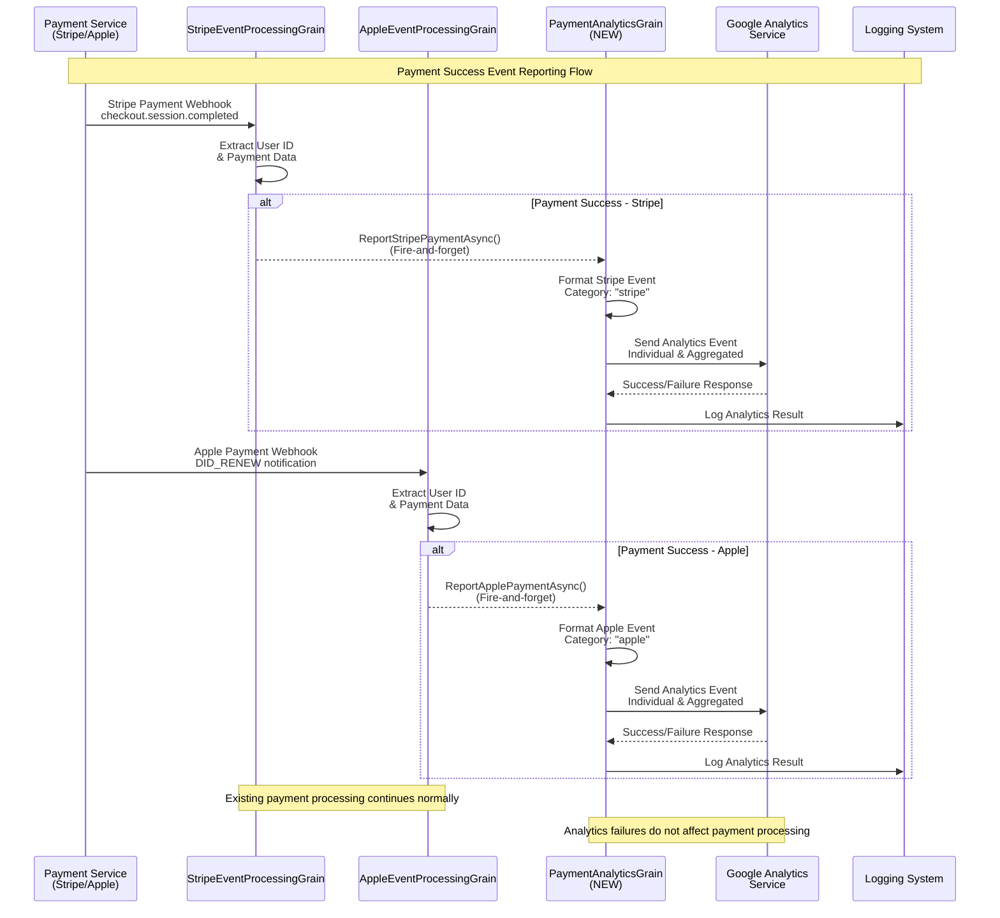
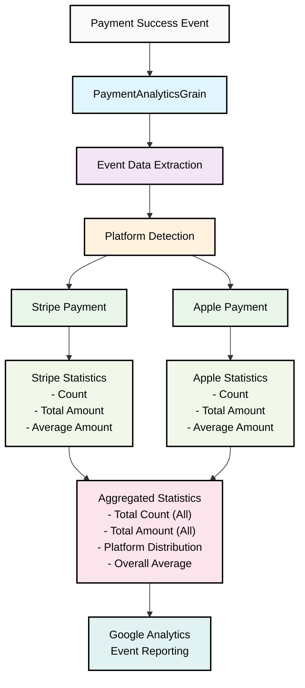

# REQ-004: Payment Analytics System - Payment Success Event Reporting

## 1. System Overview

GodGPT支付分析系统旨在实现对所有支付成功事件的实时上报。系统将在现有的StripeEventProcessingGrain和AppleEventProcessingGrain基础上，增加支付成功事件的上报功能，支持按支付类型和汇总统计的数据收集。

### Core Features

**1. Real-time Payment Event Reporting**
- Monitor successful payment events from Stripe and Apple
- Real-time reporting on payment completion
- Categorized by payment platform (Stripe/Apple)

**2. Simple Data Collection**
- Individual payment transaction reporting  
- Categorized statistics by payment type
- Aggregated statistics across all payment types

**3. Minimal Integration**
- StripeEventProcessingGrain integration
- AppleEventProcessingGrain integration
- Fire-and-forget async reporting

## 2. Requirements

### 2.1 Core Requirements

#### R1: Payment Success Event Detection
- **Description**: Detect successful payment events from both platforms
- **Sources**: 
  - StripeEventProcessingGrain: checkout.session.completed events
  - AppleEventProcessingGrain: DID_RENEW, successful subscription events
- **Trigger**: Immediately after payment success confirmation

#### R2: Event Data Collection
- **Description**: Collect essential payment information for each transaction
- **Required Data**:
  - Payment Type (Stripe/Apple)
  - User ID
  - Transaction ID  
  - Payment Amount
  - Currency
  - Payment Date/Time
  - Plan Type

#### R3: Categorized Reporting
- **Description**: Report payment events with proper categorization
- **Categories**:
  - By Payment Type: Stripe, Apple
  - Aggregated: All payments combined
- **Reporting**: Real-time per transaction

### 2.2 Technical Requirements

#### T1: Minimal Integration Impact
- **Description**: Integrate without disrupting existing payment processing
- **Approach**: Add analytics calls to existing success workflows
- **Constraint**: No modification to core payment processing logic

#### T2: Async Processing
- **Description**: All analytics reporting must be asynchronous
- **Implementation**: Fire-and-forget pattern
- **Error Handling**: Failed analytics calls should not affect payment success

## 3. Implementation Architecture

### 3.1 System Components

```
Payment Processing Grains
├── StripeEventProcessingGrain
│   └── ParseEventAndGetUserIdAsync()
│       └── [NEW] ReportPaymentSuccessAsync()
└── AppleEventProcessingGrain
    └── ParseEventAndGetUserIdAsync()
        └── [NEW] ReportPaymentSuccessAsync()

Analytics System
├── PaymentAnalyticsGrain [NEW]
│   ├── ReportStripePaymentAsync()
│   ├── ReportApplePaymentAsync()
│   └── ReportAggregatedPaymentAsync()
└── External Analytics Service
    └── Google Analytics Integration
```

### 3.2 Data Flow



### 3.3 Analytics Data Structure Flow



## 4. Event Data Structure

### 4.1 Payment Event Schema

```json
{
  "eventType": "payment_success",
  "paymentType": "stripe|apple", 
  "userId": "guid",
  "transactionId": "string",
  "amount": "decimal",
  "currency": "string",
  "planType": "string",
  "timestamp": "datetime",
  "platform": "stripe|apple"
}
```

### 4.2 Statistics Categories

**By Payment Type:**
- Stripe: count, total_amount, average_amount
- Apple: count, total_amount, average_amount

**Aggregated (All Payments):**
- Total count across all platforms
- Total amount across all platforms  
- Average transaction amount
- Platform distribution percentage

## 5. Implementation Plan

### Phase 1: Analytics Infrastructure
1. Create PaymentAnalyticsGrain
2. Design event data structure
3. Implement analytics service integration
4. Add configuration for analytics settings

### Phase 2: Stripe Integration
1. Modify StripeEventProcessingGrain
2. Add payment success event detection
3. Implement analytics event creation
4. Add async reporting calls

### Phase 3: Apple Integration  
1. Modify AppleEventProcessingGrain
2. Add payment success event detection
3. Implement analytics event creation
4. Add async reporting calls

### Phase 4: Testing & Validation
1. Unit tests for analytics components
2. Integration tests with payment flows
3. Monitoring setup
4. Performance validation

## 6. Success Criteria

### 6.1 Functional Criteria
- ✅ All successful Stripe payments are reported
- ✅ All successful Apple payments are reported
- ✅ Analytics data is categorized by payment type
- ✅ Aggregated statistics are available
- ✅ Real-time reporting with < 5 second delay

### 6.2 Performance Criteria
- ✅ No impact on payment processing performance
- ✅ Analytics calls complete within 1 second
- ✅ 99% analytics reporting success rate
- ✅ Graceful handling of analytics service failures

## 7. Integration Points

### 7.1 StripeEventProcessingGrain Integration
```csharp
// After successful user ID extraction
if (!string.IsNullOrEmpty(userId))
{
    // Existing logic
    
    // NEW: Report payment success (fire-and-forget)
    var analyticsGrain = GrainFactory.GetGrain<IPaymentAnalyticsGrain>(0);
    _ = Task.Run(async () => {
        try {
            await analyticsGrain.ReportStripePaymentAsync(paymentData);
        } catch (Exception ex) {
            _logger.LogWarning(ex, "Failed to report Stripe payment analytics");
        }
    });
}
```

### 7.2 AppleEventProcessingGrain Integration
```csharp
// After successful user ID extraction  
if (paymentDetailsDto?.UserId != Guid.Empty)
{
    // Existing logic
    
    // NEW: Report payment success (fire-and-forget)
    var analyticsGrain = GrainFactory.GetGrain<IPaymentAnalyticsGrain>(0);
    _ = Task.Run(async () => {
        try {
            await analyticsGrain.ReportApplePaymentAsync(paymentData);
        } catch (Exception ex) {
            _logger.LogWarning(ex, "Failed to report Apple payment analytics");
        }
    });
}
```

## 8. Configuration

### 8.1 Analytics Options
```csharp
public class PaymentAnalyticsOptions
{
    public bool EnableAnalytics { get; set; } = true;
    public string AnalyticsServiceUrl { get; set; }
    public int TimeoutSeconds { get; set; } = 5;
    public bool EnableStripeReporting { get; set; } = true;
    public bool EnableAppleReporting { get; set; } = true;
}
```

## 9. Dependencies

### 9.1 Internal Dependencies
- StripeEventProcessingGrain (existing)
- AppleEventProcessingGrain (existing)
- Orleans Grain infrastructure
- Logging infrastructure

### 9.2 External Dependencies
- Analytics service (Google Analytics or similar)
- HTTP client for external service calls
- Configuration management system

### 9.3 New Components Required
- PaymentAnalyticsGrain
- Analytics service client
- Event data models
- Configuration classes