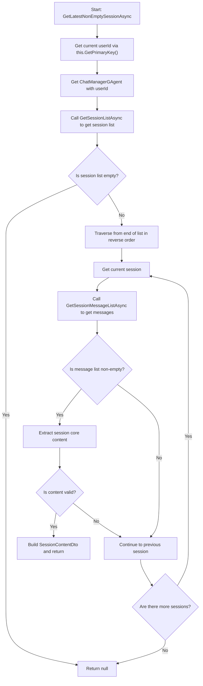
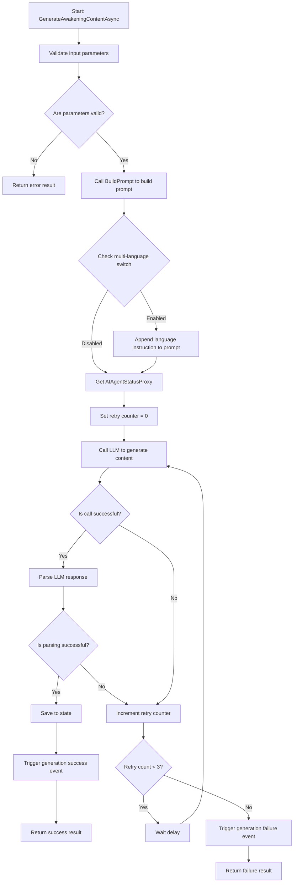
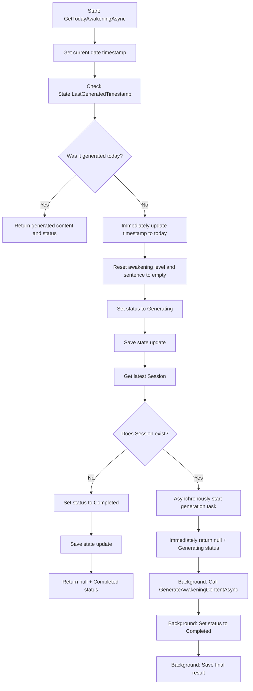
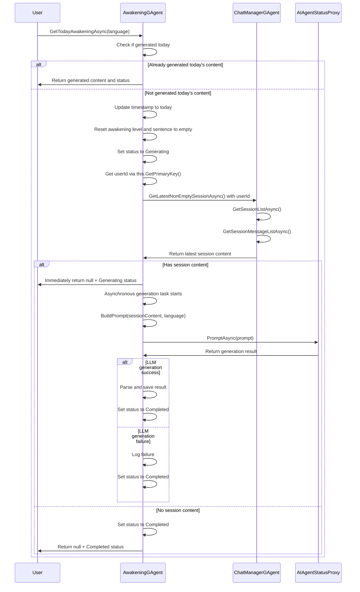

# REQ-005: Personalized Awakening System

## Requirements Overview

To improve user engagement and personalized experience, the system needs to generate personalized awakening levels and inspirational awakening sentences based on the user's recent chat content when they log in for the first time each day. If there are no chat records or analysis fails, provide default response.

## Objectives

1. **Personalized Experience**: Generate personalized awakening sentences based on user's recent chat content
2. **Multi-language Support**: Support English, Chinese, and Spanish languages
3. **Simplicity**: Return empty values when no content is available, avoiding misleading default content
4. **Performance Optimization**: Asynchronous generation without blocking user interaction
5. **Configurability**: Support configurable management of generation parameters and multi-language settings

## System Architecture Design

### Orleans Grain 架构模式

**重要架构说明**：`AwakeningGAgent` 采用 Orleans 分布式架构，以 **userId (Guid)** 为 Primary Key，每个用户都有独立的 Grain 实例。

- **Grain Key**：userId (Guid 类型)
- **实例隔离**：每个用户有专属的 AwakeningGAgent 实例
- **内部获取用户ID**：通过 `this.GetPrimaryKey()` 获取当前用户ID
- **客户端调用方式**：`var agent = _clusterClient.GetGrain<IAwakeningGAgent>(userId);`

### Core Components

#### 1. AwakeningGAgent
- **Interface**: `IAwakeningGAgent`
- **Implementation**: `AwakeningGAgent`
- **State**: `AwakeningState`
- **Events**: `AwakeningLogEvent` series

#### 2. Configuration Management
- **Configuration Class**: `AwakeningOptions`
- **Injection Method**: `IOptionsMonitor<AwakeningOptions>`

#### 3. Data Transfer Objects
- **Input**: `SessionContentDto`, `AwakeningRequestDto`
- **Output**: `AwakeningResultDto`, `AwakeningContentDto`

## Interface Definition

### IAwakeningGAgent

```csharp
using Aevatar.Core.Abstractions;
using GodGPT.GAgents.SpeechChat;
using Orleans.Concurrency;

namespace Aevatar.Application.Grains.Agents.Awakening;

/// <summary>
/// AwakeningGAgent - 个性化觉醒系统
/// 注意：此 Grain 以 userId (Guid) 为 Primary Key，每个用户有独立实例
/// 客户端调用方式：var agent = _clusterClient.GetGrain<IAwakeningGAgent>(userId);
/// </summary>
public interface IAwakeningGAgent : IGAgent
{
    /// <summary>
    /// Get the user's latest non-empty session record
    /// 内部通过 this.GetPrimaryKey() 获取当前用户ID，然后调用对应的 ChatManagerGAgent
    /// </summary>
    /// <returns>Latest session content and related information</returns>
    [ReadOnly]
    Task<SessionContentDto?> GetLatestNonEmptySessionAsync();
    
    /// <summary>
    /// Generate awakening level and sentence based on session content and language type
    /// </summary>
    /// <param name="sessionContent">Session content</param>
    /// <param name="language">Language type</param>
    /// <returns>Generated awakening content</returns>
    Task<AwakeningResultDto> GenerateAwakeningContentAsync(SessionContentDto sessionContent, VoiceLanguageEnum language);
    
    /// <summary>
    /// Get today's awakening level and quote, if not generated then generate asynchronously and return null
    /// The returned DTO contains status field, frontend can determine whether to continue polling based on this
    /// Status of Generating means generation is in progress, Completed means generation is finished (success or failure)
    /// </summary>
    /// <param name="language">Language type</param>
    /// <returns>Today's awakening content, return null if not generated, includes generation status</returns>
    [ReadOnly]
    Task<AwakeningContentDto?> GetTodayAwakeningAsync(VoiceLanguageEnum language);
    
    /// <summary>
    /// Reset today's awakening content to empty values (level=0, message="")
    /// Keep all other fields unchanged (timestamp, status, etc.)
    /// </summary>
    /// <returns>Success status of the reset operation</returns>
    Task<bool> ResetTodayContentAsync();
}
```

## Data Model Design

### AwakeningState

```csharp
using Aevatar.Core.Abstractions;
using GodGPT.GAgents.SpeechChat;

namespace Aevatar.Application.Grains.Agents.Awakening;

[GenerateSerializer]
public class AwakeningState : StateBase
{
    [Id(0)] public long LastGeneratedTimestamp { get; set; } // Timestamp in seconds
    [Id(1)] public int AwakeningLevel { get; set; } // Awakening level 1-10
    [Id(2)] public string AwakeningMessage { get; set; } = string.Empty; // Awakening message
    [Id(3)] public VoiceLanguageEnum Language { get; set; } = VoiceLanguageEnum.Unset; // Language type
    [Id(4)] public string SessionId { get; set; } = string.Empty; // Based session ID
    [Id(5)] public DateTime CreatedAt { get; set; } // Creation time
    [Id(6)] public int GenerationAttempts { get; set; } = 0; // Generation attempt count
    [Id(7)] public AwakeningStatus Status { get; set; } = AwakeningStatus.NotStarted; // Generation status
}
```

### DTO Type Definitions

```csharp
// Session content DTO
[GenerateSerializer]
public class SessionContentDto
{
    [Id(0)] public Guid SessionId { get; set; }
    [Id(1)] public string Title { get; set; } = string.Empty;
    [Id(2)] public List<ChatMessage> Messages { get; set; } = new();
    [Id(3)] public DateTime LastActivityTime { get; set; }
    [Id(4)] public string ExtractedContent { get; set; } = string.Empty; // Extracted core content
}

// Awakening generation result DTO
[GenerateSerializer]
public class AwakeningResultDto
{
    [Id(0)] public bool IsSuccess { get; set; }
    [Id(1)] public int AwakeningLevel { get; set; }
    [Id(2)] public string AwakeningMessage { get; set; } = string.Empty;
    [Id(3)] public long Timestamp { get; set; }
    [Id(4)] public string ErrorMessage { get; set; } = string.Empty;
    [Id(5)] public bool IsFromCache { get; set; } = false;
}

// Awakening content DTO
[GenerateSerializer]
public class AwakeningContentDto
{
    [Id(0)] public int AwakeningLevel { get; set; }
    [Id(1)] public string AwakeningMessage { get; set; } = string.Empty;
    [Id(2)] public AwakeningStatus Status { get; set; } = AwakeningStatus.NotStarted; // Generation status
}

// Awakening status enum
[GenerateSerializer]
public enum AwakeningStatus
{
    NotStarted = 0,    // Not started
    Generating = 1,    // Generating in progress
    Completed = 2      // Generation completed (success or failure)
}
```

### Configuration Class Definition

```csharp
namespace Aevatar.Application.Grains.Agents.Awakening.Options;

public class AwakeningOptions
{
    public bool EnableAwakening { get; set; } = true;
    public int MaxRetryAttempts { get; set; } = 3;
    public int TimeoutSeconds { get; set; } = 30;
    public string LLMModel { get; set; } = "gpt-4o-mini";
    public double Temperature { get; set; } = 0.8;
    public int MaxTokens { get; set; } = 200;
    
    // Multi-language support switch
    public bool EnableLanguageSpecificPrompt { get; set; } = false;
    
    // Prompt template configuration
    public string PromptTemplate { get; set; } = "..."; // Detailed prompt template
    
    // Language instruction templates
    public Dictionary<VoiceLanguageEnum, string> LanguageInstructions { get; set; } = new()
    {
        { VoiceLanguageEnum.Chinese, "Use Chinese for the message" },
        { VoiceLanguageEnum.English, "Use English for the message" },
        { VoiceLanguageEnum.Spanish, "Use Spanish for the message" }
    };
}
```

## Business Process Design

### Main Business Processes

#### 1. Get Latest Session Process (Optimized Version)



**Optimization Notes**: 
- The session list is already sorted in ascending chronological order, so we can directly traverse from the end backwards
- Return as soon as we find the first valid non-empty session, no need for complete sorting

#### 2. Generate Awakening Content Process (Enhanced Multi-language Support)



**Multi-language Support Enhancement**: 
- Added configuration switch `EnableLanguageSpecificPrompt`
- Disabled by default, when enabled appends language instruction at end of prompt
- Supports dynamic language switching to improve personalized experience

#### 3. Get Today's Awakening Content Process (Anti-concurrency Optimization + Status Management)



**Anti-concurrency Optimization + Status Management**: 
- First update timestamp to today, reset content, set status to Generating
- Subsequent requests detecting today's timestamp directly return current status without triggering regeneration
- Avoid duplicate generation issues in high concurrency scenarios
- After asynchronous generation completes (success or failure), set status to Completed
- Frontend can determine whether to continue polling based on status

### Swimlane Diagram



## Technical Implementation Details

### 1. User ID 获取和 ChatManager 调用实现

```csharp
public class AwakeningGAgent : GAgent<AwakeningState>, IAwakeningGAgent
{
    private readonly IClusterClient _clusterClient;
    
    public AwakeningGAgent(IClusterClient clusterClient)
    {
        _clusterClient = clusterClient;
    }
    
    public async Task<SessionContentDto?> GetLatestNonEmptySessionAsync()
    {
        // 通过 Grain 的 Primary Key 获取当前用户ID
        var userId = this.GetPrimaryKey();
        
        // 使用 userId 获取对应的 ChatManagerGAgent
        var chatManager = _clusterClient.GetGrain<IChatManagerGAgent>(userId);
        var sessionList = await chatManager.GetSessionListAsync();
        
        if (sessionList == null || sessionList.Count == 0)
        {
            return null;
        }
        
        // 从后往前遍历，查找最新的非空会话
        for (int i = sessionList.Count - 1; i >= 0; i--)
        {
            var session = sessionList[i];
            var messages = await chatManager.GetSessionMessageListAsync(session.SessionId);
            
            if (messages != null && messages.Count > 0)
            {
                // 找到非空会话，构建返回对象
                return new SessionContentDto
                {
                    SessionId = session.SessionId,
                    Title = session.Title ?? string.Empty,
                    Messages = messages,
                    LastActivityTime = session.LastActivityTime,
                    ExtractedContent = ExtractCoreContent(messages)
                };
            }
        }
        
        return null;
    }
    
    /// <summary>
    /// 获取当前用户ID的辅助方法
    /// </summary>
    private Guid GetCurrentUserId()
    {
        return this.GetPrimaryKey();
    }
    
    /// <summary>
    /// 提取核心内容的方法
    /// </summary>
    private string ExtractCoreContent(List<ChatMessage> messages)
    {
        // 提取用户消息和助手回复的关键内容
        var userMessages = messages
            .Where(m => m.ChatRole == ChatRole.User)
            .Select(m => m.Content)
            .Where(c => !string.IsNullOrWhiteSpace(c))
            .ToList();
            
        var summary = string.Join(" | ", userMessages.Take(3));
        if (summary.Length > 500)
        {
            summary = summary.Substring(0, 500) + "...";
        }
        
        return summary;
    }
}
```

### 2. Prompt Building Strategy (Supporting Multi-language Switch)

```csharp
private string BuildPrompt(SessionContentDto sessionContent, VoiceLanguageEnum language)
{
    var languageCode = GetLanguageCode(language);
    var contentSummary = ExtractAndSummarizeContent(sessionContent);
    
    var template = _options.CurrentValue.PromptTemplate;
    var basePrompt = template
        .Replace("{LANGUAGE}", languageCode)
        .Replace("{CONTENT_SUMMARY}", contentSummary)
        .Replace("{USER_CONTEXT}", BuildUserContext(sessionContent))
        .Replace("{DATE}", DateTime.UtcNow.ToString("yyyy-MM-dd"));
    
    // Check multi-language switch
    if (_options.CurrentValue.EnableLanguageSpecificPrompt)
    {
        var languageInstructions = _options.CurrentValue.LanguageInstructions;
        if (languageInstructions.TryGetValue(language, out var instruction))
        {
            basePrompt += $"\n\n{instruction}";
        }
    }
    
    return basePrompt;
}

private string ExtractAndSummarizeContent(SessionContentDto sessionContent)
{
    if (sessionContent.Messages.Count == 0)
        return "No recent conversations";
        
    // Extract key content from user messages and assistant replies
    var userMessages = sessionContent.Messages
        .Where(m => m.ChatRole == ChatRole.User)
        .Select(m => m.Content)
        .Where(c => !string.IsNullOrWhiteSpace(c))
        .ToList();
        
    var assistantMessages = sessionContent.Messages
        .Where(m => m.ChatRole == ChatRole.Assistant)
        .Select(m => m.Content)
        .Where(c => !string.IsNullOrWhiteSpace(c))
        .ToList();
    
    // Limit content length to avoid exceeding LLM token limits
    var summary = string.Join(" | ", userMessages.Take(3));
    if (summary.Length > 500)
    {
        summary = summary.Substring(0, 500) + "...";
    }
    
    return summary;
}
```

### 3. Retry Mechanism Implementation

```csharp
private async Task<AwakeningResultDto> CallLLMWithRetry(string prompt, VoiceLanguageEnum language)
{
    var maxAttempts = _options.CurrentValue.MaxRetryAttempts;
    var timeout = TimeSpan.FromSeconds(_options.CurrentValue.TimeoutSeconds);
    
    for (int attempt = 1; attempt <= maxAttempts; attempt++)
    {
        try
        {
            using var cts = new CancellationTokenSource(timeout);
            
            var proxy = await GetAIAgentStatusProxy();
            var settings = new ExecutionPromptSettings
            {
                Temperature = _options.CurrentValue.Temperature.ToString(),
                MaxTokens = _options.CurrentValue.MaxTokens
            };
            
            var response = await proxy.PromptAsync(prompt, new List<ChatMessage>(), settings);
            
            if (response.IsSuccess)
            {
                var result = ParseAwakeningResponse(response.Content, language);
                if (result.IsSuccess)
                {
                    return result;
                }
            }
            
            _logger.LogWarning($"Attempt {attempt} failed: {response.ErrorMessage}");
        }
        catch (Exception ex)
        {
            _logger.LogError(ex, $"Exception on attempt {attempt}");
        }
        
        if (attempt < maxAttempts)
        {
            await Task.Delay(1000 * attempt); // Incremental delay
        }
    }
    
    // All retries failed, return failure result
    return new AwakeningResultDto 
    { 
        IsSuccess = false, 
        ErrorMessage = "Failed to generate awakening content after all retries" 
    };
}
```

### 4. Timestamp Management (Anti-concurrency Optimization)

```csharp
private bool IsToday(long timestamp)
{
    if (timestamp == 0) return false;
    
    var dateTime = DateTimeOffset.FromUnixTimeSeconds(timestamp).DateTime;
    var today = DateTime.UtcNow.Date;
    
    return dateTime.Date == today;
}

private long GetTodayTimestamp()
{
    return ((DateTimeOffset)DateTime.UtcNow.Date).ToUnixTimeSeconds();
}

private async Task<bool> TryLockTodayGenerationAsync(VoiceLanguageEnum language)
{
    var todayTimestamp = GetTodayTimestamp();
    
    // If it's already today's timestamp, it means it's locked or generated
    if (IsToday(State.LastGeneratedTimestamp))
    {
        return false; // Already locked, no need to regenerate
    }
    
    // Atomically update timestamp to today and reset content
    RaiseEvent(new LockGenerationTimestampLogEvent 
    { 
        Timestamp = todayTimestamp 
    });
    
    // Reset awakening content for new day
    RaiseEvent(new ResetAwakeningContentLogEvent
    {
        Timestamp = todayTimestamp,
        Language = language
    });
    
    // Set status to generating
    RaiseEvent(new UpdateAwakeningStatusLogEvent
    {
        Status = AwakeningStatus.Generating
    });
    
    await ConfirmEvents();
    return true; // Successfully locked and initialized
}
```

**Anti-concurrency mechanism with status management**:
- First check if timestamp is today to avoid duplicate generation
- Atomically update timestamp to today, reset content, and set status to Generating
- Subsequent requests detecting today's timestamp return current status without triggering regeneration
- Set status to Completed after generation (success or failure) to stop frontend polling

### 5. Status Management

```csharp
private async Task SetStatusAsync(AwakeningStatus status)
{
    RaiseEvent(new UpdateAwakeningStatusLogEvent
    {
        Status = status
    });
    
    await ConfirmEvents();
}

private AwakeningContentDto? BuildAwakeningContentDto()
{
    // If content hasn't been generated today, return null
    if (!IsToday(State.LastGeneratedTimestamp))
    {
        return null;
    }
    
    // Return current content with status
    return new AwakeningContentDto
    {
        AwakeningLevel = State.AwakeningLevel,
        AwakeningMessage = State.AwakeningMessage,
        Status = State.Status
    };
}

private async Task CompleteGenerationAsync(bool isSuccess)
{
    // Always set status to completed regardless of success/failure
    await SetStatusAsync(AwakeningStatus.Completed);
    
    if (!isSuccess)
    {
        _logger.LogWarning($"Awakening generation completed with failure for user {this.GetPrimaryKey()}");
    }
}

/// <summary>
/// Reset today's awakening content to empty values (level=0, message="")
/// Keep all other fields unchanged
/// </summary>
public async Task<bool> ResetTodayContentAsync()
{
    try
    {
        // Simply reset level and message to empty values
        RaiseEvent(new ResetTodayContentLogEvent
        {
            Timestamp = DateTimeOffset.UtcNow.ToUnixTimeSeconds()
        });
        
        await ConfirmEvents();
        
        _logger.LogInformation($"Successfully reset awakening content for user {this.GetPrimaryKey()}");
        return true;
    }
    catch (Exception ex)
    {
        _logger.LogError(ex, $"Failed to reset content for user {this.GetPrimaryKey()}");
        return false;
    }
}
```


## Event Sourcing Design

### Event Definitions

```csharp
[GenerateSerializer]
public class AwakeningLogEvent : StateLogEventBase<AwakeningLogEvent>
{
}

[GenerateSerializer]
public class GenerateAwakeningLogEvent : AwakeningLogEvent
{
    [Id(0)] public long Timestamp { get; set; }
    [Id(1)] public int AwakeningLevel { get; set; }
    [Id(2)] public string AwakeningMessage { get; set; } = string.Empty;
    [Id(3)] public VoiceLanguageEnum Language { get; set; }
    [Id(4)] public string SessionId { get; set; } = string.Empty;
    [Id(5)] public bool IsSuccess { get; set; }
    [Id(6)] public int AttemptCount { get; set; }
}

[GenerateSerializer]
public class AwakeningGenerationFailedLogEvent : AwakeningLogEvent
{
    [Id(0)] public long Timestamp { get; set; }
    [Id(1)] public VoiceLanguageEnum Language { get; set; }
    [Id(2)] public string ErrorMessage { get; set; } = string.Empty;
    [Id(3)] public int AttemptCount { get; set; }
}

[GenerateSerializer]
public class LockGenerationTimestampLogEvent : AwakeningLogEvent
{
    [Id(0)] public long Timestamp { get; set; }
}

[GenerateSerializer]
public class UpdateAwakeningStatusLogEvent : AwakeningLogEvent
{
    [Id(0)] public AwakeningStatus Status { get; set; }
}

[GenerateSerializer]
public class ResetAwakeningContentLogEvent : AwakeningLogEvent
{
    [Id(0)] public long Timestamp { get; set; }
    [Id(1)] public VoiceLanguageEnum Language { get; set; }
}

[GenerateSerializer]
public class ResetTodayContentLogEvent : AwakeningLogEvent
{
    [Id(0)] public long Timestamp { get; set; }
}
```

### Event Application Logic

```csharp
// Event application in AwakeningGAgent
protected override void Apply(AwakeningLogEvent logEvent)
{
    switch (logEvent)
    {
        case GenerateAwakeningLogEvent generateEvent:
            State.LastGeneratedTimestamp = generateEvent.Timestamp;
            State.AwakeningLevel = generateEvent.AwakeningLevel;
            State.AwakeningMessage = generateEvent.AwakeningMessage;
            State.Language = generateEvent.Language;
            State.SessionId = generateEvent.SessionId;
            State.GenerationAttempts = generateEvent.AttemptCount;
            State.Status = AwakeningStatus.Completed;
            break;
            
        case LockGenerationTimestampLogEvent lockEvent:
            State.LastGeneratedTimestamp = lockEvent.Timestamp;
            break;
            
        case UpdateAwakeningStatusLogEvent statusEvent:
            State.Status = statusEvent.Status;
            break;
            
        case ResetAwakeningContentLogEvent resetEvent:
            State.LastGeneratedTimestamp = resetEvent.Timestamp;
            State.Language = resetEvent.Language;
            State.AwakeningLevel = 0;
            State.AwakeningMessage = string.Empty;
            State.GenerationAttempts = 0;
            State.Status = AwakeningStatus.Generating;
            break;
            
        case ResetTodayContentLogEvent resetTodayEvent:
            // Only reset level and message, preserve all other fields
            State.AwakeningLevel = 0;
            State.AwakeningMessage = string.Empty;
            break;
            
        case AwakeningGenerationFailedLogEvent failedEvent:
            State.Language = failedEvent.Language;
            State.GenerationAttempts = failedEvent.AttemptCount;
            State.Status = AwakeningStatus.Completed;
            // Keep previous content on failure
            break;
    }
}
```

## Configuration Management

### appsettings.json Configuration Example

```json
{
  "Awakening": {
    "EnableAwakening": true,
    "MaxRetryAttempts": 3,
    "TimeoutSeconds": 30,
    "LLMModel": "gpt-4o-mini",
    "Temperature": 0.8,
    "MaxTokens": 200,
    "EnableLanguageSpecificPrompt": false,
    "LanguageInstructions": {
      "Chinese": "Use Chinese for the message",
      "English": "Use English for the message",
      "Spanish": "Use Spanish for the message"
    },
    "PromptTemplate": "Based on the user's recent conversation content: {CONTENT_SUMMARY}, please generate a personalized awakening level (1-10) and an inspiring awakening sentence in {LANGUAGE}. The response should be motivational and reflect the user's current state and interests. Context: {USER_CONTEXT}. Date: {DATE}. Format your response as JSON: {\"level\": number, \"message\": \"string\"}"
  }
}
```

## Performance Optimization Strategies

### 1. Asynchronous Processing
- Use `Task.Run` for background generation
- Avoid blocking user interface response

### 2. Caching Strategy
- Date-based caching mechanism
- Avoid regenerating content for the same day

### 3. Content Preprocessing
- Limit session content length
- Intelligently extract key information

### 4. Error Handling
- Clear error logging
- Return null on failure to avoid misleading content

## Testing Strategy

### 1. Unit Test Coverage
- Normal flow of each method
- Exception handling
- Boundary condition testing
- Multi-language support testing

### 2. Integration Testing
- Integration with ChatManager
- Integration with LLM service
- Configuration system integration

### 3. Performance Testing
- Response time testing
- Concurrent processing capability
- Memory usage

## Deployment and Operations

### 1. Monitoring Metrics
- Generation success rate
- Average response time
- Error rate statistics
- Empty return rate

### 2. Logging
- Detailed operation logs
- Error logs and exception tracking
- Performance metrics recording

### 3. Configuration Hot Updates
- Support runtime configuration updates
- Dynamic adjustment of language instructions

## 客户端调用示例

### Controller 中的调用方式

```csharp
[ApiController]
[Route("api/[controller]")]
public class AwakeningController : ControllerBase
{
    private readonly IClusterClient _clusterClient;
    
    public AwakeningController(IClusterClient clusterClient)
    {
        _clusterClient = clusterClient;
    }
    
    [HttpGet("today")]
    public async Task<ActionResult<AwakeningContentDto>> GetTodayAwakening(
        [FromQuery] VoiceLanguageEnum language = VoiceLanguageEnum.Chinese)
    {
        // 从认证上下文获取用户ID
        var userId = GetCurrentUserIdFromAuth(); 
        
        // 获取用户专属的 AwakeningGAgent 实例
        var awakeningAgent = _clusterClient.GetGrain<IAwakeningGAgent>(userId);
        
        // 调用方法
        var result = await awakeningAgent.GetTodayAwakeningAsync(language);
        
        if (result == null)
        {
            return NotFound("No awakening content available");
        }
        
        return Ok(result);
    }
    
    [HttpPost("reset-content")]
    public async Task<ActionResult<bool>> ResetTodayContent()
    {
        // Get current user's ID from authentication
        var userId = GetCurrentUserIdFromAuth(); 
        
        // Get user's AwakeningGAgent instance
        var awakeningAgent = _clusterClient.GetGrain<IAwakeningGAgent>(userId);
        
        // Reset content to empty values
        var result = await awakeningAgent.ResetTodayContentAsync();
        
        if (result)
        {
            return Ok(new { Success = true, Message = "Content reset successfully" });
        }
        else
        {
            return BadRequest(new { Success = false, Message = "Failed to reset content" });
        }
    }
    
    private Guid GetCurrentUserIdFromAuth()
    {
        // 从 JWT Token 或其他认证方式获取用户ID
        // 具体实现取决于认证机制
        return Guid.Parse(User.FindFirst("userId")?.Value ?? throw new UnauthorizedAccessException());
    }
}
```

## Content Reset Feature

The `ResetTodayContentAsync` method provides a simple way to clear awakening content:

### Purpose
Reset awakening level to 0 and message to empty string while keeping all other fields unchanged.

### Usage
```csharp
var result = await awakeningAgent.ResetTodayContentAsync();
```

### Behavior
- Sets `AwakeningLevel = 0`
- Sets `AwakeningMessage = ""`
- Preserves all other state fields (timestamp, status, language, etc.)
- Returns `true` on success, `false` on failure

## Summary

This requirements document provides a complete implementation plan for the personalized awakening system, including:

1. **System Architecture**: Distributed architecture based on Orleans Grain
2. **Interface Design**: Clear method definitions and responsibility separation
3. **Data Model**: Complete state management and DTO design
4. **Business Process**: Detailed flowcharts and swimlane diagrams
5. **Technical Implementation**: Specific code implementation strategies
6. **Configuration Management**: Flexible configuration system design
7. **Error Handling**: Clear failure handling and null return
8. **Performance Optimization**: Asynchronous processing and caching strategies

## Key Optimization Features

### 🚀 **Performance Optimization**
- **Session Retrieval Optimization**: Traverse directly from end of ascending list, avoiding unnecessary sorting
- **Anti-concurrency Mechanism**: Timestamp locking strategy ensuring content generation only once per day
- **Asynchronous Processing**: Return null immediately, generate personalized content asynchronously in background
- **Status Management**: Avoid infinite frontend polling through status field, improving user experience

### 🌍 **Multi-language Enhancement**
- **Configuration Switch**: `EnableLanguageSpecificPrompt` controls language-specific prompts
- **Dynamic Language Instructions**: Append corresponding language instructions based on user language preference
- **Default Disabled Strategy**: Ensure system compatibility and progressive feature enablement

### 🔒 **Concurrency Safety**
- **Atomic Locking**: Use Event Sourcing to ensure atomicity of timestamp updates
- **Duplicate Check Mechanism**: Multiple layers of checks to avoid duplicate generation
- **Distributed Lock**: Simple and effective distributed lock mechanism based on timestamps

### 📊 **Status Management**
- **Three-state Design**: NotStarted/Generating/Completed clearly represents generation progress
- **Anti-polling Mechanism**: Frontend determines whether to continue polling based on status
- **Failure Handling**: Mark as Completed regardless of success/failure, avoiding permanent Generating state
- **Content Reset**: Reset level and sentence on first daily generation, ensuring state consistency

This system design ensures high availability, scalability, and user experience optimization, with deep optimization specifically for high concurrency scenarios.

## Updated Design Philosophy

**Simplicity Principle**: This system adopts the "empty is empty" design philosophy. When personalized content cannot be generated, it directly returns null rather than providing potentially misleading default content.

**Status-driven Principle**: Avoid infinite frontend polling through explicit status management, providing better user experience. The status design ensures:

- **Data Authenticity**: Avoid users mistaking generic content for personalized generation
- **System Simplicity**: Reduce unnecessary configuration and fallback logic
- **Development Efficiency**: Simplify testing and maintenance complexity
- **User Experience**: Client can provide more appropriate UI interaction based on null values and status
- **Resource Conservation**: Frontend stops polling based on status, reducing unnecessary API calls
- **State Consistency**: Daily reset ensures consistency between state and content

This design provides complete and concise technical specifications for subsequent code implementation. 