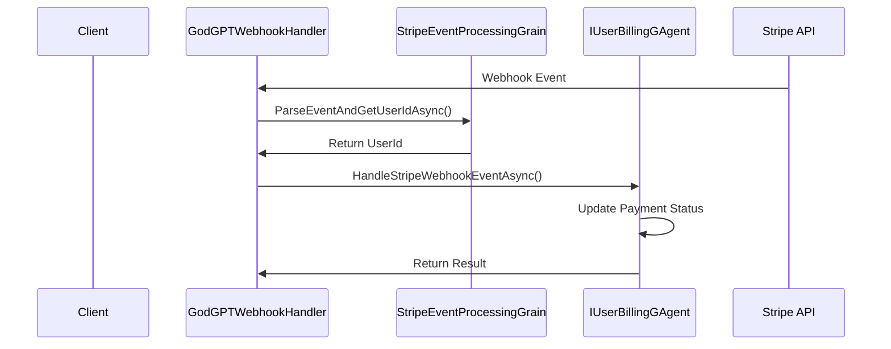
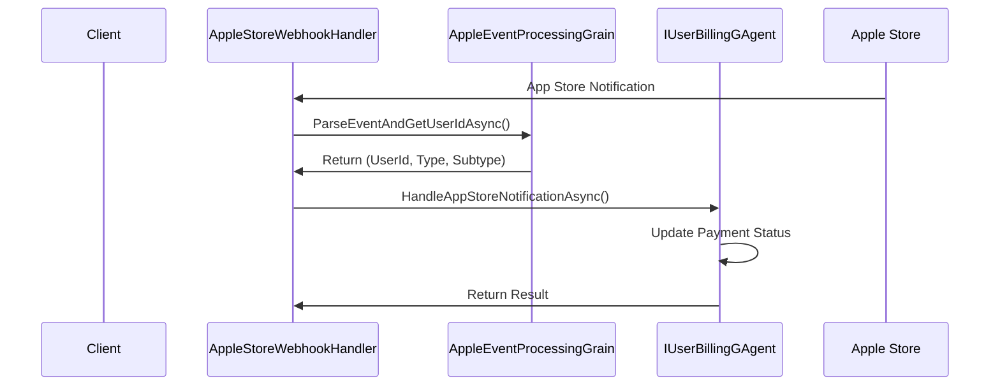
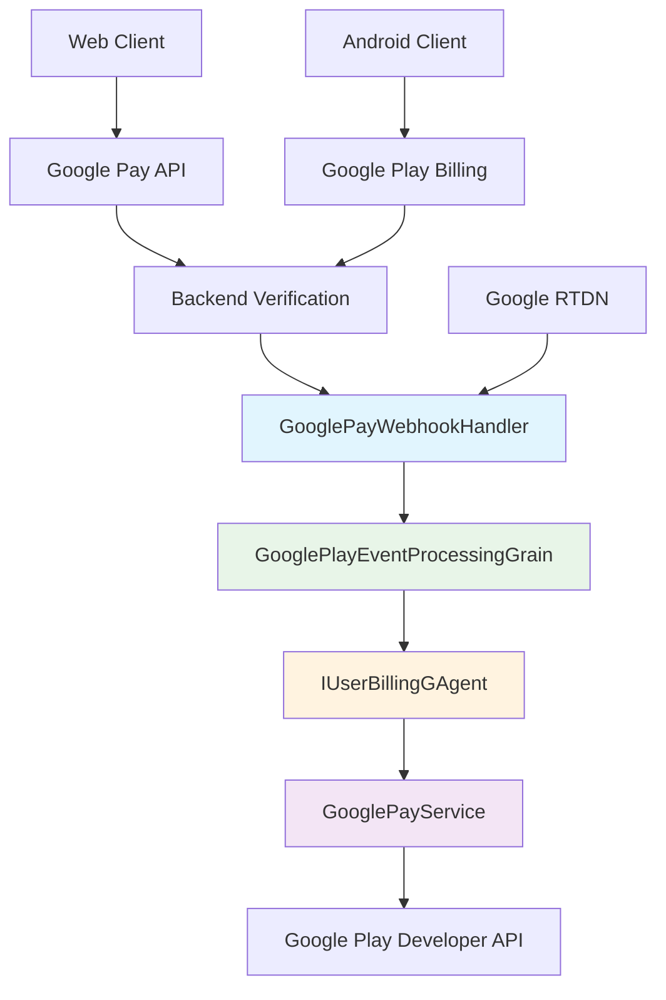
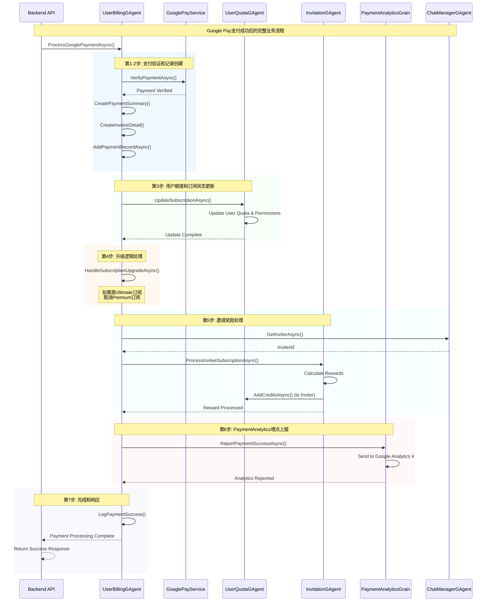
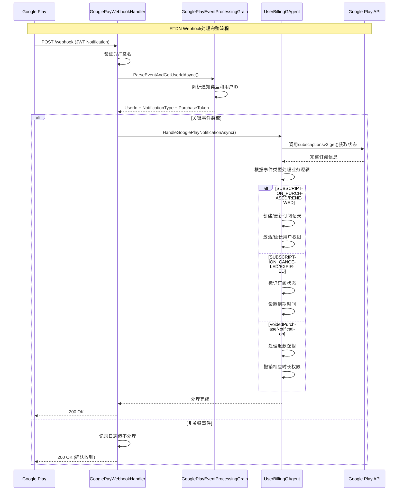
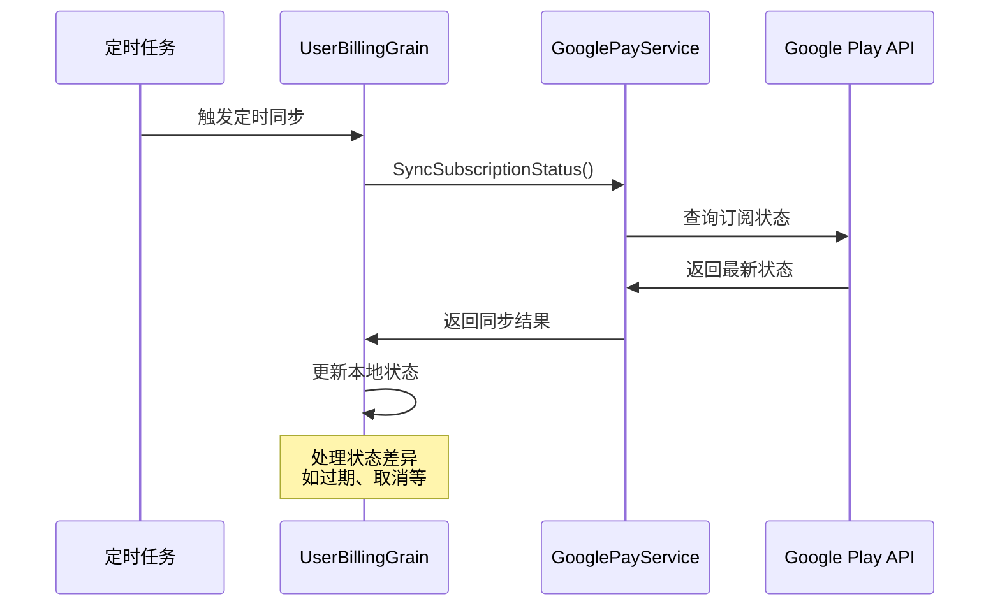
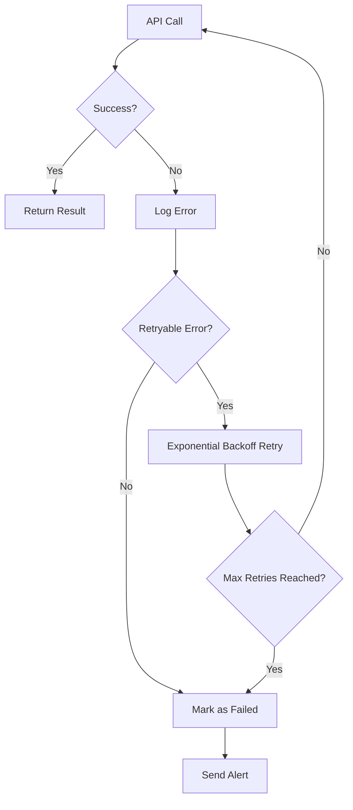
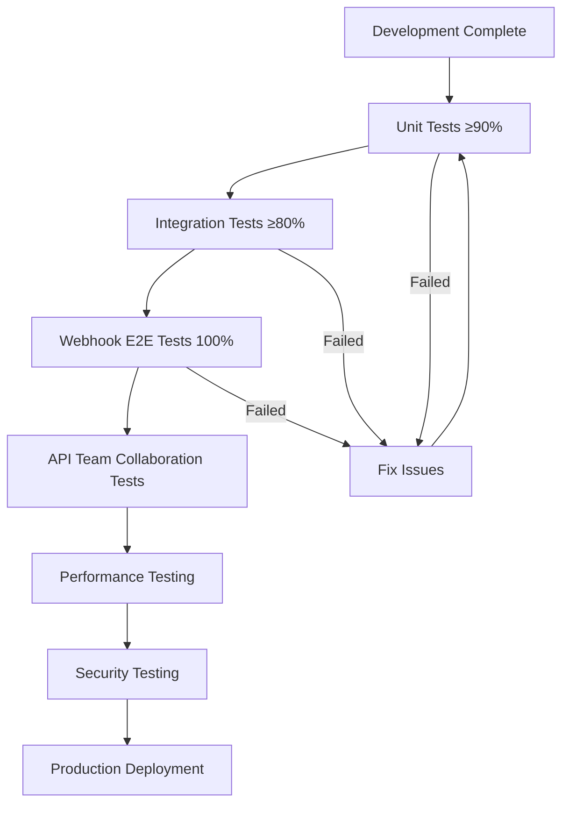

# REQ-006: Google Pay Integration System

## 1. Requirements Overview

### 1.1 Background
The system currently supports Stripe and Apple Store payments. We need to add Google Pay payment integration to provide more payment options for Web and Android users. Google Pay integration needs to support subscription purchases, automatic renewals, webhook callbacks, refund processing, and other complete workflows.

### 1.2 Objectives
- Implement Google Pay Web and Android payment integration
- Support subscription purchases and automatic renewals
- Implement Real-time Developer Notifications (RTDN) webhook processing
- Provide complete refund and subscription cancellation workflows
- Ensure architectural consistency with existing Stripe/Apple payment systems

### 1.3 Associated Documentation
This design document is part of a comprehensive development package:

| Document | Purpose | Key Content |
|----------|---------|-------------|
| **Current Document** | Technical design and architecture | Business requirements, system design, implementation specifications |
| **[Google Pay Testing Strategy](../google-pay-testing-strategy.md)** | Comprehensive testing framework | Test environment setup, unit/integration test suites, mock services, quality assurance |

> **💡 Development Workflow**: Developers should reference both documents throughout the development lifecycle to ensure complete implementation and thorough testing validation.

### 1.4 Scope and System Boundaries

#### **Current Project Responsibility Scope (GodGPT.GAgents Backend Core Layer)**
- ✅ Google Play Developer API integration
- ✅ RTDN webhook processing logic
- ✅ Subscription status synchronization and validation
- ✅ Payment status management and data persistence
- ✅ Grain business logic implementation
- ✅ Error handling and retry mechanisms
- ✅ Monitoring and logging

#### **Other Team Responsibility Scope (Controller/API Layer)**
- ❌ HTTP API Controller implementation
- ❌ Routing configuration and parameter validation
- ❌ Request/response serialization/deserialization
- ❌ OpenAPI documentation and interface specifications
- ❌ Frontend interaction layer design

#### **Team Collaboration Boundaries**
```
┌─────────────────────────┐    ┌──────────────────────────┐
│   API Controller Layer  │    │   GAgents Business Layer │
│   (Other Teams)          │◄──►│   (Current Project)       │
│                         │    │                          │
│ • HTTP Routing & Valid. │    │ • IUserBillingGAgent     │
│ • Parameter Ser/Deser.  │    │ • GooglePayWebhookHandler│
│ • API Documentation     │    │ • Business Flow & State  │
│ • Error Code Conversion │    │ • Third-party API Integ. │
└─────────────────────────┘    └──────────────────────────┘
```

**Integration Contract**: The API layer calls the business layer through Orleans Grain interfaces, and the business layer provides standard method signatures and DTO data structures.

## 2. 支付平台能力对比

### 2.1 三种支付平台订阅管理能力对比

> **核心参考表**: 快速了解各平台在订阅管理方面的能力差异，指导API设计

| 操作类型 | Stripe | Apple Store | Google Play | 实现方案 |
|----------|--------|-------------|-------------|----------|
| **查询订阅状态** | ✅ 完整API支持 | ✅ 完整API支持 | ✅ 完整API支持 | 三个平台都提供API查询 |
| **创建订阅** | ✅ 服务端API | ✅ 客户端API | ✅ 客户端API | Stripe服务端，移动端客户端 |
| **取消订阅** | ✅ API直接取消 | ❌ 用户自行操作 | ❌ 用户自行操作 | **关键差异** |
| **修改订阅** | ✅ API直接修改 | ❌ 用户自行操作 | ❌ 用户自行操作 | 升级/降级等 |
| **退款处理** | ✅ API直接退款 | ❌ 开发者后台 | ❌ 开发者后台 | **关键差异** |
| **订阅暂停** | ✅ API控制 | ❌ 不支持 | ✅ API控制 | Google Play特有功能 |
| **Webhook通知** | ✅ 实时webhook | ✅ Server Notifications | ✅ RTDN | 都支持实时通知 |

### 2.2 各支付平台订阅操作流程

> **说明**: 以下流程对比的是在各支付平台（Stripe/Apple Store/Google Play）管理订阅的操作流程，不是产品会员的管理流程。

#### 2.2.1 支付平台订阅取消流程对比

```mermaid
graph TD
    subgraph "Stripe (API控制)"
        A1[用户点击取消] --> B1[后端API调用]
        B1 --> C1[Stripe取消订阅]
        C1 --> D1[立即生效/期末生效]
    end
    
    subgraph "Apple Store (用户自管理)"
        A2[用户需要取消] --> B2[系统引导说明]
        B2 --> C2[用户前往App Store]
        C2 --> D2[在App Store管理订阅]
        D2 --> E2[Apple Notification通知系统]
    end
    
    subgraph "Google Play (用户自管理)"  
        A3[用户需要取消] --> B3[系统引导说明]
        B3 --> C3[用户前往Play Store]
        C3 --> D3[在Play Store管理订阅]
        D3 --> E3[RTDN通知系统]
    end
    
    style B1 fill:#c8e6c9
    style B2 fill:#ffcdd2
    style B3 fill:#ffcdd2
```



#### 2.2.2 支付平台退款处理流程对比

```mermaid
graph TD
    subgraph "Stripe (完全API控制)"
        S1[退款申请] --> S2[API调用退款]
        S2 --> S3[自动处理]
        S3 --> S4[Webhook通知]
    end
    
    subgraph "Apple Store (后台处理)"
        A1[退款申请] --> A2[App Store Connect]
        A2 --> A3[手动审批]
        A3 --> A4[Apple通知系统]
    end
    
    subgraph "Google Play (后台处理)"
        G1[退款申请] --> G2[Play Console]
        G2 --> G3[手动审批]
        G3 --> G4[RTDN通知系统]
    end
    
    style S2 fill:#c8e6c9
    style A2 fill:#fff9c4
    style G2 fill:#fff9c4
```



### 2.3 Design Decision Guidance

Based on capability comparison, Google Pay integration design principles:

| Feature | Design Decision | Reason |
|------|----------|------|
| **Subscription Query** | Provide Complete API | All platforms support it, needed by users and customer service |
| **Cancel Subscription** | Provide User Guidance Page | Google Play doesn't support third-party cancellation |
| **Refund Processing** | Customer Service Tools + User Guidance | Requires manual operation in Play Console |
| **Webhook Processing** | Complete RTDN Integration | Core mechanism for payment status changes |


## 3. Existing Architecture Analysis

### 3.1 Stripe Payment Pattern


### 3.2 Apple Payment Pattern


### 3.3 Existing Data Structures
```csharp
public enum PaymentPlatform
{
    Stripe = 0,
    AppStore = 1
    // Need to add GooglePlay = 2
}

public enum PaymentStatus
{
    None = 0,
    Pending = 1,
    Processing = 2,
    Completed = 3,
    Failed = 4,
    Refunded_In_Processing = 5,
    Refunded = 6,
    Cancelled_In_Processing = 7,
    Cancelled = 8,
    Disputed = 9,
    CancelPending = 10,
    Unknown = 11
}
```

## 4. Google Pay集成设计

### 4.1 Overall Architecture



### 4.2 Backend API Interface Design

#### 4.2.1 Web Payment Verification API

```csharp
[ApiController]
[Route("api/payment/google-pay")]
public class GooglePayWebController : ControllerBase
{
    [HttpPost("verify")]
    public async Task<IActionResult> VerifyWebPayment([FromBody] GooglePayWebVerificationRequest request)
    {
        // 1. Verify user identity
        // 2. Call IUserBillingGAgent to verify Web payment
        // 3. Return verification result
    }
    
    [HttpGet("subscription-status")]
    public async Task<IActionResult> GetSubscriptionStatus()
    {
        // Get user's current subscription status
    }
}

// Web API Request/Response DTO
[GenerateSerializer]
public class GooglePayWebVerificationRequest
{
    [Id(0)] public string PaymentToken { get; set; }
    [Id(1)] public string ProductId { get; set; }
    [Id(2)] public string OrderId { get; set; }
    [Id(3)] public string Environment { get; set; } // "PRODUCTION" or "TEST"
}
```

#### 4.2.2 Android Payment Verification API

```csharp
[ApiController]
[Route("api/payment/google-play")]
public class GooglePlayPaymentController : ControllerBase
{
    [HttpPost("verify")]
    public async Task<IActionResult> VerifyPurchase([FromBody] GooglePlayPurchaseVerificationRequest request)
    {
        // 1. Verify user identity
        // 2. Call IUserBillingGAgent to verify purchase
        // 3. Return verification result
    }
    
    [HttpGet("subscription-status")]
    public async Task<IActionResult> GetSubscriptionStatus()
    {
        // Get user's current subscription status
    }
    
    [HttpPost("cancel-subscription")]
    public async Task<IActionResult> CancelSubscription([FromBody] CancelSubscriptionRequest request)
    {
        // Cancel subscription
    }
}

// Android API Request/Response DTO
[GenerateSerializer]
public class GooglePlayPurchaseVerificationRequest
{
    [Id(0)] public string PurchaseToken { get; set; }
    [Id(1)] public string ProductId { get; set; }
    [Id(2)] public string PackageName { get; set; }
    [Id(3)] public string OrderId { get; set; }
}

// Unified Response DTO
[GenerateSerializer]
public class PaymentVerificationResponse
{
    [Id(0)] public bool IsValid { get; set; }
    [Id(1)] public string Message { get; set; }
    [Id(2)] public DateTime? SubscriptionStartDate { get; set; }
    [Id(3)] public DateTime? SubscriptionEndDate { get; set; }
    [Id(4)] public string TransactionId { get; set; }
}
```

### 4.3 Core Component Design

#### 4.3.1 GooglePayWebhookHandler

**File Location**: `src/GodGPT.Webhook/Http/GooglePayWebhookHandler.cs`

```csharp
using Aevatar.Application.Grains.Agents.ChatManager.Common;
using Aevatar.Application.Grains.ChatManager.UserBilling;
using Aevatar.Application.Grains.UserBilling;
using Aevatar.Application.Grains.Webhook;
using Aevatar.Webhook.SDK.Handler;
using Microsoft.AspNetCore.Http;
using Microsoft.Extensions.Logging;

namespace GodGPT.Webhook.Http;

public class GooglePayWebhookHandler : IWebhookHandler
{
    private readonly ILogger<GooglePayWebhookHandler> _logger;
    private readonly IClusterClient _clusterClient;
    
    private static readonly string GooglePlayEventProcessingGrainId = "GooglePlayEventProcessingGrainId_1";

    public GooglePayWebhookHandler(
        IClusterClient clusterClient,
        ILogger<GooglePayWebhookHandler> logger)
    {
        _clusterClient = clusterClient;
        _logger = logger;
    }

    public string RelativePath => "api/webhooks/godgpt-googleplay-payment";
    public string HttpMethod => "POST";

    public async Task<object> HandleAsync(HttpRequest request)
    {
        try
        {
            _logger.LogDebug(
                "[GooglePayWebhookHandler][webhook] Received request: Method={method}, Path={path}, QueryString={query}",
                request.Method, request.Path, request.QueryString);

            // 1. Read RTDN notification payload
            var json = await new StreamReader(request.Body).ReadToEndAsync();
            
            // 2. Use GooglePlayEventProcessingGrain to parse notification and get userId
            var googlePlayEventProcessingGrain = _clusterClient.GetGrain<IGooglePlayEventProcessingGrain>(GooglePlayEventProcessingGrainId);
            var (userId, notificationType, purchaseToken) = await googlePlayEventProcessingGrain.ParseEventAndGetUserIdAsync(json);
            
            _logger.LogInformation("[GooglePayWebhookHandler][webhook] userId:{0}, notificationType:{1}, purchaseToken:{2} json: {3}",
                userId, notificationType, purchaseToken, json);
                
            if (userId == default)
            {
                _logger.LogWarning("[GooglePayWebhookHandler][webhook] Could not determine user ID from notification");
                // Return 200 status to avoid Google retries
                return new { success = true, message = "Notification received but no associated user found" };
            }
            
            // 3. Filter by event type (only process key business events)
            if (!IsKeyBusinessEvent(notificationType))
            {
                _logger.LogInformation("[GooglePayWebhookHandler][webhook] Filter NotificationType {0}", notificationType);
                return new { success = true, message = "Notification received but filtered by type" };
            }
            
            // 4. Use found userId to call UserBillingGAgent to process notification
            var userBillingGAgent = _clusterClient.GetGrain<IUserBillingGAgent>(userId);
            var result = await userBillingGAgent.HandleGooglePlayNotificationAsync(userId.ToString(), json);
            
            if (!result)
            {
                _logger.LogWarning("[GooglePayWebhookHandler][Webhook] Failed to process notification for user {UserId}", userId);
                return new { success = false, message = "Failed to process notification" };
            }
            
            // Return success response
            _logger.LogInformation("[GooglePayWebhookHandler][webhook] Successfully processed notification for user {UserId}", userId);
            return new { success = true };
        }
        catch (Exception ex)
        {
            _logger.LogError(ex, "[GooglePayWebhookHandler][webhook] Error processing webhook request");
            // Return 200 status to avoid Google retries (can be adjusted based on business requirements)
            return new { success = false, error = "Internal server error" };
        }
    }
    
    private bool IsKeyBusinessEvent(string notificationType)
    {
        return notificationType switch
        {
            "SUBSCRIPTION_PURCHASED" => true,     // Subscription purchase success
            "SUBSCRIPTION_RENEWED" => true,       // Subscription renewal success
            "SUBSCRIPTION_CANCELED" => true,      // Subscription cancellation
            "SUBSCRIPTION_EXPIRED" => true,       // Subscription expiration
            "VoidedPurchaseNotification" => true, // Refund processing
            _ => false // Other types temporarily filtered
        };
    }
}
```

#### 4.3.2 GooglePlayEventProcessingGrain

```csharp
public interface IGooglePlayEventProcessingGrain : IGrainWithStringKey
{
    Task<(Guid UserId, string NotificationType, string PurchaseToken)> ParseEventAndGetUserIdAsync(string json);
}

[StatelessWorker]
[Reentrant]
public class GooglePlayEventProcessingGrain : Grain, IGooglePlayEventProcessingGrain
{
    private readonly ILogger<GooglePlayEventProcessingGrain> _logger;
    private readonly GooglePlayOptions _options;
    
    public async Task<(Guid UserId, string NotificationType, string PurchaseToken)> ParseEventAndGetUserIdAsync(string json)
    {
        try
        {
            // 1. Parse RTDN notification JSON
            var notification = JsonSerializer.Deserialize<GooglePlayNotification>(json);
            var message = notification.Message;
            
            // 2. JWT signature verification (key security measure)
            var jwtToken = message.Data;
            var handler = new JwtSecurityTokenHandler();
            
            // Get Google public keys for verification
            var googlePublicKeys = await GetGooglePublicKeysAsync();
            var validationParameters = new TokenValidationParameters
            {
                ValidateIssuer = true,
                ValidIssuer = "Google",
                ValidateAudience = true,
                ValidAudience = _options.PackageName,
                ValidateLifetime = true,
                IssuerSigningKeys = googlePublicKeys,
                ClockSkew = TimeSpan.FromMinutes(5)
            };
            
            var principal = handler.ValidateToken(jwtToken, validationParameters, out var validatedToken);
            var payload = JsonSerializer.Deserialize<RTDNPayload>(
                Convert.FromBase64String(((JwtSecurityToken)validatedToken).Payload.Base64UrlEncode()));
            
            // 3. User ID mapping strategy (solving key business risks)
            var userId = await MapPurchaseTokenToUserIdAsync(payload.SubscriptionNotification.PurchaseToken);
            
            // 4. Return parsed results
            return (userId, payload.SubscriptionNotification.NotificationType, payload.SubscriptionNotification.PurchaseToken);
        }
        catch (Exception ex)
        {
            _logger.LogError(ex, "[GooglePlayEventProcessingGrain] Failed to parse RTDN notification");
            return (Guid.Empty, string.Empty, string.Empty);
        }
    }
    
    /// <summary>
    /// Map purchaseToken to user ID
    /// Strategy: Use userId mapping table recorded when purchase was created
    /// </summary>
    private async Task<Guid> MapPurchaseTokenToUserIdAsync(string purchaseToken)
    {
        // Query user mapping records from when purchase was created
        // This requires storing purchaseToken to userId association in database when user makes purchase
        var userMappingGrain = GrainFactory.GetGrain<IUserPurchaseTokenMappingGrain>(purchaseToken);
        return await userMappingGrain.GetUserIdAsync();
    }
    
    private async Task<IEnumerable<SecurityKey>> GetGooglePublicKeysAsync()
    {
        // Get JWT verification public keys from Google
        // Implement public key caching mechanism to avoid frequent requests
        // Reference: https://www.googleapis.com/oauth2/v3/certs
        throw new NotImplementedException("Need to implement Google public key retrieval logic");
    }
}

/// <summary>
/// User purchase token mapping Grain
/// Used to establish association between purchaseToken and userId
/// </summary>
public interface IUserPurchaseTokenMappingGrain : IGrainWithStringKey
{
    Task SetUserIdAsync(Guid userId);
    Task<Guid> GetUserIdAsync();
}
```

#### 4.3.3 Extend IUserBillingGAgent (Business Process Integration)
```csharp
public interface IUserBillingGAgent
{
    // Existing methods...
    
    // New Google Pay methods (integrated complete business process)
    Task<bool> VerifyGooglePlayPurchaseAsync(string purchaseToken, string productId);
    Task<bool> VerifyGooglePayWebPaymentAsync(string paymentToken, string productId);
    Task<bool> HandleGooglePlayNotificationAsync(Guid userId, string notificationData);
    Task<bool> SyncGooglePlaySubscriptionAsync(string subscriptionId);
    Task<bool> ProcessGooglePlayRefundAsync(string purchaseToken);
}

// Google Pay payment processing core business flow
public class GooglePayBusinessFlow
{
    // 1. Payment verification
    private async Task<PaymentSummary> CreatePaymentRecordAsync();
    
    // 2. User quota update  
    private async Task UpdateUserQuotaAsync();
    
    // 3. Invitation reward processing
    private async Task ProcessInviteeSubscriptionAsync();
    
    // 4. PaymentAnalytics tracking
    private async Task ReportPaymentSuccessAsync();
    
    // 5. Upgrade logic processing
    private async Task HandleSubscriptionUpgradeAsync();
    
    // 6. Audit log recording
    private async Task LogPaymentEventAsync();
}
```

#### 4.3.4 GooglePayService
```csharp
public interface IGooglePayService
{
    Task<GooglePlayPurchaseDto> VerifyPurchaseAsync(string purchaseToken, string productId);
    Task<GooglePlaySubscriptionDto> GetSubscriptionAsync(string subscriptionId);
    Task<bool> RefundPurchaseAsync(string purchaseToken);
    Task<bool> CancelSubscriptionAsync(string subscriptionId);
}

public class GooglePayService : IGooglePayService
{
    private readonly AndroidPublisherService _publisherService;
    // Implement Google Play Developer API calls
}
```

### 4.4 Business Process Integration Design

> **Important**: Google Pay integration must include the same business processes and tracking mechanisms as existing Stripe/Apple payments to ensure complete user experience and data tracking.

#### 4.4.1 Core Business Process List

Based on analysis of existing payment systems, Google Pay integration needs to include the following complete business processes:

| Business Process | Description | Existing Implementation | Google Pay Implementation |
|---------|------|----------|----------------|
| **Payment Verification** | Verify payment credential validity | Stripe API / Apple API | Google Play API / Google Pay API |
| **Payment Record Creation** | Create PaymentSummary and InvoiceDetail | `AddPaymentRecordAsync()` | Same mechanism |
| **User Quota Update** | Update subscription status and permissions | `UpdateUserQuotaAsync()` | Same mechanism |
| **Invitation Reward Processing** | Grant inviter rewards | `ProcessInviteeSubscriptionAsync()` | Same mechanism |
| **PaymentAnalytics Tracking** | Report to Google Analytics 4 | `ReportPaymentSuccessAsync()` | Same mechanism |
| **Upgrade Logic Processing** | Ultimate users cancel Premium | Upgrade logic | Same mechanism |
| **Audit Log Recording** | Detailed operation logs | Structured logging | Same mechanism |

#### 4.4.2 Google Pay Complete Business Process Implementation

```csharp
public class GooglePayPaymentProcessor
{
    public async Task<PaymentVerificationResponse> ProcessGooglePaymentAsync(
        string paymentToken, 
        string productId, 
        PaymentPlatform platform)
    {
        try
        {
            // Step 1: Payment verification
            var verificationResult = await VerifyPaymentAsync(paymentToken, productId, platform);
            if (!verificationResult.IsValid)
            {
                return CreateErrorResponse("Payment verification failed");
            }

            // Step 2: Create payment record
            var paymentSummary = await CreatePaymentRecordAsync(verificationResult, platform);
            
            // Step 3: Update user quota and subscription status
            await UpdateUserQuotaAsync(paymentSummary);
            
            // Step 4: Handle upgrade logic (if Ultimate subscription)
            if (paymentSummary.MembershipLevel == MembershipLevel.Ultimate)
            {
                await HandleSubscriptionUpgradeAsync(paymentSummary.UserId);
            }
            
            // Step 5: Process invitation rewards
            await ProcessInviteeSubscriptionAsync(
                paymentSummary.UserId, 
                paymentSummary.PlanType, 
                IsUltimate(paymentSummary.MembershipLevel),
                paymentSummary.InvoiceDetails.First().InvoiceId
            );
            
            // Step 6: PaymentAnalytics tracking report
            _ = ReportPaymentSuccessAsync(
                paymentSummary.UserId, 
                paymentSummary.OrderId, 
                platform
            );
            
            // Step 7: Record success log
            _logger.LogInformation(
                "[GooglePayProcessor] Payment processed successfully. UserId: {UserId}, OrderId: {OrderId}, Platform: {Platform}",
                paymentSummary.UserId, paymentSummary.OrderId, platform);
                
            return CreateSuccessResponse(paymentSummary);
        }
        catch (Exception ex)
        {
            // Error log recording
            _logger.LogError(ex, 
                "[GooglePayProcessor] Payment processing failed. Token: {Token}, ProductId: {ProductId}", 
                paymentToken?.Substring(0, 10) + "***", productId);
            throw;
        }
    }
    
    // Asynchronous PaymentAnalytics reporting (non-blocking main process)
    private async Task ReportPaymentSuccessAsync(Guid userId, string transactionId, PaymentPlatform platform)
    {
        try
        {
            var analyticsGrain = GrainFactory.GetGrain<IPaymentAnalyticsGrain>(
                $"payment-analytics{platform}");
            var analyticsResult = await analyticsGrain.ReportPaymentSuccessAsync(
                platform, transactionId, userId.ToString());
                
            if (analyticsResult.IsSuccess)
            {
                _logger.LogInformation(
                    "[GooglePayAnalytics] Successfully reported payment to GA4. TransactionId: {TransactionId}", 
                    transactionId);
            }
            else
            {
                _logger.LogWarning(
                    "[GooglePayAnalytics] Failed to report payment to GA4. TransactionId: {TransactionId}, Error: {Error}",
                    transactionId, analyticsResult.ErrorMessage);
            }
        }
        catch (Exception ex)
        {
            _logger.LogError(ex, 
                "[GooglePayAnalytics] Error reporting payment analytics. TransactionId: {TransactionId}", 
                transactionId);
        }
    }
}
```

#### 4.4.3 邀请奖励系统集成

Google Pay支付成功后，必须调用现有的邀请奖励系统：

```csharp
// 与现有Stripe/Apple支付完全相同的邀请奖励处理
private async Task ProcessInviteeSubscriptionAsync(Guid userId, PlanType planType, bool isUltimate, string invoiceId)
{
    var chatManagerGAgent = GrainFactory.GetGrain<IChatManagerGAgent>(userId);
    var inviterId = await chatManagerGAgent.GetInviterAsync();
    if (inviterId != null && inviterId != Guid.Empty)
    {
        var invitationGAgent = GrainFactory.GetGrain<IInvitationGAgent>((Guid)inviterId);
        await invitationGAgent.ProcessInviteeSubscriptionAsync(userId.ToString(), planType, isUltimate, invoiceId);
        
        _logger.LogInformation(
            "[GooglePayInvitation] Processed invitee subscription reward. InviterId: {InviterId}, InviteeId: {InviteeId}, PlanType: {PlanType}",
            inviterId, userId, planType);
    }
}
```

#### 4.4.4 完整业务流程时序图




### 4.5 支付流程设计

#### 4.5.1 Web支付流程（后端API设计）

> **注意**: 本设计仅关注后端API接口，不涉及Web前端的具体实现。前端团队将负责Google Pay JS API的集成，完成支付后调用我们提供的后端API进行验证。

**后端API调用流程**:
1. Web前端集成Google Pay JS API完成支付
2. 前端获取Payment Token和相关数据
3. 前端调用后端API: `POST /api/payment/google-pay/verify` 
4. 后端验证Payment Token有效性
5. 更新用户订阅状态并返回结果

```mermaid
swimlane-beta
    title Web Backend API Payment Flow
    columns WebClient BackendAPI GooglePayAPI UserBillingGAgent
    
    WebClient : 完成Google Pay支付 : POST /api/payment/google-pay/verify : -- : --
    BackendAPI : 接收Payment Token和Product ID : 调用Google Pay API验证 : 创建支付记录 : 更新用户订阅状态
    GooglePayAPI : -- : 验证Payment Token有效性 : 返回支付详细信息 : --
    UserBillingGAgent : -- : -- : 处理业务逻辑 : 返回处理结果
```

**API调用示例**:
```bash
POST /api/payment/google-pay/verify
Authorization: Bearer {user_token}
Content-Type: application/json

{
  "paymentToken": "BwAYBmVjb25fdGVzdEOBR2Fz...",
  "productId": "premium_monthly",
  "orderId": "12999763169054705758.1371079406387615"
}
```

#### 4.5.2 Android支付流程（后端API设计）

> **注意**: 本设计仅关注后端API接口，不涉及Android客户端的具体实现。Android客户端需要使用Google Play Billing Library完成支付后，调用我们提供的后端API进行验证。

**后端API调用流程**:
1. Android客户端完成支付，获取Purchase Token和相关数据
2. 客户端调用后端API: `POST /api/payment/google-play/verify`
3. 后端验证Purchase Token有效性
4. 更新用户订阅状态并返回结果

```mermaid
swimlane-beta
    title Android Backend API Payment Flow
    columns AndroidClient BackendAPI GooglePlayAPI UserBillingGAgent
    
    AndroidClient : 完成支付获取Purchase Data : POST /api/payment/google-play/verify : -- : --
    BackendAPI : 接收Purchase Token和Product ID : 调用Google Play API验证 : 创建支付记录 : 更新用户订阅状态
    GooglePlayAPI : -- : 验证Purchase Token有效性 : 返回购买详细信息 : --
    UserBillingGAgent : -- : -- : 处理业务逻辑 : 返回处理结果
```

**API调用示例**:
```bash
POST /api/payment/google-play/verify
Authorization: Bearer {user_token}
Content-Type: application/json

{
  "purchaseToken": "gkjsdlgkjsdlgkjsdlgkj...",
  "productId": "premium_monthly",
  "packageName": "com.godgpt.app",
  "orderId": "GPA.1234-5678-9012-34567"
}
```

#### 4.5.3 RTDN Webhook事件处理

Google Play通过Real-time Developer Notifications (RTDN)向开发者发送订阅状态变更通知。

##### 支持的RTDN事件类型

基于现有Stripe和Apple的webhook处理模式，Google Pay RTDN将支持以下关键事件：

| 事件类型 | 对应的RTDN通知 | 业务含义 | 处理逻辑 |
|---------|---------------|----------|----------|
| **支付成功** | `SUBSCRIPTION_PURCHASED` | 新订阅购买成功 | 创建订阅记录，激活用户权限 |
| **订阅续费** | `SUBSCRIPTION_RENEWED` | 订阅自动续费成功 | 延长订阅有效期，更新权限 |
| **订阅取消** | `SUBSCRIPTION_CANCELED` | 用户取消订阅 | 标记订阅为已取消，设置到期时间 |
| **订阅过期** | `SUBSCRIPTION_EXPIRED` | 订阅已过期 | 移除用户权限，记录过期状态 |
| **退款处理** | `VoidedPurchaseNotification` | Google处理退款 | 撤销订阅，退还剩余时长 |

##### 与现有系统的对比

| 支付平台 | 支付成功 | 订阅成功 | 取消订阅 | 退款成功 | 退款感知 |
|----------|----------|----------|----------|----------|----------|
| **Stripe** | ✅ `checkout.session.completed` | ✅ `invoice.paid` | ✅ `customer.subscription.deleted` | ✅ `charge.refunded` | **✅ 实时感知** |
| **Apple Store** | ✅ `INITIAL_BUY` | ✅ `DID_RENEW` | ✅ `EXPIRED`/`DID_CHANGE_RENEWAL_STATUS` | ✅ `REFUND` | **✅ 实时感知** |
| **Google Play** | ✅ `SUBSCRIPTION_PURCHASED` | ✅ `SUBSCRIPTION_RENEWED` | ✅ `SUBSCRIPTION_CANCELED` | ✅ `VoidedPurchaseNotification` | **✅ 实时感知** |

> **重要**: Google Pay与Apple、Stripe一样，都支持实时退款通知，确保支付状态的及时同步。

##### RTDN Webhook处理流程



##### 核心设计特点

1. **完整事件覆盖**: 支持支付成功、续费、取消、过期、退款的完整生命周期
2. **实时退款感知**: 与Stripe一样能实时通知退款事件，确保状态同步
3. **幂等性设计**: 使用purchaseToken确保重复通知的安全处理
4. **分层处理**: 关键业务事件与辅助事件分开处理，确保核心流程稳定

##### 现有系统的订阅状态管理逻辑梳理

基于现有代码分析，系统有以下关键的订阅状态管理机制：

**1. 订阅取消状态修改逻辑**
```csharp
// UserBillingGrain.cs 订阅取消处理
public async Task<CancelSubscriptionResponseDto> CancelSubscriptionAsync(CancelSubscriptionDto cancelSubscriptionDto)
{
    // 1. 修改PaymentSummary状态为Cancelled_In_Processing
    paymentSummary.Status = PaymentStatus.Cancelled_In_Processing;
    
    // 2. 调用平台API取消订阅(如Stripe)
    var subscription = await service.UpdateAsync(cancelSubscriptionDto.SubscriptionId, options);
    
    // 3. 通过Webhook确认最终状态
    // 在HandleStripeWebhookEventAsync中:
    if (invoiceDetail.Status == PaymentStatus.Cancelled && subscriptionIds.Contains(paymentSummary.SubscriptionId))
    {
        subscriptionIds.Remove(paymentSummary.SubscriptionId);
        await userQuotaGAgent.UpdateSubscriptionAsync(subscriptionInfoDto);
    }
}
```

**2. 扩展的GetActiveSubscriptionStatusAsync方法**
```csharp
// UserBillingGAgent.cs 
public async Task<ActiveSubscriptionStatusDto> GetActiveSubscriptionStatusAsync()
{
    var result = new ActiveSubscriptionStatusDto();
    
    foreach (var payment in State.PaymentHistory)
    {
        var isActiveSubscription = payment.InvoiceDetails != null && 
                                 payment.InvoiceDetails.Any() &&
                                 payment.InvoiceDetails.All(item => item.Status != PaymentStatus.Cancelled);
        
        switch (payment.Platform)
        {
            case PaymentPlatform.AppStore:
                result.HasActiveAppleSubscription = true;
                break;
            case PaymentPlatform.Stripe:
                result.HasActiveStripeSubscription = true;
                break;
            case PaymentPlatform.GooglePlay:  // 需要新增
                result.HasActiveGooglePlaySubscription = true;
                break;
        }
    }
    
    result.HasActiveSubscription = result.HasActiveAppleSubscription || 
                                 result.HasActiveStripeSubscription || 
                                 result.HasActiveGooglePlaySubscription;
    return result;
}
```

**3. 订阅升级时的自动取消逻辑**
```csharp
// UserBillingGrain.cs - 处理订阅升级
if (invoiceDetail.Status == PaymentStatus.Completed && !invoiceIds.Contains(invoiceDetail.InvoiceId))
{
    // 自动取消其他低等级订阅
    foreach (var subscriptionId in subscriptionIds.Where(s => s != paymentSummary.SubscriptionId))
    {
        await CancelSubscriptionAsync(new CancelSubscriptionDto
        {
            UserId = userId,
            SubscriptionId = subscriptionId,
            CancellationReason = $"Upgrade to a new subscription {paymentSummary.SubscriptionId}",
            CancelAtPeriodEnd = true
        });
    }
    
    // 更新为更高等级的订阅
    if (SubscriptionHelper.GetPlanTypeLogicalOrder(subscriptionInfoDto.PlanType) <= 
        SubscriptionHelper.GetPlanTypeLogicalOrder((PlanType)productConfig.PlanType))
    {
        subscriptionInfoDto.PlanType = (PlanType)productConfig.PlanType;
    }
}
```

##### Google Pay订阅升级机制解答

**问题1: 订阅产品是否需要在Google Play设置商品？**

✅ **需要预先设置**。Google Play使用现代订阅架构：

1. **订阅产品(Subscription)**: 定义订阅的核心价值(如Premium会员)
2. **基础计划(Base Plan)**: 定义计费周期和价格(如monthly-autorenewing、yearly-autorenewing)  
3. **优惠方案(Offer)**: 定义折扣和试用(如新用户7天免费试用)

```
Premium订阅
├── monthly-autorenewing ($10/月)
│   ├── 新用户7天免费试用
│   └── 升级用户首月5折
└── yearly-autorenewing ($100/年)
    └── 年付8折优惠
```

**问题2: 订阅升级是否需要用户手动取消？**

✅ **Google Play会自动处理**，类似现有Stripe逻辑：

1. **Replacement Mode机制**: Google Play支持订阅替换模式
   - `WITH_TIME_PRORATION`: 按时间比例退款并立即升级
   - `CHARGE_PRORATED_PRICE`: 立即升级并收取差价
   - `CHARGE_FULL_PRICE`: 立即收取新订阅全价

2. **系统自动处理流程**:
   ```
   用户升级: $10/月 → $20/月
   ↓
   Google Play自动取消$10订阅
   ↓  
   激活$20订阅
   ↓
   发送RTDN通知: SUBSCRIPTION_CANCELED (旧) + SUBSCRIPTION_PURCHASED (新)
   ↓
   后端处理: 更新订阅状态、延长到期时间
   ```

3. **与现有Stripe逻辑一致**: 系统已有自动取消低等级订阅的处理机制

#### 4.5.4 订阅状态同步流程



## 5. Data Structure Design

### 5.1 DTO Definitions

```csharp
[GenerateSerializer]
public class GooglePlayPurchaseDto
{
    [Id(0)] public string PurchaseToken { get; set; }
    [Id(1)] public string ProductId { get; set; }
    [Id(2)] public long PurchaseTimeMillis { get; set; }
    [Id(3)] public int PurchaseState { get; set; }
    [Id(4)] public string OrderId { get; set; }
    [Id(5)] public string PackageName { get; set; }
    [Id(6)] public bool AutoRenewing { get; set; }
    [Id(7)] public string DeveloperPayload { get; set; }
}

[GenerateSerializer]
public class GooglePlaySubscriptionDto
{
    [Id(0)] public string SubscriptionId { get; set; }
    [Id(1)] public long StartTimeMillis { get; set; }
    [Id(2)] public long ExpiryTimeMillis { get; set; }
    [Id(3)] public bool AutoRenewing { get; set; }
    [Id(4)] public int PaymentState { get; set; }
    [Id(5)] public string OrderId { get; set; }
    [Id(6)] public string PriceAmountMicros { get; set; }
    [Id(7)] public string PriceCurrencyCode { get; set; }
}

[GenerateSerializer]
public class GooglePlayNotificationDto
{
    [Id(0)] public string Version { get; set; }
    [Id(1)] public string PackageName { get; set; }
    [Id(2)] public long EventTimeMillis { get; set; }
    [Id(3)] public GooglePlaySubscriptionNotification SubscriptionNotification { get; set; }
    [Id(4)] public GooglePlayOneTimeProductNotification OneTimeProductNotification { get; set; }
}
```

### 5.2 Configuration Options

```csharp
[GenerateSerializer]
public class GooglePayOptions
{
    [Id(0)] public string PackageName { get; set; }
    [Id(1)] public string ServiceAccountEmail { get; set; }
    [Id(2)] public string ServiceAccountKeyPath { get; set; }
    [Id(3)] public string WebhookEndpoint { get; set; }
    [Id(4)] public string ApplicationName { get; set; }
    [Id(5)] public int TimeoutSeconds { get; set; } = 30;
    [Id(6)] public bool EnableSandboxTesting { get; set; }
    [Id(7)] public string PubSubTopicName { get; set; }
}
```

### 5.3 Enum Extensions

```csharp
public enum PaymentPlatform
{
    [Id(0)] Stripe = 0,
    [Id(1)] AppStore = 1,
    [Id(2)] GooglePlay = 2  // New addition
}

public enum GooglePlayNotificationType
{
    SUBSCRIPTION_RECOVERED = 1,
    SUBSCRIPTION_RENEWED = 2,
    SUBSCRIPTION_CANCELED = 3,
    SUBSCRIPTION_PURCHASED = 4,
    SUBSCRIPTION_ON_HOLD = 5,
    SUBSCRIPTION_IN_GRACE_PERIOD = 6,
    SUBSCRIPTION_RESTARTED = 7,
    SUBSCRIPTION_PRICE_CHANGE_CONFIRMED = 8,
    SUBSCRIPTION_DEFERRED = 9,
    SUBSCRIPTION_PAUSED = 10,
    SUBSCRIPTION_PAUSE_SCHEDULE_CHANGED = 11,
    SUBSCRIPTION_REVOKED = 12,
    SUBSCRIPTION_EXPIRED = 13
}
```

## 6. Analytics and Data Tracking Design

### 6.1 PaymentAnalytics Integration

Google Pay must integrate with the existing PaymentAnalytics system to ensure data tracking completeness:

#### 6.1.1 Analytics Data Structure

```csharp
public class GooglePayAnalyticsData
{
    // Basic payment information
    public PaymentPlatform Platform { get; set; }              // GooglePay / GooglePlay
    public string TransactionId { get; set; }                  // 唯一交易ID
    public string UserId { get; set; }                         // 用户ID
    public decimal PaymentAmount { get; set; }                 // 支付金额
    public string Currency { get; set; }                       // 货币类型
    public string ProductId { get; set; }                      // 产品ID
    public PlanType PlanType { get; set; }                     // 订阅类型
    
    // 业务扩展信息
    public string MembershipLevel { get; set; }                // Premium/Ultimate
    public bool IsUpgrade { get; set; }                        // 是否升级
    public bool HasInviter { get; set; }                       // 是否有邀请人
    public string PaymentMethod { get; set; }                  // 支付方式
    public DateTime PaymentTime { get; set; }                  // 支付时间
    
    // 技术信息
    public string UserAgent { get; set; }                      // 用户代理
    public string DeviceType { get; set; }                     // 设备类型
    public string Environment { get; set; }                    // 环境信息
}
```

#### 6.1.2 埋点上报时机

```csharp
public class GooglePayAnalyticsTracker
{
    // 1. 支付开始埋点
    public async Task TrackPaymentStartAsync(string userId, string productId, PaymentPlatform platform)
    {
        var eventData = new
        {
            event_name = "payment_start",
            platform = platform.ToString(),
            product_id = productId,
            user_id = userId,
            timestamp = DateTimeOffset.UtcNow.ToUnixTimeSeconds()
        };
        await SendToAnalyticsAsync(eventData);
    }
    
    // 2. 支付成功埋点（主要埋点）
    public async Task TrackPaymentSuccessAsync(GooglePayAnalyticsData data)
    {
        var uniqueTransactionId = $"{data.UserId}^{data.Platform}^{data.TransactionId}";
        
        var eventData = new
        {
            event_name = "purchase",                           // GA4标准事件
            transaction_id = uniqueTransactionId,
            currency = data.Currency,
            value = data.PaymentAmount,
            items = new[]
            {
                new
                {
                    item_id = data.ProductId,
                    item_name = data.PlanType.ToString(),
                    item_category = data.MembershipLevel,
                    quantity = 1,
                    price = data.PaymentAmount
                }
            },
            // 自定义参数
            platform = data.Platform.ToString(),
            membership_level = data.MembershipLevel,
            is_upgrade = data.IsUpgrade,
            has_inviter = data.HasInviter,
            payment_method = data.PaymentMethod
        };
        
        await _analyticsGrain.ReportPaymentSuccessAsync(
            data.Platform, data.TransactionId, data.UserId);
    }
    
    // 3. 支付失败埋点
    public async Task TrackPaymentFailureAsync(string userId, string errorCode, string errorMessage)
    {
        var eventData = new
        {
            event_name = "payment_failed",
            user_id = userId,
            error_code = errorCode,
            error_message = errorMessage,
            timestamp = DateTimeOffset.UtcNow.ToUnixTimeSeconds()
        };
        await SendToAnalyticsAsync(eventData);
    }
    
    // 4. 邀请奖励埋点
    public async Task TrackInvitationRewardAsync(string inviterId, string inviteeId, decimal rewardAmount)
    {
        var eventData = new
        {
            event_name = "invitation_reward",
            inviter_id = inviterId,
            invitee_id = inviteeId,
            reward_amount = rewardAmount,
            timestamp = DateTimeOffset.UtcNow.ToUnixTimeSeconds()
        };
        await SendToAnalyticsAsync(eventData);
    }
}
```

### 6.2 业务指标监控

#### 6.2.1 关键业务指标

Google Pay集成需要监控以下关键指标，与现有Stripe/Apple指标保持一致：

| 指标类别 | 指标名称 | 计算方式 | 目标值 |
|----------|----------|----------|--------|
| **转化指标** | 支付成功率 | 成功支付数 / 总支付尝试数 | >95% |
| **用户指标** | 新用户转化率 | 首次付费用户数 / 注册用户数 | >5% |
| **收入指标** | ARPU (Average Revenue Per User) | 总收入 / 付费用户数 | 趋势向上 |
| **留存指标** | 续费率 | 自动续费成功数 / 到期订阅数 | >80% |
| **邀请指标** | 邀请转化率 | 邀请成功付费数 / 总邀请数 | >10% |

#### 6.2.2 监控仪表板集成

```csharp
public class GooglePayMetricsCollector
{
    public async Task CollectPaymentMetricsAsync()
    {
        var metrics = new GooglePayMetrics
        {
            // 实时指标
            TotalPayments = await CountTotalPaymentsAsync(PaymentPlatform.GooglePay),
            SuccessfulPayments = await CountSuccessfulPaymentsAsync(PaymentPlatform.GooglePay),
            FailedPayments = await CountFailedPaymentsAsync(PaymentPlatform.GooglePay),
            
            // 收入指标
            TotalRevenue = await CalculateTotalRevenueAsync(PaymentPlatform.GooglePay),
            AverageOrderValue = await CalculateAverageOrderValueAsync(PaymentPlatform.GooglePay),
            
            // 用户指标
            NewPayingUsers = await CountNewPayingUsersAsync(PaymentPlatform.GooglePay),
            ReturningPayingUsers = await CountReturningPayingUsersAsync(PaymentPlatform.GooglePay),
            
            // 邀请指标
            InvitationRewards = await CountInvitationRewardsAsync(PaymentPlatform.GooglePay),
            
            // 时间戳
            CollectedAt = DateTime.UtcNow
        };
        
        // 发送到监控系统
        await SendToMonitoringSystemAsync(metrics);
    }
}
```

### 6.3 日志记录规范

#### 6.3.1 结构化日志格式

Google Pay的日志记录必须与现有系统保持一致的格式：

```csharp
public class GooglePayLogger
{
    // 支付开始日志
    public void LogPaymentStart(string userId, string productId, PaymentPlatform platform)
    {
        _logger.LogInformation(
            "[GooglePay][PaymentStart] User {UserId} starting payment for product {ProductId} on platform {Platform}",
            userId, productId, platform);
    }
    
    // 支付验证日志
    public void LogPaymentVerification(string transactionId, bool isValid, string errorMessage = null)
    {
        if (isValid)
        {
            _logger.LogInformation(
                "[GooglePay][PaymentVerification] Transaction {TransactionId} verified successfully",
                transactionId);
        }
        else
        {
            _logger.LogWarning(
                "[GooglePay][PaymentVerification] Transaction {TransactionId} verification failed: {ErrorMessage}",
                transactionId, errorMessage);
        }
    }
    
    // 业务流程日志
    public void LogBusinessFlowStep(string step, string userId, bool success, string details = null)
    {
        var level = success ? LogLevel.Information : LogLevel.Warning;
        _logger.Log(level,
            "[GooglePay][BusinessFlow] Step {Step} for user {UserId}: {Status}. {Details}",
            step, userId, success ? "Success" : "Failed", details);
    }
    
    // 埋点上报日志
    public void LogAnalyticsEvent(string eventName, string transactionId, bool success)
    {
        _logger.LogInformation(
            "[GooglePay][Analytics] Event {EventName} for transaction {TransactionId}: {Status}",
            eventName, transactionId, success ? "Reported" : "Failed");
    }
}
```

## 7. Error Handling and Security Design

### 7.1 Error Handling Strategy



### 7.2 Security Validation

```csharp
public class GooglePlaySecurityValidator
{
    public bool ValidateRtdnMessage(string message, string signature)
    {
        // 1. 验证JWT签名
        // 2. 检查消息时间戳
        // 3. 验证包名
        // 4. 防重放攻击检查
    }
    
    public bool ValidatePurchaseToken(string purchaseToken, string expectedPackageName)
    {
        // 1. 调用Google Play API验证
        // 2. 检查包名匹配
        // 3. 验证购买状态
        // 4. 检查时间有效性
    }
}
```

### 7.3 监控和日志

```csharp
public class GooglePayMetrics
{
    public void RecordPurchaseVerification(bool success, TimeSpan duration);
    public void RecordWebhookProcessing(string notificationType, bool success);
    public void RecordSubscriptionSync(int syncedCount, int errorCount);
    public void RecordApiCall(string apiMethod, bool success, TimeSpan latency);
}
```

## 8. Deployment and Configuration

### 8.1 Google Play Console配置

1. **创建应用和订阅产品**
   - 配置订阅SKU
   - 设置价格层级
   - 定义订阅周期

2. **配置RTDN**
   - 设置Pub/Sub topic
   - 配置webhook endpoint
   - 启用实时通知

3. **生成Service Account**
   - 创建服务账号
   - 下载JSON密钥文件
   - 分配适当权限

### 8.2 应用配置

```json
{
  "GooglePay": {
    "PackageName": "com.godgpt.app",
    "ServiceAccountEmail": "service-account@project.iam.gserviceaccount.com",
    "ServiceAccountKeyPath": "/path/to/service-account-key.json",
    "WebhookEndpoint": "/api/webhooks/godgpt-googleplay-payment",
    "ApplicationName": "GodGPT",
    "TimeoutSeconds": 30,
    "EnableSandboxTesting": false,
    "PubSubTopicName": "projects/project-id/topics/play-billing"
  }
}
```

## 9. Testing Strategy

> **📋 Complete Testing Guide**: For detailed testing procedures, mock services, and test environment setup, refer to the comprehensive testing strategy document: [Google Pay Testing Strategy](../google-pay-testing-strategy.md)

### 9.1 Testing Overview

Google Pay integration testing follows a multi-layered approach to ensure system reliability and business process integrity:

#### 9.1.1 Testing Scope Coverage
| Testing Layer | Coverage Target | Key Components |
|---------------|-----------------|----------------|
| **Unit Tests** | ≥90% code coverage | GooglePlayEventProcessingGrain, GooglePayWebhookHandler, UserBillingGAgent extensions |
| **Integration Tests** | ≥80% API coverage | End-to-end payment flows, business process validation |
| **Webhook E2E Tests** | 100% RTDN scenarios | Real-time notification processing, JWT validation |
| **API Contract Tests** | 100% interface coverage | Mock services for API team collaboration |

#### 9.1.2 Test Environment Configuration

**Sandbox Environment Setup**:
```yaml
# Reference: google-pay-testing-strategy.md Section 1.1
Test Application:
  Package Name: com.godgpt.app.test
  Test Track: Internal Testing
  License Testers: test1@godgpt.com, test2@godgpt.com

RTDN Configuration:
  Test Endpoint: https://test-api.godgpt.com/api/webhooks/godgpt-googleplay-payment
  Pub/Sub Topic: google-play-rtdn-test
  JWT Validation: Mock Google public keys for testing
```

### 9.2 Core Testing Components

#### 9.2.1 Unit Testing Framework
```csharp
// Reference implementation available in testing strategy document
[TestClass]
public class GooglePlayEventProcessingGrainTests
{
    [TestMethod]
    public async Task ParseEventAndGetUserIdAsync_ValidJWT_ReturnsCorrectUserId()
    {
        // Validates JWT parsing and user ID extraction
        // Full implementation: google-pay-testing-strategy.md Section 2.1
    }
    
    [TestMethod]
    public async Task ParseEventAndGetUserIdAsync_InvalidJWT_ReturnsEmptyResult()
    {
        // Tests security validation for invalid JWT tokens
    }
}
```

#### 9.2.2 Integration Testing Suite
```csharp
// Comprehensive integration tests covering business flows
[TestClass]
public class GooglePayIntegrationTests : AevatarGodGPTTestsBase
{
    [TestMethod]
    public async Task EndToEndPaymentFlow_NewSubscription_CompletesSuccessfully()
    {
        // Tests complete payment verification → user quota update → analytics tracking
        // Detailed implementation: google-pay-testing-strategy.md Section 2.2
    }
    
    [TestMethod]
    public async Task SubscriptionUpgrade_FromMonthlyToYearly_HandlesCorrectly()
    {
        // Validates upgrade logic and subscription management
    }
}
```

### 9.3 Mock Services for API Team Collaboration

#### 9.3.1 MockUserBillingGAgent Service
```csharp
// Provides standardized mock responses for API development teams
// Complete implementation: google-pay-testing-strategy.md Section 4.1
public class MockUserBillingGAgent : IUserBillingGAgent
{
    public async Task<PaymentVerificationResultDto> VerifyGooglePayPaymentAsync(GooglePayVerificationDto request)
    {
        // Returns predefined test scenarios based on input tokens
        // Enables API team to develop without backend dependencies
    }
}
```

#### 9.3.2 Test Case Documentation for API Teams
Standard test cases with expected inputs/outputs are provided in the testing strategy document to ensure consistent API behavior across different implementation teams.

### 9.4 RTDN Webhook Testing

#### 9.4.1 End-to-End Webhook Validation
```csharp
// Comprehensive webhook testing with real JWT validation
[TestMethod]
public async Task WebhookE2E_SubscriptionPurchased_UpdatesUserCorrectly()
{
    // Tests complete RTDN flow: JWT validation → user identification → business logic
    // Implementation details: google-pay-testing-strategy.md Section 2.3
}
```

#### 9.4.2 Security Testing
- **JWT Validation**: Tests against invalid, expired, and malformed tokens
- **Replay Attack Prevention**: Validates idempotent processing
- **Rate Limiting**: Ensures webhook endpoint can handle high-frequency notifications

### 9.5 Performance and Load Testing

#### 9.5.1 Performance Targets
| Metric | Target | Test Method |
|--------|--------|-------------|
| **API Response Time** | < 2 seconds | 100 concurrent requests |
| **Webhook Processing** | < 1 second | RTDN simulation |
| **Payment Success Rate** | > 99.9% | 1000 test transactions |

#### 9.5.2 Load Testing Scenarios
- **High-frequency RTDN**: Simulate burst notification scenarios
- **Concurrent Verifications**: Multiple simultaneous payment verifications
- **Database Load**: Validate subscription status under load

### 9.6 Testing Tools and Utilities

#### 9.6.1 RTDN Simulator
```csharp
// RTDNSimulator provides realistic test data generation
// Full implementation: google-pay-testing-strategy.md Section 3.1
public static class RTDNSimulator
{
    public static string CreateTestRTDNPayload(string notificationType, string purchaseToken, Guid userId)
    {
        // Generates valid JWT tokens for testing webhook processing
    }
}
```

#### 9.6.2 Test Data Management
- **Isolated Test Environment**: Separate databases and caches for testing
- **Reproducible Test Data**: Standardized test users and scenarios
- **Environment Configuration**: Automated setup for different testing stages

### 9.7 Quality Assurance Process

#### 9.7.1 Testing Execution Flow


#### 9.7.2 Continuous Testing Integration
- **Automated Test Execution**: Integration with CI/CD pipeline
- **Test Metrics Collection**: Coverage and performance monitoring
- **Regression Testing**: Automated validation of existing functionality

### 9.8 Testing Documentation References

| Testing Aspect | Reference Document Section |
|----------------|---------------------------|
| **Environment Setup** | google-pay-testing-strategy.md Section 1 |
| **Unit Test Implementation** | google-pay-testing-strategy.md Section 2.1 |
| **Integration Test Scenarios** | google-pay-testing-strategy.md Section 2.2 |
| **Webhook Testing Framework** | google-pay-testing-strategy.md Section 2.3 |
| **Mock Services for API Teams** | google-pay-testing-strategy.md Section 4 |
| **Test Data Management** | google-pay-testing-strategy.md Section 3.2 |
| **Performance Testing** | google-pay-testing-strategy.md Section 6 |

> **Important**: The testing strategy document provides complete implementation details, mock service code, and step-by-step testing procedures. Developers should refer to it for detailed testing guidance and ready-to-use testing components.

## 10. Grain Interface Specifications (System Boundaries)

> **重要说明**: 本章节定义GodGPT.GAgents项目提供给API Controller层的业务接口。HTTP API的具体实现、路由配置、参数验证等由其他团队负责。

### 10.1 系统边界说明

```
                    系统边界线
    ┌─────────────────────────┐ │ ┌──────────────────────────┐
    │   Controller/API层       │ │ │   GAgents业务逻辑层      │
    │   (其他团队负责)          │ │ │   (当前项目负责)          │
    │                         │ │ │                          │
    │ • HTTP路由和验证        │ │ │ • IUserBillingGAgent     │
    │ • 请求响应序列化        │◄┼─┼►│ • GooglePayWebhookHandler│
    │ • OpenAPI文档          │ │ │ • 支付验证业务逻辑       │
    │ • 错误码标准化         │ │ │ • 第三方API集成          │
    └─────────────────────────┘ │ └──────────────────────────┘
                    当前设计边界
```

**职责划分**:
- **左侧（其他团队）**: HTTP协议层、API规范、文档
- **右侧（当前项目）**: 业务逻辑、数据处理、第三方集成

### 10.2 IUserBillingGAgent接口扩展

```csharp
public interface IUserBillingGAgent : IGrainWithGuidKey
{
    // 现有方法保持不变...
    
    /// <summary>
    /// 验证Google Pay Web支付
    /// </summary>
    /// <param name="request">Google Pay验证请求</param>
    /// <returns>支付验证结果</returns>
    Task<PaymentVerificationResultDto> VerifyGooglePayPaymentAsync(GooglePayVerificationDto request);
    
    /// <summary>
    /// 验证Google Play购买
    /// </summary>
    /// <param name="request">Google Play验证请求</param>
    /// <returns>支付验证结果</returns>
    Task<PaymentVerificationResultDto> VerifyGooglePlayPurchaseAsync(GooglePlayVerificationDto request);
    
    /// <summary>
    /// 处理Google Play实时通知
    /// </summary>
    /// <param name="userId">用户ID</param>
    /// <param name="notification">RTDN通知数据</param>
    /// <returns>处理是否成功</returns>
    Task<bool> HandleGooglePlayNotificationAsync(string userId, GooglePlayNotificationDto notification);
}
```

### 10.3 数据传输对象(DTO)定义

#### 10.3.1 请求DTO

```csharp
/// <summary>
/// Google Pay Web支付验证请求
/// </summary>
public class GooglePayVerificationDto
{
    public string PaymentToken { get; set; }      // Google Pay Payment Token
    public string ProductId { get; set; }         // 产品ID
    public string OrderId { get; set; }           // Google Pay订单ID
    public string UserId { get; set; }            // 用户ID
}

/// <summary>
/// Google Play购买验证请求
/// </summary>
public class GooglePlayVerificationDto
{
    public string PurchaseToken { get; set; }     // Google Play Purchase Token
    public string ProductId { get; set; }         // 产品ID
    public string PackageName { get; set; }       // 应用包名
    public string OrderId { get; set; }           // Google Play订单ID
    public string UserId { get; set; }            // 用户ID
}

/// <summary>
/// Google Play RTDN通知数据
/// </summary>
public class GooglePlayNotificationDto
{
    public string NotificationType { get; set; }  // 通知类型
    public string PurchaseToken { get; set; }     // 购买凭证
    public string SubscriptionId { get; set; }    // 订阅ID
    public string ProductId { get; set; }         // 产品ID
    public DateTime NotificationTime { get; set; } // 通知时间
}
```

#### 10.3.2 响应DTO

```csharp
/// <summary>
/// 支付验证结果
/// </summary>
public class PaymentVerificationResultDto
{
    public bool IsValid { get; set; }             // 验证是否成功
    public string Message { get; set; }           // 结果消息
    public string TransactionId { get; set; }     // 交易ID
    public DateTime? SubscriptionStartDate { get; set; } // 订阅开始时间
    public DateTime? SubscriptionEndDate { get; set; }   // 订阅结束时间
    public string ErrorCode { get; set; }         // 错误码（验证失败时）
}
```

### 10.4 API Controller层集成参考

> **说明**: 以下为API团队的参考实现建议，具体实现方式由API团队决定

#### 10.4.1 建议的HTTP端点映射

| Grain方法 | 建议HTTP端点 | 说明 |
|-----------|-------------|------|
| `VerifyGooglePayPaymentAsync` | `POST /api/payment/google-pay/verify` | Web端支付验证 |
| `VerifyGooglePlayPurchaseAsync` | `POST /api/payment/google-play/verify` | Android端支付验证 |

#### 10.4.2 Controller层调用示例

```csharp
// API Controller参考实现（由其他团队负责）
[ApiController]
[Route("api/payment")]
public class GooglePayController : ControllerBase
{
    private readonly IGrainFactory _grainFactory;
    
    public GooglePayController(IGrainFactory grainFactory)
    {
        _grainFactory = grainFactory;
    }
    
    [HttpPost("google-pay/verify")]
    public async Task<IActionResult> VerifyGooglePayPayment([FromBody] GooglePayVerificationRequest request)
    {
        // 1. API层负责参数验证和转换
        var dto = MapToDto(request);
        
        // 2. 调用Grain业务逻辑
        var userBillingGAgent = _grainFactory.GetGrain<IUserBillingGAgent>(Guid.Parse(request.UserId));
        var result = await userBillingGAgent.VerifyGooglePayPaymentAsync(dto);
        
        // 3. API层负责响应格式转换和错误处理
        return result.IsValid ? Ok(MapToResponse(result)) : BadRequest(result);
    }
}
```

### 10.5 Webhook处理器接口

#### 10.5.1 IGooglePayWebhookHandler

```csharp
public interface IGooglePayWebhookHandler : IWebhookHandler
{
    /// <summary>
    /// 处理Google Play RTDN通知
    /// </summary>
    /// <param name="notificationPayload">JWT格式的通知载荷</param>
    /// <returns>处理结果</returns>
    Task<IActionResult> HandleGooglePlayNotificationAsync(string notificationPayload);
}
```

#### 10.5.2 GooglePlayEventProcessingGrain

```csharp
public interface IGooglePlayEventProcessingGrain : IGrainWithStringKey
{
    /// <summary>
    /// 解析RTDN通知并提取用户信息
    /// </summary>
    /// <param name="notificationJson">RTDN JSON载荷</param>
    /// <returns>解析结果</returns>
    Task<(string UserId, string NotificationType, string PurchaseToken)> ParseEventAndGetUserIdAsync(string notificationJson);
```

### 10.6 集成契约总结

#### **当前项目提供的核心能力**

| 组件类型 | 接口/方法 | 输入 | 输出 | 说明 |
|----------|-----------|------|------|------|
| **Grain业务逻辑** | `VerifyGooglePayPaymentAsync` | `GooglePayVerificationDto` | `PaymentVerificationResultDto` | Web端支付验证 |
| **Grain业务逻辑** | `VerifyGooglePlayPurchaseAsync` | `GooglePlayVerificationDto` | `PaymentVerificationResultDto` | Android端支付验证 |
| **Webhook处理** | `HandleGooglePlayNotificationAsync` | JWT Payload | `IActionResult` | RTDN实时通知处理 |
| **事件解析** | `ParseEventAndGetUserIdAsync` | JSON Payload | `(UserId, Type, Token)` | 事件数据解析 |

#### **API团队需要实现的映射**

```
HTTP层 (其他团队)           →     Grain层 (当前项目)
POST /api/payment/google-pay/verify  →  VerifyGooglePayPaymentAsync()
POST /api/payment/google-play/verify  →  VerifyGooglePlayPurchaseAsync()
POST /webhook/google-play-rtdn        →  GooglePayWebhookHandler
```

#### **关键集成点**

1. **数据转换边界**: HTTP请求→DTO→Grain方法调用
2. **错误处理边界**: Grain业务异常→HTTP状态码转换
3. **认证授权边界**: JWT验证→UserId提取→Grain调用
4. **响应格式边界**: Grain结果→HTTP JSON响应

> **设计原则**: 当前项目专注于业务逻辑实现，API团队专注于协议和接口标准化。两者通过明确的DTO契约进行解耦。

## 11. Implementation Plan

### 11.1 Development Phases

| Phase | Task | Estimated Time | Dependencies | Key Content |
|------|------|----------|------|----------|
| 1 | Core Grain Interface Implementation | 3 days | None | IUserBillingGAgent extensions, DTO design |
| 2 | Webhook Handler | 2 days | Phase 1 | GooglePayWebhookHandler, EventProcessingGrain |
| 3 | Google API Integration | 3 days | Phase 1,2 | Google Play Developer API integration, payment verification |
| 4 | Business Process Integration | 2 days | Phase 3 | Invitation rewards, user quota, PaymentAnalytics |
| 5 | Error Handling and Retry | 2 days | Phase 4 | Exception handling, retry mechanisms |
| 6 | Monitoring and Logging | 1 day | All | Metrics monitoring, alert mechanisms |
| 7 | **Unit Testing** | 3 days | Phase 1-5 | **Grain tests, Webhook tests** (Ref: [Testing Strategy](../google-pay-testing-strategy.md) Section 2.1) |
| 8 | **Integration Testing** | 2 days | All | **End-to-end tests, Payment flow tests** (Ref: [Testing Strategy](../google-pay-testing-strategy.md) Section 2.2) |
| 9 | **Mock Services for API Teams** | 1 day | Phase 1-6 | **MockUserBillingGAgent, Test documentation** (Ref: [Testing Strategy](../google-pay-testing-strategy.md) Section 4) |
| 10 | Interface Documentation and Deployment | 1 day | All | Grain interface docs, deployment guide |

**Total**: 20 days (Updated to include mock services phase)

#### 11.1.1 Enhanced Testing Integration

**Testing Phases Aligned with Development**:
- **Concurrent Unit Testing**: Unit tests developed alongside each implementation phase
- **Mock Services Development**: Parallel development to enable API team collaboration
- **Environment Setup**: Test environment configuration following [Testing Strategy Section 1](../google-pay-testing-strategy.md)
- **RTDN Simulator**: Testing tools development for webhook validation

#### 11.1.2 Quality Gates

Each development phase includes specific quality gates that must be met before proceeding:

| Phase | Quality Gate | Testing Requirement |
|-------|-------------|-------------------|
| Phase 1-6 | Code Review + Unit Tests | ≥90% code coverage per component |
| Phase 7 | Unit Test Suite | Complete test suite with mock services |
| Phase 8 | Integration Tests | ≥80% API coverage, webhook E2E validation |
| Phase 9 | API Collaboration | Successful integration with API team using mock services |
| Phase 10 | Pre-deployment | All tests passing, performance benchmarks met |

### 11.2 发布策略

1. **开发环境验证**
   - 沙盒测试通过
   - 单元测试覆盖率>90%
   - 集成测试通过

2. **灰度发布**
   - 5%用户群体
   - 监控支付成功率
   - 观察系统性能

3. **全量发布**
   - 逐步扩大到100%
   - 持续监控关键指标
   - 准备快速回滚

## 12. Risks and Mitigation

### 12.1 技术风险

| 风险 | 影响 | 概率 | 缓解措施 |
|------|------|------|----------|
| Google Play API变更 | 高 | 中 | 版本锁定，订阅API更新通知 |
| RTDN消息丢失 | 中 | 低 | 定时状态同步作为备份 |
| 网络超时导致重复处理 | 中 | 中 | 幂等性设计，事务控制 |

### 12.2 业务风险

| 风险 | 影响 | 概率 | 缓解措施 |
|------|------|------|----------|
| 支付流程中断 | 高 | 低 | 多重验证，自动重试 |
| 用户退款争议 | 中 | 中 | 详细日志记录，客服工具 |
| 订阅状态不一致 | 中 | 低 | 定期对账，异常告警 |

## 13. Success Criteria

### 13.1 功能指标

- ✅ Web和Android支付流程正常
- ✅ RTDN webhook处理成功率>99%
- ✅ 订阅状态同步准确率>99.9%
- ✅ 支付验证响应时间<2秒
- ✅ 系统可用性>99.9%

### 13.2 业务指标

- 支付成功率>95%
- 用户支付体验评分>4.5/5
- 客服投诉率<1%
- 退款处理时间<24小时

## 14. Summary

Google Pay integration design follows the existing Stripe and Apple payment architectural patterns, ensuring system consistency and maintainability. The core features of the design include:

### 🎯 Design Completeness
- **Complete Business Process Integration**: Includes 7 core steps including payment verification, user quota updates, invitation rewards, PaymentAnalytics tracking, etc.
- **Multi-platform API Support**: Provides dedicated API interfaces for Web and Android platforms
- **Real-time Webhook Processing**: Handles subscription status changes through RTDN webhooks

### 🛡️ Data Consistency Assurance
- **Real-time Webhook Processing**: Ensures timely payment status synchronization through RTDN
- **Dual-channel Verification**: Frontend API verification + Backend Webhook notifications
- **Idempotent Design**: Prevents duplicate processing and status conflicts

### 📊 Monitoring and Observability
- **Analytics Data Tracking**: Integrates Google Analytics 4 for payment data analysis
- **Key Metrics Monitoring**: Core metrics like payment success rate, response time, etc.
- **Exception Alert Mechanism**: Automatically detects anomalies and sends timely alerts

### 🔒 Security and Reliability
- **Payment Verification**: Multi-layer verification ensures payment security
- **Error Handling**: Comprehensive retry mechanisms and exception handling
- **Duplicate Prevention**: Idempotent design prevents duplicate operations

### 🚀 Implementation Assurance
- **20-day Detailed Development Plan**: Covers complete implementation path for core features including testing phases
- **[Comprehensive Testing Strategy](../google-pay-testing-strategy.md)**: Complete test framework with 90%+ unit test coverage, integration tests, webhook E2E validation, and mock services for API team collaboration
- **Quality Gates Integration**: Each development phase includes specific testing requirements and coverage targets
- **Gradual Release Plan**: Ensures system stability through thorough testing validation

### 🎯 Key Design Decisions

**1. Payment Platform Capability Difference Adaptation**
- **Capability Comparison Table at Document Top**: Clearly shows management capability differences between the three payment platforms
- **Google Play**: 仅支持查询，取消需用户自行操作
- **Stripe**: 支持完整的API控制  
- **Apple Store**: 用户自行管理
- **API设计**: 专注于支付平台订阅管理，产品订阅使用现有系统

**2. 用户体验优化**
- **智能操作引导**: 根据平台能力自动显示正确的操作选项
- **详细指导信息**: 为不支持API操作的平台提供用户操作指南
- **统一错误处理**: 所有API使用统一的错误响应格式

**3. 开发效率提升**
- **能力对比API**: 前端可动态获取各平台支持的操作
- **管理信息API**: 提供平台特定的操作指导
- **清晰的控制器分离**: 支付平台订阅与产品订阅职责明确

**Key Highlights**: 
1. **Platform Capability Comparison Table** allows development teams to understand platform limitations at a glance, avoiding design errors
2. **Dual-channel Design** ensures payment status synchronization reliability through API verification + Webhook notifications
3. **API Design Focus** on payment platform subscription management, reusing existing product subscription systems
4. **User Guidance Mechanism** ensures good user experience even under platform limitations

This design document provides development teams with clear and complete implementation guidelines. Particularly through the capability comparison table at the top and focused API design, it enables developers to quickly understand platform differences and implement corresponding functionality, ensuring the quality and reliability of Google Pay integration.